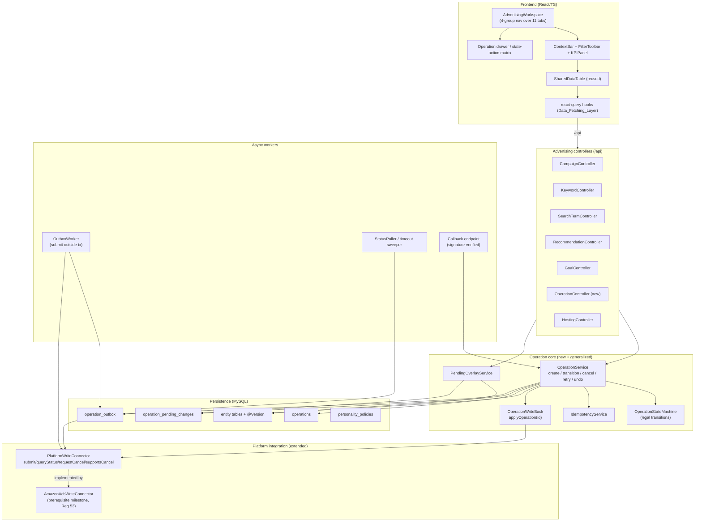

# Design Document

## Overview

This design turns the AdPilot advertising module from a "local ad-data management prototype" into a coherent Amazon Ads management workflow with explicit operation state, honest platform-sync feedback, correct data logic, a canonical API contract, consistent isolation/permission enforcement, and a four-group information architecture. It spans the React/TypeScript frontend (`frontend/`) and the Java 17 / Spring Boot 3.2.5 backend (`backend-java/`, MyBatis-Plus + JPA + MySQL 8.0 + Redis).

The central idea is the **Operation model**: every advertising write — manual pause, budget/bid change, keyword/negative add, AI-hosting adjustment, applied recommendation, campaign creation — is modeled as a single, auditable `Operation` with an explicit `operationScope` (`platform_mutation` vs `local_configuration`) and, for platform mutations, an explicit `Sync_State` lifecycle. Platform mutations are persisted with an **Outbox** entry inside one DB transaction and submitted to Amazon asynchronously **outside** any transaction by an Outbox worker, through an **extended `PlatformWriteConnector`** contract (`submit`, `queryStatus`, `requestCancel`, `supportsCancel`). The confirmed (Amazon-truth) value lives once on the entity; pending changes live on the Operation and are surfaced to the UI through a **Pending_Overlay** join, so a failed sync never corrupts confirmed data.

The design is explicit about current reality (verified against code):

- There is **no** `PlatformWriteConnector` implementation today; the only write path is the recommendation-only `WriteBackServiceImpl.apply(recommendationId)`. The generic `Operation_Write_Back` and the extended connector contract are **net-new** (Requirements 2, 53, 55).
- `AiHostingOptimizer` adjusts only **local keyword bids** and writes to `bid_changes`/`automation_executions` directly (the "stubbed connector seam"). Executable hosting ships in phases: **V1 = bid only** (current reach), V2 = +budget, V3 = +keyword/negative (Requirement 54).
- `riskPreference` exists only on `GoalEntity`; Campaigns have no personality field; no advertising entity has a `@Version` column; `MarketplaceEntity` has currency but no timezone; `parentAsin`/`targetingGoal` are `@Transient` on `CampaignEntity`. All of these are added by this rework.

This design **reconciles** with four existing specs and does not redefine their ownership:

| Spec | Owns | This spec |
|---|---|---|
| `core-platform-completion` | `PlatformWriteConnector` contract, `Permission_Service`/`Data_Scope_Service`, scheduling, alerts, recommendation write-back (`apply(recommendationId)`) | **Generalizes** write-back into `Operation_Write_Back`; **extends** the connector contract (Req 55); **applies** scope/permission uniformly |
| `app-functionality-completion` | Eleven-tab taxonomy, Insight Agent | **Regroups** tabs into four groups without removing data surfaces (Req 28); reuses Insight Agent |
| `platform-ux-logistics-enhancements` | `SharedDataTable`/`FilterToolbar`/`BulkActionBar`, react-query `Data_Fetching_Layer`, `saved_views`/`column_configs`, `CampaignsWorkspace` decomposition | **Completes** the partially-wired advertising table capabilities (Req 31) |
| `project-fix-and-cleanup` | `db/schema.sql` single source of truth, build/deploy | Adds all new tables/columns consistent with that approach |

## Architecture

### Backend module layout

A new sub-package `modules/advertising/operation` houses the Operation model; the existing `modules/writeback` is generalized rather than replaced.



### Write path (platform_mutation), end-to-end

```mermaid
sequenceDiagram
    participant UI
    participant Ctrl as Controller
    participant OS as OperationService
    participant DB as MySQL (1 tx)
    participant OBW as OutboxWorker
    participant Conn as WriteConnector
    participant AMZ as Amazon

    UI->>Ctrl: PATCH change (+ loaded version, logicalIdempotencyKey)
    Ctrl->>OS: createOperation(...)
    OS->>OS: scope check, permission, ownership, in-flight conflict, idempotency coalesce
    Note over OS,DB: ONE transaction (no Amazon call)
    OS->>DB: insert Operation + pending_change + audit + outbox; @Version guard on entity read
    DB-->>OS: committed (entity confirmed value UNCHANGED)
    OS-->>Ctrl: creation result (Sync_State = pending | local-only | awaiting_approval)
    Ctrl-->>UI: per-item creation result (NOT "Amazon applied")
    Note over OBW,Conn: OUTSIDE any transaction
    OBW->>DB: claim outbox row
    OBW->>Conn: submit(ctx, change, submissionIdempotencyKey)
    Conn->>AMZ: write
    AMZ-->>Conn: platformRef / status
    Conn-->>OBW: accepted(platformRef) | rejected(reason)
    OBW->>OS: transition submitted -> amazon-processing/effective/failed
    AMZ-->>CBK: async callback (signed)
    CBK->>OS: verify signature -> idempotent transition -> effective
    OS->>DB: on effective, set entity confirmed value = after
```

When the Active_Store is **not write-capable** (no connector implementation OR no valid active `PlatformConnection`), `createOperation` skips the Outbox and resolves the platform mutation directly to the terminal `local-only` state (Requirements 2.4, 3.2, 53). `local_configuration` Operations never touch the Outbox, never get a Sync_State, and carry an `executionStatus` instead (Requirements 3.7–3.9, 6.2).

### Frontend architecture

The four-group navigation (Requirement 28) is a presentation layer **over** the existing eleven `CampaignsWorkspace` tabs — no tab data surface is removed. A single `useAdvertisingQueryState` hook is the single source of truth for filters/date-range/sort/pagination shared by the `FilterToolbar`, `KPIPanel`, and `SharedDataTable` (Requirement 39), and serializes to/from the URL (Requirement 34). Operation actions are rendered from a pure `actionsForSyncState(state, operation)` function implementing the Requirement 56 matrix.

## Components and Interfaces

### 1. Operation model & state machine (Req 2, 3, 4, 8)

```java
// modules/advertising/operation/OperationScope.java
public enum OperationScope { PLATFORM_MUTATION, LOCAL_CONFIGURATION }

// modules/advertising/operation/SyncState.java — platform lifecycle
public enum SyncState {
    LOCAL_ONLY, PENDING, AWAITING_APPROVAL, SUBMITTED, AMAZON_PROCESSING,
    EFFECTIVE, FAILED, CANCEL_REQUESTED, CANCELLED, SUPERSEDED, EXPIRED, RECONCILIATION_REQUIRED;

    // The Unsettled_State set (Req 7, 5.6)
    static final Set<SyncState> UNSETTLED = EnumSet.of(
        PENDING, AWAITING_APPROVAL, SUBMITTED, AMAZON_PROCESSING,
        CANCEL_REQUESTED, EXPIRED, RECONCILIATION_REQUIRED);
}

// modules/advertising/operation/ExecutionStatus.java — local_configuration only
public enum ExecutionStatus { APPLIED, FAILED, CANCELLED }

public enum OperationSource { MANUAL, RECOMMENDATION, ONE_CLICK_OPTIMIZE, AI_HOSTING, CREATION }
```

`OperationStateMachine` is a **pure** component exposing `boolean canTransition(SyncState from, SyncState to)` and `SyncState transition(SyncState from, TransitionEvent event)`, encoding exactly the legal transitions in Requirement 4.1. It is the single authority; `OperationService` never mutates `sync_state` without consulting it.

```java
public interface OperationService {
    OperationResult createOperation(CreateOperationCommand cmd);   // Req 2,3,5,6
    OperationResult transition(UUID operationId, TransitionEvent event); // Req 4
    OperationResult cancel(UUID operationId);     // Req 4.7/4.8 (routes by state)
    OperationResult retry(UUID operationId);      // Req 4.2/4.5 (new attempt)
    OperationResult undo(UUID operationId);       // Req 8.4/8.5 (compensating op)
    OperationResult reconcile(UUID operationId);  // Req 4.10, 56.5
    OperationResult approve(UUID operationId);     // awaiting_approval -> submitted
    OperationResult reject(UUID operationId);      // awaiting_approval -> cancelled
    OperationResult publishLocalDraft(UUID localOnlyOperationId); // Req 12.10
}
```

`createOperation` performs, in order: permission check (Req 27), data-scope + per-record ownership validation (Req 24, 25), in-flight conflict lock (Req 5.6), idempotency coalescing by `logicalIdempotencyKey` (Req 5.3), optimistic-version check (Req 5.4/5.5), approval-threshold evaluation (Req 4, 22.8, 49.19), write-capability resolution (Req 53), then the single-transaction persistence of Operation + pending-change + audit + outbox (Req 6.1).

### 2. Generic Operation Write-Back (Req 2, 9, 53.5)

```java
public interface OperationWriteBack {
    OperationResult applyOperation(UUID operationId); // routes ONLY platform_mutation
}
```

`OperationWriteBackImpl` resolves the Active_Store's `PlatformConnection` and the platform's `PlatformWriteConnector`, builds a `PlatformChange` from the Operation's pending value, and submits with the Operation's `submissionIdempotencyKey`. The existing `WriteBackService.apply(recommendationId)` is reconciled to **delegate**: it creates a `recommendation`-sourced Operation and calls `applyOperation` (Req 2.3, 9.1), preserving its `@RequiresApproval` gating.

### 3. Extended PlatformWriteConnector (Req 55)

The existing SPI is extended (default methods keep `core-platform-completion` reconciled, not forked):

```java
public interface PlatformWriteConnector {
    String platform();
    PlatformWriteResult submit(ConnectionContext ctx, PlatformChange change); // existing

    // --- Req 55 extension ---
    PlatformStatusResult queryStatus(ConnectionContext ctx, String platformReference); // idempotent, non-mutating (55.2/55.6)
    PlatformCancelResult requestCancel(ConnectionContext ctx, String platformReference); // 55.3
    default boolean supportsCancel() { return false; }                                   // 55.3
    // platform-reported status -> SyncState mapping (55.4)
    SyncState mapPlatformStatus(String platformStatus);
}
```

`submit` returns a `platformReference` stored on the Operation (Req 55.7) used to correlate `queryStatus`/`requestCancel`/callbacks. The inbound callback endpoint (`CallbackController`) verifies signature before any state mutation (Req 55.5) and rejects unverified callbacks. The `AmazonAdsWriteConnector` bean is the **prerequisite milestone** (Req 53) — until it is registered AND the store has a valid active connection, the store is not write-capable.

`WriteCapabilityService.isWriteCapable(storeId)` = (a connector bean for the store's platform exists) AND (store has a valid active `PlatformConnection`).

### 4. Async workers (Req 4, 6, 51)

- **OutboxWorker** — claims `operation_outbox` rows (status `pending`, `SELECT ... FOR UPDATE SKIP LOCKED` / version-claim), submits through the connector **outside** any DB transaction, advances Sync_State idempotently, emits structured write-back metrics (Req 51.6).
- **StatusPoller / TimeoutSweeper** — for `submitted`/`amazon-processing` Operations, calls `queryStatus`; transitions to `expired` after the configurable 15-minute timeout (Req 4.4); drives `cancel_requested` and `reconciliation_required` resolution (Req 4.9/4.10).
- **WriteBackAlerting** — raises an alert when, over a rolling 15-min window with ≥10 attempts, failure rate ≥25%, or ≥5 consecutive failures for one store+connector (Req 51.7), all thresholds configurable (Req 51.11).

### 5. Pending Overlay (Req 7, 12)

`PendingOverlayService` joins each entity row with its unsettled Operation's pending value. Implemented as a query-layer left-join from the entity to the latest Operation in an Unsettled_State for that `(entityType, entityId, field)`, producing VO fields `confirmedValue` + optional `pendingValue` + `pendingSyncState`. No second physical column per field is added (Req 7.1).

### 6. AI hosting & executable personality (Req 22, 49, 50, 54)

`AiHostingOptimizer` is refactored so that it no longer writes `bid_changes`/`keyword.bid` directly. Instead, for each proposed adjustment it calls `OperationService.createOperation(... source=AI_HOSTING)` so hosting drives the same write path (Req 9.3). A new `PersonalityResolver` resolves a Campaign's effective `AI_Personality` (Campaign override > Goal default > Store default > `balanced`, Req 49.2/49.3). A new `PersonalityPolicyService` loads the configurable `personality_policies` table and the pure `HostingBidOptimizer.adjustBid` clamp is extended so the **Safety_Boundary always wins** over the personality-allowed magnitude (Req 22.4, 49.10/49.11). Capability gating by active phase (`adpilot.hosting.phase = V1|V2|V3`) restricts which adjustment types the optimizer emits and which the UI shows as executable (Req 22.1/22.2, 54).

`SafetyBoundaryResolver` resolves limits through Campaign override > Goal boundary > Store policy > System default (Req 22.11). The optimizer records on each AI Operation: trigger metric, resolved personality, `Personality_Rule_Version`, personality-allowed max magnitude, actual applied magnitude, decision reason, before/after, predicted impact, approval-required flag, sync result (Req 49.9).

### 7. Recommendation, search-term, goal, engine correctness (Req 10–20, 46, 57)

- `RecommendationStatusMapper` (pure) maps Operation Sync_State → Recommendation_Status with every Unsettled_State → `applying`, `cancelled`/`superseded` → `pending`, `local-only` → `local-only`, never `expired`→`failed` (Req 10.8). Unknown Recommendation_Type → reject, stay `pending` (Req 11).
- `SearchTermHarvestService` derives target campaign/ad group from the term, applies the chosen `Harvest_Action` correctly (`add_negative` creates a Negative_Keyword, never a positive Keyword), validates override targets against scope, and rejects unresolvable/invalid actions (Req 13).
- `GoalMetricsService` scopes metrics to the goal's campaigns and propagates **only** target ACoS + optimization goal, never overwriting campaign-level overrides (Req 20).
- `RecommendationEngineService` is hardened: null-safe, ad-group default-bid fallback, zero-sales waste rule, duplicate suppression, target-ACoS resolution order (Goal → product → configurable default 0.25), store-scoped (Req 18). Smart diagnosis is scoped to a parent ASIN and reuses the same duplicate suppression (Req 46), with scheduling honestly driven by the `core-platform-completion` scheduler or not claimed (Req 47).
- `AcosScale` (pure) defines decimal-ratio storage/compare and ×100 display; a per-column migration with an ambiguity exception list (Req 17). `ObjectStatusVocabulary` (pure) normalizes legacy `active→enabled` etc. with an unknown-value exception list (Req 16). `OptimizationGoalMigration` maps legacy goal-type/hosting-goal values to the new enum with an exception list (Req 57).

### 8. Canonical API schema & machine values (Req 14, 48)

The canonical `KeywordVo`, `SearchTermVo`, `GoalVo` are revised (flattened metrics, `bidHealthScore`; `harvestingStatus`/`periodStart`/`periodEnd`/single `cpc`; `campaigns`/`products`/`trendData`/`campaignCount`). The backend returns **only** `Machine_Value_Enum` values; the frontend owns all display translation (Req 48.4/48.5). The frontend adapts to the canonical schema (Req 14.5), not vice versa.

### 9. Frontend components (Req 28–45, 50, 56)

- `AdvertisingWorkspace` — four-group nav (`广告管理 / 搜索词管理 / 智能优化 / 记录与审计`) over the eleven existing tabs (Req 28).
- `ContextBar` (store/site/account/currency/data-date/last-sync, Req 29), `FilterChips` (Req 29), collapsible `KpiPanel` (default last-7-days vs prior-7-days in Marketplace_Timezone, Req 30), `useAdvertisingQueryState` single-source-of-truth + URL encoding (Req 34, 39).
- Completion of `SharedDataTable` wiring for advertising: `total`/`tableKey` props, pagination, column management, export, saved views (Req 31, 32, 33); multi-pinned-column cumulative offsets and currency-aware formatting (Req 38); fixed status enumerations (Req 35); cross-page selection semantics (Req 44); explicit UI states (Req 41); accessibility (Req 42); responsive ≥768px strategy (Req 43); context preservation across tab switches (Req 45); store-switch & unsaved-edit guards (Req 40).
- `OperationActions` — renders Approve/Reject/Cancel/Retry/Reconcile/Undo strictly from `actionsForSyncState` (Req 56); distinct copy for "关闭AI托管" vs "取消平台操作" (Req 48.7).
- AI hosting UI: settings drawer ordered sections, three-segment personality control with 人格影响预览, resolved-personality column with inherited/override indicator, overview first-screen figures, 人格分布, decision explanations (Req 50).

## Data Models

All new tables/columns are added to `db/schema.sql` (single source of truth) consistent with `project-fix-and-cleanup`, with a defined migration + rollback (Req 51.8).

### New: `operations` (Operation_Record, Req 8)

| Column | Type | Notes |
|---|---|---|
| `id` | char(36) PK | |
| `store_id` | char(36) | scope, indexed |
| `operation_source` | varchar(20) | IMMUTABLE: manual/recommendation/one_click_optimize/ai_hosting/creation |
| `operation_scope` | varchar(20) | platform_mutation / local_configuration |
| `entity_type` | varchar(40) | campaign/keyword/... |
| `entity_id` | char(36) | target object |
| `field` | varchar(40) | writable field changed (nullable for multi-field) |
| `logical_operation_id` | char(36) | stable across attempts, indexed |
| `logical_idempotency_key` | varchar(120) | click coalescing, unique-ish per logical change |
| `attempt_id` | char(36) | per attempt |
| `submission_idempotency_key` | varchar(120) | per platform submission |
| `attempt_number` | int | 1-based |
| `parent_operation_id` | char(36) | publish→`local-only` draft (Req 12.10); null otherwise |
| `before_value` | json | Amazon-confirmed value at creation |
| `after_value` | json | requested pending value |
| `reversible` | boolean | undo eligibility |
| `affected_count` | int | bulk |
| `acting_user_id` | char(36) | from security context (Req 24.4) |
| `sync_state` | varchar(30) | platform_mutation lifecycle; null for local_configuration |
| `execution_status` | varchar(20) | local_configuration only: applied/failed/cancelled |
| `platform_reference` | varchar(120) | connector correlation (Req 55.7) |
| `platform_result` | json | where provided |
| `status_reason` | varchar(500) | for failed/cancelled/expired/cancel_requested/reconciliation_required |
| `personality_rule_version` | varchar(40) | AI decisions (Req 49.9) |
| `ai_decision` | json | trigger metric, resolved personality, allowed/actual magnitude, reason, predicted impact |
| `created_at` / `updated_at` | datetime | Req 4.6 |

Indexes: `(store_id, sync_state)`, `(entity_type, entity_id, sync_state)` for the in-flight lock and overlay, `(logical_operation_id)`, `(logical_idempotency_key)`, `(submission_idempotency_key)`.

### New: `operation_pending_changes` (Req 7)

`id`, `operation_id`, `entity_type`, `entity_id`, `field`, `before_value`, `after_value`, `status` (open/closed), timestamps. The Pending_Overlay reads the open row for an Unsettled_State Operation.

### New: `operation_outbox` (Req 6)

`id`, `operation_id`, `store_id`, `platform`, `payload` json, `submission_idempotency_key`, `status` (pending/claimed/submitted/done/failed), `attempt_count`, `claimed_at`, `created_at`. Written in the same transaction as the Operation; never written for `local_configuration`.

### New: `personality_policies` (Req 49.5/49.6)

One row per `(scope, personality)` carrying the concrete numeric fields (`minClicks`, `minOrders`, `lookbackDays`, `minConversionRate`, `negativeConfidenceThreshold`, `acosToleranceRatio`, `approvalBidChangeRatio`, `approvalBudgetChangeRatio`, `maxBidIncreaseRatio`, `maxBidDecreaseRatio`, `maxDailyBudgetIncreaseRatio`, `adjustmentCooldownHours`, `exploreBudgetRatioMin`, `exploreBudgetRatioMax`, plus V3 keyword fields) seeded with the Requirement 49.5 defaults, plus `rule_version`.

### New: `object_status_migration_exceptions`, `acos_migration_exceptions`, `optimization_goal_migration_exceptions`

`id`, `table_name`, `column_name`, `record_id`, `original_value`, `reason`, `created_at` — unknown/ambiguous values flagged for manual review (Req 16.6, 17.6, 57.3).

### Modified entities

- **`campaigns`**: add `campaign_personality` varchar(20) nullable (Req 49.2); add `origin` varchar(20) immutable (`local`/`amazon_import`, Req 12.6); add `amazon_campaign_id` varchar(100) (Req 12.7); add `@Version version` bigint (Req 5.4); persist `parent_asin`/`targeting_goal` OR add a `campaign_product_links` association table with index (Req 15.4) — see below. Retire `ai_managed`/`hosting_goal` semantics in favor of `AI_Hosting_Status` + `Optimization_Goal` machine enums.
- **`goals`**: `risk_preference` becomes the `Goal_Personality_Default` (machine enum), `type`→ migrated `Optimization_Goal`; add `@Version`.
- **`keywords`, `ad_groups`, `targets`, `negative_keywords`, `product_ads`**: add `@Version version` (Req 5.4).
- **`stores`** (core): add `default_personality` varchar(20) (Store_Default_Personality, Req 49.2) and the per-store hosting policy fields incl. "allow local draft / forbid when not write-capable" (Req 12.3); reconcile with `core-platform-completion` ownership.
- **`marketplaces`** (`MarketplaceEntity`): add `timezone` varchar(64) IANA (Marketplace_Timezone, Req 51.12).

### New: `campaign_product_links` (Req 15.4)

`id`, `campaign_id`, `parent_asin` varchar(20), `product_id` char(36), `targeting_goal` varchar(40), index `(campaign_id, parent_asin)` and `(store_id, parent_asin)` — the persisted source for the parent-ASIN / targeting-goal server-side filters. Until populated, those filters are out of scope and the frontend does not offer them (Req 15.5).

### Saved views / column configs (reused, Req 31, 34)

Reuse `saved_views` and `column_configs` from `platform-ux-logistics-enhancements`, keyed by `(user_id, table_key)`. A Saved_View change creates **no** Operation (Req 3.9).

## Correctness Properties

*A property is a characteristic or behavior that should hold true across all valid executions of a system — essentially, a formal statement about what the system should do. Properties serve as the bridge between human-readable specifications and machine-verifiable correctness guarantees.*

The properties below were derived from the acceptance-criteria prework and consolidated to remove redundancy (e.g. the many "not write-capable → local-only" criteria collapse into one property; all "confirmed value unchanged" criteria collapse into one invariant). Each is universally quantified and intended to be implemented by a single property-based test (jqwik on the backend, fast-check on the frontend), minimum 100 iterations.

### Property 1: Operation scope determines routing

*For any* Operation, it is submitted through Operation_Write_Back / the Write_Connector if and only if its `operationScope` is `platform_mutation`; a `local_configuration` Operation is never submitted to the platform and never produces an Outbox entry, regardless of its Operation_Source.

**Validates: Requirements 2.1, 2.2, 2.3, 2.6, 3.7, 6.2, 9.1, 9.2, 9.3, 21.3**

### Property 2: Write-capability gating yields local-only

*For any* `platform_mutation` Operation created against a Store that is not write-capable, the Operation resolves to the terminal `local-only` Sync_State, no platform submission is attempted, and the pending value is surfaced through the Pending_Overlay.

**Validates: Requirements 2.4, 3.2, 9.4, 12.5, 21.5, 53.3**

### Property 3: Write-capability predicate

*For any* combination of (platform Write_Connector implementation present or absent, Store PlatformConnection valid-active or not), the Store is write-capable if and only if BOTH the connector implementation exists AND the Store has a valid active PlatformConnection.

**Validates: Requirements 53.1, 53.2**

### Property 4: Only legal Sync_State transitions are permitted

*For any* pair of Sync_States (from, to), `OperationStateMachine.canTransition(from, to)` returns true if and only if (from, to) is one of the transitions enumerated in Requirement 4.1; every other transition is rejected.

**Validates: Requirements 4.1, 3.1**

### Property 5: Confirmed value changes only on effective

*For any* Operation that reaches any Sync_State other than `effective`, the affected entity's Amazon-confirmed value is left unchanged; the confirmed value is updated to the Operation's after value exactly when the Operation becomes `effective`.

**Validates: Requirements 3.4, 3.5, 4.4, 4.7, 4.11, 6.4, 7.4, 7.5, 12.1**

### Property 6: Cancellation routes by submission state

*For any* Operation, an operator cancel transitions it directly to `cancelled` when it is not yet submitted (`pending` or `awaiting_approval`), and transitions it to `cancel_requested` (never directly to `cancelled`) when it is already submitted or in flight (`submitted` or `amazon-processing`); in both cases the confirmed value is unchanged.

**Validates: Requirements 4.7, 4.8, 56.4**

### Property 7: cancel_requested resolves without ever marking the original failed

*For any* Operation in `cancel_requested`, it resolves to exactly one of: `cancelled` (platform confirms not applied), `effective` (platform reports already applied, with a compensating rollback Operation created), or `reconciliation_required` (the cancellation request itself errored or could not be confirmed); it is never resolved to `failed` by a failed cancellation.

**Validates: Requirements 4.9, 55.3**

### Property 8: expired and reconciliation_required resolve via platform query

*For any* Operation in `expired` or `reconciliation_required`, the system queries the platform's actual state before any retry and resolves to exactly one of `effective`, `failed`, or `cancelled` according to the reported state, and never immediately retries; `expired` never maps directly to a terminal failure without a platform query.

**Validates: Requirements 4.10, 56.5**

### Property 9: Supersession routes by submission state

*For any* in-flight Operation replaced by a newer Operation against the same object (including an AI_Personality recompute), the replaced Operation is transitioned directly to `superseded` when not yet submitted (`pending`/`awaiting_approval`) and routed through the `cancel_requested` path when already submitted or in flight; the confirmed value is unchanged.

**Validates: Requirements 4.11, 49.14**

### Property 10: Retry creates a fresh attempt without mutating the original

*For any* `failed` Operation that is retried, a new attempt is created in `pending` with a new `attemptId`, a new `submissionIdempotencyKey`, and an incremented `attemptNumber` under the same `logicalOperationId` and `logicalIdempotencyKey`, and the original failed Operation_Record is left unchanged.

**Validates: Requirements 4.2, 7.8**

### Property 11: Automatic retries are bounded

*For any* logical Operation, the number of automatic retry attempts (tracked by `attemptNumber` under one `logicalOperationId`) never exceeds 3; beyond that an explicit operator retry is required.

**Validates: Requirements 4.5**

### Property 12: Not-write-capable stores never enter platform states

*For any* Operation on a Store that is not write-capable, the Operation never enters `submitted`, `amazon-processing`, `effective`, `cancel_requested`, or `reconciliation_required`, and inbound platform callbacks for that Store are not processed.

**Validates: Requirements 4.12, 53.2**

### Property 13: Submission idempotency vs retry independence

*For any* sequence of platform callbacks, poll results, or re-deliveries, a delivery carrying an already-processed `submissionIdempotencyKey` produces no duplicate platform request, while a retry — carrying a new `submissionIdempotencyKey` — is never blocked by a prior attempt's submission key.

**Validates: Requirements 5.2, 5.7**

### Property 14: Repeated activations coalesce into one logical Operation

*For any* number of repeated operator activations of the same control sharing one `logicalIdempotencyKey` before the logical Operation completes, exactly one logical Operation is created.

**Validates: Requirements 5.3**

### Property 15: Optimistic-lock rejects stale writes

*For any* Operation submitted against an entity whose optimistic-lock version has changed since the operator's view was loaded, the entity update (`WHERE id = ? AND version = ?`) affects zero rows and the Operation is rejected as a version conflict.

**Validates: Requirements 5.4, 5.5**

### Property 16: In-flight conflict lock

*For any* object that already has an Operation in any Unsettled_State, a new conflicting Operation against the same object is rejected and the operator is informed an Operation is already in progress.

**Validates: Requirements 5.6**

### Property 17: Effective-with-external-version-change requires explicit reconciliation

*For any* Operation that becomes `effective` while the local object's optimistic-lock version changed during external execution, the system records both the platform-confirmed value and the conflicting local change and requires explicit operator resolution rather than overwriting last-writer-wins.

**Validates: Requirements 5.8**

### Property 18: Callback/poll processing is idempotent

*For any* platform result, processing it more than once produces the same final Sync_State as processing it once.

**Validates: Requirements 5.7, 55.6**

### Property 19: First transaction is atomic and side-effect-free externally

*For any* `platform_mutation` Operation creation, the first database transaction persists all of {Operation_Record, pending-change, audit entry, Outbox entry} or none of them, does not change the entity's confirmed value, and performs no platform call; the asynchronous Outbox worker submits outside any database transaction.

**Validates: Requirements 6.1, 6.3**

### Property 20: Batch scope and per-item result semantics

*For any* Bulk_Operation, if it references records belonging to more than one Store the whole batch is rejected; otherwise each referenced item is attempted independently and the API returns a uniform per-item result identifying the record id, the creation result, and the failure reason where creation failed, representing creation (not platform application).

**Validates: Requirements 6.5, 6.6, 6.7, 6.8, 36.2, 25.4**

### Property 21: Pending_Overlay surfaces confirmed and pending for every Unsettled_State

*For any* writable field with an Operation in any Unsettled_State, the Pending_Overlay exposes both the entity's Amazon-confirmed value and the Operation's pending value; when no Operation is in progress, only the confirmed value is exposed.

**Validates: Requirements 7.3, 7.6, 7.7**

### Property 22: Operation_Record completeness and statusReason coverage

*For any* recorded Operation, the Operation_Record contains all required audit fields (source, scope, key model, before/after, reversible, affected count, acting user, timestamps, resulting state); a `statusReason` is present whenever the state is `failed`, `cancelled`, `expired`, `cancel_requested`, or `reconciliation_required`; a `platform_mutation` carries a `sync_state` and null `executionStatus`, and a `local_configuration` carries an `executionStatus` in {`applied`,`failed`,`cancelled`} and null `sync_state`.

**Validates: Requirements 8.1, 3.8, 22.10, 49.9, 49.15**

### Property 23: Undo availability predicate

*For any* Operation, the Undo action is offered if and only if its Sync_State is `effective` AND its `reversible` flag is true AND its before value is still valid (no newer `effective` Operation has since changed the field); when offered and activated, Undo creates a new compensating Operation_Record rather than deleting the original.

**Validates: Requirements 8.4, 8.5, 56.3, 22.10**

### Property 24: Saved_View change creates no Operation

*For any* Saved_View create/update/delete, no Operation_Record and no operation-log entry is created.

**Validates: Requirements 3.9**

### Property 25: Recommendations are never marked effective without an effective Operation

*For any* Recommendation, one-click-optimize action, or hosting adjustment, it is marked effective only if a corresponding Operation_Record has reached the `effective` Sync_State.

**Validates: Requirements 9.5**

### Property 26: Recommendation_Status mapping is total and exact

*For any* Sync_State, the resulting Recommendation_Status equals the Requirement 10.8 mapping: every Unsettled_State → `applying`; `effective` → `effective`; `failed` → `failed`; `cancelled` and `superseded` → `pending`; `local-only` → `local-only`; a Recommendation with no applied Operation → `pending`; `expired` never maps to `failed`.

**Validates: Requirements 10.1, 10.2, 10.3, 10.4, 10.5, 10.6, 10.7, 10.8**

### Property 27: Unsupported Recommendation_Type is rejected, not applied

*For any* Recommendation whose Recommendation_Type does not map to a defined Operation, the apply request is rejected with an error naming the unsupported type and the Recommendation remains in `pending`.

**Validates: Requirements 11.1, 11.2**

### Property 28: origin and Operation_Source are immutable

*For any* Campaign and any Operation, the Campaign's `origin` and the Operation's `Operation_Source` are never rewritten across any state transition, including when the Campaign syncs to the platform.

**Validates: Requirements 12.6**

### Property 29: Synced-list inclusion is gated by effective creation and amazon_campaign_id

*For any* Campaign, it appears in the Amazon-synced campaign list if and only if it has a non-empty `amazon_campaign_id` and its creation Operation reached `effective`; otherwise it appears only in the local-drafts view / with a local-source badge.

**Validates: Requirements 12.7, 12.8**

### Property 30: Publishing a local-only draft creates a new linked Operation

*For any* terminal `local-only` draft Operation, "submit to Amazon" creates a NEW `pending` `platform_mutation` Operation carrying its own new `logicalOperationId` and a `parentOperationId` referencing the original draft, and does not transition the original `local-only` Operation.

**Validates: Requirements 12.10**

### Property 31: Harvest action determines the produced object

*For any* Search_Term and Harvest_Action, harvesting produces exactly: an enabled exact-match Keyword for `add_exact`; an enabled phrase-match Keyword for `add_phrase`; a Negative_Keyword (and never a positive Keyword) for `add_negative`; a watch record (and neither Keyword nor Negative_Keyword) for `watchlist`; and an invalid action is rejected with an error naming it.

**Validates: Requirements 13.3, 13.4, 13.5, 13.6, 13.7**

### Property 32: Harvest target derivation and scoped override

*For any* Search_Term harvested without an override target, the target Campaign and Ad_Group are derived from the term's associated campaign and ad group; *for any* supplied override target, it is used instead only when it lies within the caller's effective data scope.

**Validates: Requirements 13.1, 13.2**

### Property 33: GoalVo campaignCount equals its campaigns collection length

*For any* GoalVo, `campaignCount` equals the length of its `campaigns` collection.

**Validates: Requirements 14.4**

### Property 34: Backend emits only machine-value enums

*For any* advertising response object, every enumerated field (AI_Hosting_Status, AI_Personality, Optimization_Goal, Object_Status) carries only a Machine_Value_Enum value and never a display string.

**Validates: Requirements 14.7, 48.4**

### Property 35: Frontend machine-value-to-display translation is total

*For any* Machine_Value_Enum value the backend can return, the frontend maps it to a defined display string, and the mapping is total over the enum.

**Validates: Requirements 48.5, 3.6**

### Property 36: Server-side filters constrain the full result set

*For any* dataset and supported list filter (search-term date/status, keyword ad-group/match-type, persisted campaign parent-ASIN/targeting-goal), every returned row satisfies the filter and no matching row across all pages is omitted; a filter referencing a non-persisted field is rejected with a validation error rather than ignored.

**Validates: Requirements 15.1, 15.2, 15.3, 15.6, 15.7**

### Property 37: Server-side pagination and sort return the correct global slice

*For any* dataset, page parameters, and sort key, the returned page equals the corresponding slice of the globally sorted, fully filtered result set (not merely the current page re-sorted).

**Validates: Requirements 33.1, 33.4**

### Property 38: Object_Status vocabulary normalization with exception list

*For any* stored Object_Status value, a known legacy value normalizes per the fixed mapping (`active→enabled`, `paused→paused`, `archived→archived`) and an unknown value is written to the migration exception list and never auto-mapped to a canonical value.

**Validates: Requirements 16.1, 16.5, 16.6, 16.7**

### Property 39: ACoS decimal-ratio scale is consistent across layers

*For any* ACoS ratio r, the percentage display equals r×100, threshold comparisons are performed on stored ratios, and a value stored as r and displayed as (r×100)% denote the same ratio across database, API, filter parameters, and form parsing layers.

**Validates: Requirements 17.1, 17.2, 17.3, 17.4, 17.7**

### Property 40: Migration never guesses unknown or ambiguous values

*For any* historical ACoS value ambiguous under its column semantics, any unknown legacy Object_Status value, and any unmappable goal-type/hosting-goal value, the value is written to the appropriate migration exception list and is never auto-converted or auto-mapped.

**Validates: Requirements 17.5, 17.6, 16.6, 57.1, 57.2, 57.3**

### Property 41: Recommendation engine robustness and resolution

*For any* record (including records with null fields, no bid, or no sales), the recommendation engine completes without a null-reference error; uses the Ad_Group default bid when the record has no bid and skips bid recommendations when neither exists; treats zero sales under the spend-without-sales waste rule rather than the ACoS-threshold rule; and resolves the target ACoS in the order Goal target ACoS → product `target_acos` → configurable system default (0.25).

**Validates: Requirements 18.1, 18.2, 18.3, 18.4, 18.6**

### Property 42: Recommendation generation is deduplicated and store-scoped

*For any* Store, the engine never produces more than one Recommendation representing the same change for the same target, and never produces a Recommendation for a record outside the requested Store.

**Validates: Requirements 18.5, 18.8, 46.3, 46.4**

### Property 43: Smart diagnosis is scoped to its parent ASIN

*For any* Smart_Diagnosis run for a parent ASIN, the analysis includes only campaigns and records associated with that parent ASIN and excludes all records outside it.

**Validates: Requirements 46.1, 46.2**

### Property 44: Period-over-period trend uses the immediately preceding equal-length period

*For any* selected period, the growth value is computed against the immediately preceding period of equal length; when the preceding period has no data, the growth is reported as not-available rather than derived from a zero baseline.

**Validates: Requirements 19.4, 19.5**

### Property 45: Savings are derived from structured multi-currency-normalized amounts

*For any* Recommendation savings figure, the amount is derived from structured monetary values normalized to the Store's single reporting currency, never parsed from description text.

**Validates: Requirements 19.2, 19.3**

### Property 46: AI estimates carry their method and degrade honestly

*For any* AI sales-change or spend-savings figure, it is computed as an estimate recording the baseline, attribution window, confidence indicator, and algorithm version (never a naive before/after delta); when no valid baseline exists it is signaled as not-estimable and the fixed "暂不可估算：缺少有效基线" indication is shown instead of a fabricated estimate.

**Validates: Requirements 19.6, 19.7, 19.8, 50.12**

### Property 47: Goal metrics are scoped and propagation is whitelisted

*For any* Goal, its metrics are scoped to the Goal's associated Campaigns; updating the Goal propagates only the target ACoS and the optimization goal to associated Campaigns/Ad_Groups, never the Goal name, budget, or personality default, and never overwrites a Campaign-level override.

**Validates: Requirements 20.1, 20.2, 20.3**

### Property 48: AI_Personality resolution precedence

*For any* combination of (Campaign_Personality override, Goal_Personality_Default, Store_Default_Personality), the resolved effective AI_Personality is the first defined value in the order Campaign override → Goal default → Store default, falling back to `balanced` when none is defined.

**Validates: Requirements 49.2, 49.3**

### Property 49: Safety_Boundary always bounds the applied magnitude

*For any* AI hosting adjustment, the actual applied magnitude is at most the minimum of the personality-allowed maximum magnitude and the resolved Safety_Boundary limit, the adjusted value stays within the resolved [minBid, maxBid] window, and no Safety_Boundary limit is ever widened to admit an out-of-range value.

**Validates: Requirements 22.3, 22.4, 22.6, 49.4, 49.10, 49.11**

### Property 50: Out-of-range starting values only move toward the safe range

*For any* current value already outside the Safety_Boundary, a hosting adjustment moves it only toward the safe range (never further out of range) and flags the Campaign.

**Validates: Requirements 22.5**

### Property 51: Safety_Boundary resolution precedence

*For any* combination of (Campaign override, Goal boundary, Store policy, System default) for a given limit, the effective limit is the first level that defines it, with a Campaign-level override always taking precedence.

**Validates: Requirements 22.11, 49.11**

### Property 52: Approval gate triggers below the maximum

*For any* change whose absolute change ratio is greater than or equal to the applicable approval threshold (`approvalBidChangeRatio` / `approvalBudgetChangeRatio`), the Operation transitions to `awaiting_approval`; and for every personality each approval ratio is strictly less than its corresponding maximum ratio, so approval can trigger before the maximum is reached.

**Validates: Requirements 22.8, 49.5, 49.19, 4.1**

### Property 53: Personality change is never silent and never auto-executes all

*For any* Optimization_Goal selection or personality change, AI_Personality is never switched without explicit operator confirmation, and changing AI_Personality never immediately recomputes and executes all hosted Campaigns.

**Validates: Requirements 49.8, 49.12**

### Property 54: Hosting pause/turn-off stops new ops and resolves in-flight ones

*For any* Campaign whose hosting is turned off or while the global pause switch is engaged, no new hosting Operations are generated; existing `awaiting_approval` hosting Operations are cancelled and existing `submitted`/`amazon-processing` hosting Operations are left to resolve (optionally via `cancel_requested`) rather than silently dropped.

**Validates: Requirements 22.9, 22.12**

### Property 55: Capability phase gating

*For any* active phase (V1/V2/V3) and capability (bid/budget/keyword/negative), the capability is presented as executable and has personality controls applied if and only if it is implemented for that phase (V1=bid; V2=+budget; V3=+keyword+negative).

**Validates: Requirements 22.1, 22.2, 49.4, 54.1, 54.2, 54.3, 54.4**

### Property 56: Permission matrix enforcement

*For any* advertising resource and action, the Backend requires exactly the permission code assigned by the Requirement 27.1 matrix and rejects the action with HTTP 403 when the caller lacks it; audit resources (Operation, SyncLog, BidChange) expose no interactive delete permission.

**Validates: Requirements 24.2, 24.3, 27.1, 27.3, 27.4, 27.5, 27.6**

### Property 57: Data scope and ownership prevent cross-store access

*For any* advertising read/write referencing a record or Store, the operation succeeds only when the record/Store lies within the caller's effective data scope; a reference to another store's record (including by guessed identifier, and any cross-store member of a bulk request) is rejected with HTTP 403 without disclosing contents, and the acting user is always resolved from the authenticated security context.

**Validates: Requirements 24.1, 24.4, 25.1, 25.2, 25.3, 25.4**

### Property 58: Frontend control visibility follows the permission matrix

*For any* permission set, an advertising action control is shown/enabled if and only if the set contains the matrix code for that control's action, and a hidden or disabled control never issues its Backend request.

**Validates: Requirements 26.1, 26.2, 26.3, 26.4, 27.7**

### Property 59: Tab-to-group assignment is a total partition

*For any* advertising tab, it is assigned to exactly one of the four groups, and the union of the four groups covers every existing tab with none removed.

**Validates: Requirements 28.1, 28.2, 28.4**

### Property 60: Filter chips correspond exactly to applied filters

*For any* set of applied filters, exactly one Filter_Chip is displayed per applied filter condition (none when no filters are applied), and removing a chip removes that condition and re-requests with the remaining filters.

**Validates: Requirements 29.3, 29.4, 29.5**

### Property 61: Single source of truth for query conditions

*For any* change to a query condition, the Filter controls, the KPI_Panel, and the table all read from the same single query-condition state and update together; no divergent query-condition set exists.

**Validates: Requirements 39.1, 39.2, 39.3**

### Property 62: URL filter/sort round-trip

*For any* advertising filter-and-sort state, encoding it into the page URL and decoding it on load yields the same filter-and-sort state.

**Validates: Requirements 34.4, 34.5**

### Property 63: Saved view isolation

*For any* Saved_View, it is persisted scoped to the requesting user and table key and is never readable by another user.

**Validates: Requirements 34.3**

### Property 64: Result count equals server total

*For any* filtered result set, the toolbar result count equals the server-reported total number of records matching the active filters across all pages.

**Validates: Requirements 32.2**

### Property 65: Status filter options come from a fixed enumeration

*For any* set of currently loaded rows, each status filter offers exactly the fixed enumeration of possible status values for that field, independent of which status values appear in the loaded rows.

**Validates: Requirements 35.1, 35.2, 35.3**

### Property 66: Multi-pinned-column offsets are cumulative and non-overlapping

*For any* ordered list of pinned column widths, each pinned column's horizontal offset equals the cumulative width of the pinned columns preceding it, so offsets are strictly increasing and pinned columns never overlap.

**Validates: Requirements 38.1, 33.2**

### Property 67: Monetary values are formatted in their own currency

*For any* monetary advertising value, it is formatted in the currency of the Active_Store, and in a multi-currency view each value is formatted with its own currency rather than a single assumed currency.

**Validates: Requirements 38.2, 38.3**

### Property 68: Cross-page selection semantics

*For any* selection, "select current page" includes only rendered rows, while "select all filtered results" is defined by the active filter conditions across all pages, applies the Bulk_Operation to every matching record, and displays the covered count.

**Validates: Requirements 44.1, 44.2, 44.3, 44.4**

### Property 69: Context preservation round-trip across tab switches

*For any* tab switch and return, the originating tab's active filters are restored, its row selection is restored for rows still present, and an unsaved in-progress edit is preserved rather than discarded.

**Validates: Requirements 45.1, 45.2, 45.3**

### Property 70: Export covers the chosen scope and visible columns only

*For any* export, choosing "all filtered rows" produces the full filtered result set and choosing "current page" produces only the current page, and in both cases the file contains only the columns currently visible in the operator's column configuration.

**Validates: Requirements 37.2, 37.3, 37.4**

### Property 71: Every view resolves to exactly one explicit UI state

*For any* combination of (loading, permission, row-count, partial-error, stale-cache), the advertising view resolves to exactly one of the defined states: loading, empty, partial-error, stale-cache, no-permission, or normal content.

**Validates: Requirements 41.1, 41.2, 41.3, 41.4, 41.5**

### Property 72: In-progress controls prevent double submission

*For any* Operation or Bulk_Operation in progress, the control that initiated it is disabled until the in-progress Operation completes, so the same Operation cannot be submitted twice.

**Validates: Requirements 36.3**

### Property 73: Responsive threshold switching at 768px

*For any* viewport width, the full desktop table and full editing controls are rendered at or above 768px while a read-oriented alternative offering only view/pause/approve is rendered below 768px, switching as the threshold is crossed.

**Validates: Requirements 43.2, 43.3, 43.4**

### Property 74: Day boundaries are computed in the Marketplace_Timezone

*For any* "today"/day-boundary metric or recurring schedule, the boundary is computed in the Active_Store's Marketplace_Timezone (correct across midnight and date-line cases); when the Marketplace_Timezone is unset, the computation is rejected with a configuration error rather than defaulting to the server timezone.

**Validates: Requirements 30.4, 51.13, 51.14**

### Property 75: Notification dedupe and lifecycle

*For any* notification trigger, a notification is produced only when no open notification shares its dedupe key, and when the underlying condition is resolved or invalidated the stale notification is closed.

**Validates: Requirements 23.2, 23.3**

### Property 76: queryStatus is idempotent and non-mutating; status mapping is total

*For any* previously submitted Operation, repeated `queryStatus` calls return the same result for an unchanged platform state and never mutate platform state, and every platform-reported status maps to exactly one defined Sync_State.

**Validates: Requirements 55.2, 55.4, 55.6**

### Property 77: Inbound callbacks are signature-verified before acting

*For any* inbound platform callback, the Backend verifies its authenticity/signature before mutating any Operation state; a callback whose signature cannot be verified is rejected and mutates no Operation.

**Validates: Requirements 55.5**

### Property 78: Platform reference correlates connector interactions

*For any* `platform_mutation` Operation, the platform reference returned at submission is stored and used to correlate `queryStatus` results, `requestCancel` requests, and inbound callbacks to that same Operation.

**Validates: Requirements 55.7**

### Property 79: State-to-actions matrix is exact

*For any* Sync_State, the set of action buttons offered (drawn from Approve, Reject, Cancel, Retry, Reconcile, Undo) equals exactly the Requirement 56.1 matrix for that state, and no action outside that set is offered.

**Validates: Requirements 56.1, 56.2, 8.3, 21.4**

### Property 80: Write-back failure alerting threshold

*For any* sequence of write-back attempts, an alert is raised exactly when, over the rolling window with at least the minimum sample, the failure rate is at or above the configured threshold, OR when the configured number of consecutive failures occurs for the same Store and Write_Connector.

**Validates: Requirements 51.7, 51.11**

### Property 81: Secrets are masked in logs

*For any* logged platform request, no credential or secret value appears in the emitted log output.

**Validates: Requirements 51.5**

## Error Handling

- **Validation errors (HTTP 400)** — unsupported list-filter field (Req 15.6), invalid Harvest_Action (Req 13.7), unresolvable harvest target (Req 13.8), unsupported Recommendation_Type (Req 11.2), and missing Marketplace_Timezone for day-boundary computations (Req 51.14) are rejected through `BusinessException` and surfaced via the existing `GlobalExceptionHandler` with a machine-readable code and a message that names the offending input. The current rows/records are left unchanged.
- **Authorization errors (HTTP 403)** — missing permission (Req 24.3, 27.5) and cross-store/out-of-scope record references (Req 25.2, 25.3) are rejected without disclosing record contents, enforced uniformly by `PermissionAspect` + `DataScopeService` ahead of business logic.
- **Optimistic-lock conflicts** — a zero-row version-guarded update is converted into a typed conflict result that rejects the Operation (Req 5.4/5.5) and prompts the operator to reload; an effective-with-external-change conflict enters explicit reconciliation rather than overwriting (Req 5.8).
- **In-flight conflict** — a new Operation against an object with an Unsettled_State Operation is rejected with an "operation already in progress" message (Req 5.6).
- **Platform submission failures** — the connector returns a `rejected` result (or throws for transport/credential failures, treated as rejection) carrying the platform reason; the Operation becomes `failed` with a `statusReason`, the confirmed value is unchanged, and the Operation stays retryable (Req 3.5, 8.1, 8.3).
- **Timeouts / unconfirmed cancellations** — never collapse to a silent failure: `expired` and `cancel_requested` route through platform `queryStatus` and resolve to `effective`/`failed`/`cancelled`/`reconciliation_required` (Req 4.9, 4.10), and a failed cancellation becomes `reconciliation_required`, never `failed` (Req 4.9).
- **Outbox worker failures** — isolated per row (mirroring the existing `AiHostingOptimizer` per-campaign isolation) so one failing submission never blocks others; bounded automatic retries (≤3) then require explicit operator retry (Req 4.5).
- **Partial batch results** — in-scope bulk operations return per-item creation results with per-item failure reasons (Req 6.6/6.7), explicitly distinguished from submission and platform-final results (Req 6.8, 36.2).
- **Migration ambiguities** — ambiguous ACoS, unknown Object_Status, and unmappable Optimization_Goal values are written to migration exception lists for manual review rather than guessed (Req 16.6, 17.6, 57.3).
- **Frontend states** — every view renders one explicit state (loading / empty / partial-error / stale-cache / no-permission / content); mutations never auto-retry and surface a manual retry (Req 41), and unverified or unauthorized actions never fire their request (Req 26.4, 58).

## Testing Strategy

### Dual approach

- **Property-based tests** verify the universal properties above. Backend uses **jqwik** (already present per `backend-java/.jqwik-database`); frontend uses **fast-check** with **Vitest**. Each correctness property is implemented by a **single** property-based test running a **minimum of 100 iterations**, tagged with a comment of the form **Feature: advertising-workspace-rework, Property {number}: {property_text}** and referencing the requirement(s) it validates.
- **Example-based unit tests** cover concrete scenarios and the criteria classified EXAMPLE in the prework (contract shapes, specific UI flows, fixed copy strings, stepwise creation flow, drawer/section ordering).
- **Integration tests** cover the criteria classified INTEGRATION (Outbox worker submitting outside a transaction, scheduler registration for diagnosis, structured write-back logging/metrics) with 1–3 representative examples.
- **Smoke/structural checks** cover SMOKE criteria (schema has no duplicate pending column, seeded permission codes exist, personality policy seed present, feature flags wired, browser support config).

### Backend property tests (jqwik)

Generators produce: random Sync_States and transition events; random Operations with source/scope; random write-capability states; random key-model sequences (clicks vs retries vs re-deliveries); random entity-version sequences; random datasets + filters; random ACoS ratios and legacy status values; random personality/goal/store/campaign configurations; random bid/budget magnitudes; random caller-scope vs record-store combinations; random platform statuses. Persistence/isolation properties use service tests with mocked mappers or a test database, mocking `DataScopeService`/`SecurityUtils` to vary scope and acting user, and a stub `PlatformWriteConnector` (extending the existing test stubs in `modules/writeback`) for submit/queryStatus/requestCancel/supportsCancel outcomes.

High-value targets: Property 4 (state machine), 5 (confirmed-value invariant), 7/8 (cancel/expired resolution), 13/14/18 (idempotency), 15/16/17 (concurrency), 26 (recommendation status mapping), 31 (harvest mapping), 36/37 (server-side filter/sort), 38/39/40 (vocabulary/ACoS/migration), 48/49/51/52 (personality resolution, safety clamp, approval gate), 56/57 (permission & ownership), 76/77 (connector idempotency & callback verification), 79 (state-action matrix).

### Frontend property tests (fast-check)

Targets: Property 35 (machine→display translation totality), 59 (tab partition), 60 (filter chips ↔ filters), 61 (single source of truth), 62 (URL round-trip), 65 (fixed status enumerations), 66 (multi-pin offsets), 67 (currency formatting), 68 (cross-page selection), 69 (context preservation round-trip), 71 (UI state resolution), 73 (responsive threshold), 79 (state-action matrix), 58 (permission-driven visibility). These exercise pure helpers (`actionsForSyncState`, `resolvePinnedOffsets`, `encodeFilters/decodeFilters`, `translateMachineValue`, `resolveViewState`) and hook logic with a mocked `QueryClient`.

### Mapping to Requirement 52

The Requirement 52 testing-coverage criteria (52.1–52.35) are realized by the tests above: contract tests (52.1), isolation & 越权 tests (52.2/52.3 → Properties 56/57), state-machine tests (52.4 → Property 4), write-back success/failure/timeout/duplicate (52.5 → Properties 7/8/13/18), ACoS migration (52.6 → Property 40), batch partial-failure (52.7 → Property 20), UI permission (52.8 → Properties 56/58), filter/pagination/sort e2e (52.9 → Properties 36/37), local-only indication (52.10 → Property 2), personality enforcement & safety clamp (52.11 → Property 49), approval transitions (52.12 → Property 52), cancel/supersede (52.13 → Properties 6/9), direct submitted→effective (52.16 → Property 4), timezone boundaries (52.17 → Property 74), personality recompute/supersede (52.18 → Property 9), Outbox (52.19 → Property 19), optimistic-lock (52.20 → Property 15), cancel_requested/reconciliation/expired resolution (52.21/52.22/52.27/52.28 → Properties 7/8), Recommendation_Status mapping (52.29 → Property 26), undo availability (52.30 → Property 23), external-version conflict (52.31 → Property 17), executionStatus/operationScope separation (52.23/52.32 → Properties 1/22/24), idempotency key model (52.24 → Properties 13/14), local-only publish (52.25 → Property 30), connector architecture & extended contract (52.26/52.33 → Properties 3/76/77/78), state-action matrix (52.34 → Property 79), Optimization_Goal migration (52.35 → Property 40), and Personality_Rule_Version recording & inheritance (52.14/52.15 → Properties 22/48).
