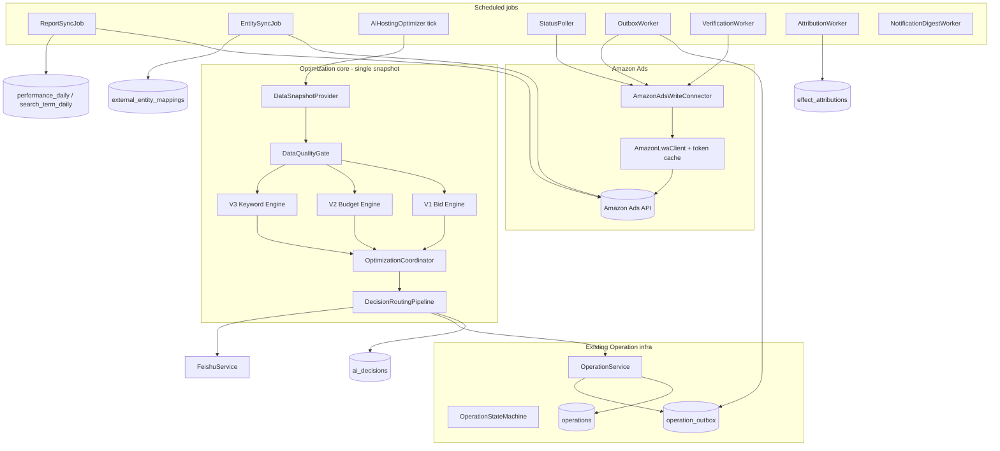
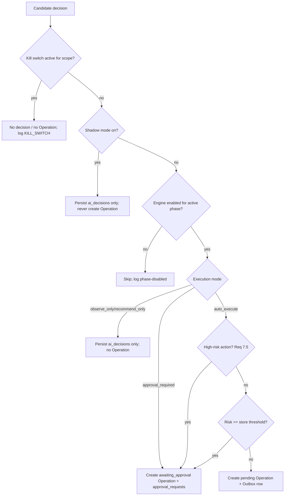
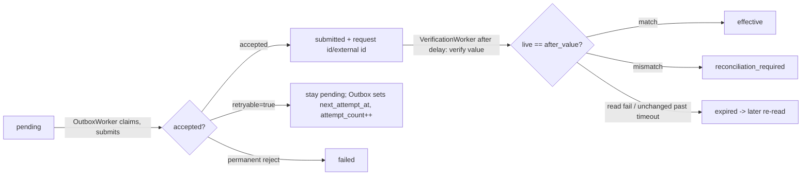

# Design Document

## Overview

The **Amazon Ads AI Hosting System** closes the loop between AdPilot's existing
Operation infrastructure (the `advertising-workspace-rework` spec �Operation state
machine, Outbox, StatusPoller, PersonalityResolver, SafetyBoundaryResolver,
`AiHostingOptimizer` V1) and real **Amazon Ads API** execution, then layers on V2
budget optimization, V3 keyword/negative-keyword engines, a single-snapshot
optimization coordinator, real-data dashboard, effect attribution, Feishu
notifications, rollback, and production governance (shadow/canary/kill-switch).

This design is deliberately **additive**. It reuses, rather than re-invents, the
write path that already exists:

- `OperationService.createOperation(...)` remains the single transactional entry
  point that persists the `operations` row, the `operation_pending_changes` overlay,
  the audit log, and (for a write-capable `platform_mutation`) the `operation_outbox`
  row �never calling the platform inside the transaction.
- `OutboxWorker` remains the single component that submits `pending` Operations to a
  platform connector, and `StatusPoller` remains the component that resolves
  in-flight Operations.
- `OperationStateMachine` remains the single transition authority.
- `SafetyBoundaryResolver` / `SafetyBoundary` / `SafetyBoundaryLimits` remain the
  pure boundary-resolution core.
- `FeishuService` remains the notification integration resolver.

The net-new work is: (1) a concrete `AmazonAdsWriteConnector` implementing the
existing `PlatformWriteConnector` SPI; (2) the asynchronous Amazon Ads **Reporting**
and **Entity** sync jobs; (3) the data-quality gate; (4) the V2/V3 engines and the
`OptimizationCoordinator`; (5) the enhanced multi-level safety boundaries with
explicit comparison semantics and only-tighten inheritance; (6) the deterministic
`RiskScore` + `ExecutionMode` precedence pipeline; (7) the `ai_decisions` store and
immutable `Decision_Snapshot`; (8) effect attribution; (9) rollback; (10) the
real-data dashboard, settings, and analytics APIs; and (11) production governance.

### Key research findings that shaped the design

- **The Amazon Ads write SPI must be extended, not forked.** `PlatformWriteResult`
  is today a 3-field record `(accepted, platformReference, message)`. Requirements
  1.8/1.9/1.11/1.12/16.5 require **structured** fields (Amazon request ID, external
  entity ID, platform error code, `retryable`, `retryAfter`). We extend the record
  with new fields and keep the existing factory methods working, so the automation
  runner and write-back service compile unchanged.
- **The Outbox is the single retry owner.** The connector performs exactly one
  platform call per `submit(...)` invocation and never sleeps/loops; all delayed
  retry scheduling lives on the Outbox row (`attempt_count`, `next_attempt_at`,
  `last_error` �new columns). This is consistent with Requirements 1.8, 1.9, 15.2,
  30.7.
- **The approval edge must change.** The current `OperationStateMachine` maps
  `awaiting_approval --APPROVE--> submitted`, but `OutboxWorker` only claims
  `pending` rows. Requirement 7.7/24.2 require `awaiting_approval --APPROVE-->
  pending`. We change the `APPROVE` edge to land on `PENDING` and ensure the Outbox
  row exists at approval time.
- **Read-after-write verification needs context the current `queryStatus` lacks.**
  `queryStatus(ctx, platformReference)` has no entity type/field/expected value, so
  it cannot compare a live value to the Operation's `after_value`. We add a
  `verify(ConnectionContext, PlatformChange, SubmissionMetadata)` default method to
  the SPI (Requirement 16.6 option a) returning structured live field values for the
  business layer to compare.
- **`performance_daily` must be hardened.** Its date column is `date` (Requirement
  32.1 mandates `report_date`), it has no uniqueness, currency, `data_status`,
  `data_version`, or `updated_at`. Search-term data must NOT overload it; it lives in
  a new `search_term_daily` table (Requirements 31, 32.5).
- **`personality_policies` scoping is broken.** Its `UNIQUE(scope, personality)` (no
  `scope_id`) makes a "store" policy global. Requirement 38 requires keying by
  `(scope_type, scope_id, personality, rule_version)` with a single active version.
- **Org isolation is layered on top of data-scope.** Stores carry `org_id`; the
  hosting layer validates that every inbound id resolves to a store in the caller's
  org BEFORE the existing `DataScopeService` store-level checks (Requirement 39).

### Phasing

Implementation follows the 11 governance phases declared in the requirements. The
`HostingPhase` enum (V1/V2/V3) gates *engine capability*; the new `ExecutionMode`,
`Shadow_Mode`, and `Kill_Switch` gate *whether decisions execute*. These are
orthogonal and combined by the fixed precedence pipeline (Requirement 7.10).

## Architecture

### System context



### Optimization run sequence (single immutable snapshot)

```mermaid
sequenceDiagram
  participant Trig as Trigger (scheduled/manual)
  participant Run as OptimizationRunService
  participant Snap as DataSnapshotProvider
  participant Gate as DataQualityGate
  participant Eng as V1/V2/V3 engines
  participant Coord as OptimizationCoordinator
  participant Pipe as DecisionRoutingPipeline
  participant OpSvc as OperationService

  Trig->>Run: trigger(storeId, campaignId?)
  Run->>Run: create optimization_runs row (status=running)
  Run->>Snap: capture(store, lookback) -> immutable snapshot
  loop per hosted campaign
    Run->>Gate: check(campaign, snapshot)
    alt gate fails (stale/incomplete/fail-closed)
      Run->>Run: record skip reason
    else gate passes
      Eng->>Eng: produce candidate decisions from snapshot
      Coord->>Coord: de-conflict, prioritize, clip to safety boundary
      loop per surviving candidate
        Pipe->>Pipe: KillSwitch -> Shadow -> Phase -> ExecMode -> HighRisk -> RiskThreshold
        Pipe->>OpSvc: persist ai_decisions; create Operation (pending|awaiting_approval) or none
      end
    end
  end
  Run->>Run: finalize optimization_runs (status=completed, per-campaign results)
```

### Decision routing pipeline (Requirement 7.10)

The pipeline is a single fixed-precedence function so every module agrees on the
outcome. A higher-precedence stop short-circuits all lower stages.



### Write/verify lifecycle (Requirements 16.7, 20)



The connector NEVER sleeps for a retry; a `retryable` rejection is returned and the
Outbox owns the delayed re-claim via `next_attempt_at`.

## Components and Interfaces

### 1. Amazon Ads Write Connector (`apisync.connector`)

`AmazonAdsWriteConnector implements PlatformWriteConnector`, registered as a Spring
bean with `platform() == "amazon_ads"`. It is discovered automatically by
`OutboxWorker`/`StatusPoller` (which build `Map<platform, connector>` from all
injected beans).

Responsibilities (Requirement 1, 15, 16):
- Translate a `PlatformChange` into the correct Amazon Ads API call by `changeType`:
  keyword bid (`bid`), campaign budget (`budget`), campaign state (`state`), keyword
  creation (`keyword`), negative keyword creation (`negative_keyword`).
- Resolve the internal entity's Amazon external id from `external_entity_mappings`
  (reject `NO_EXTERNAL_MAPPING` when absent).
- Obtain a fresh LWA access token via a new `AmazonAdsTokenService` (caches per
  `PlatformConnection`, proactive refresh within 5 minutes of expiry, decrypts
  `refresh_token` via `CryptoUtil`).
- Perform **exactly one** HTTP call per `submit`. Map results:
  - 2xx success �`PlatformWriteResult.accepted(...)` carrying Amazon request id +
    external entity id as structured fields.
  - 429 �rejected, `retryable=true`, `retryAfter` from `Retry-After`.
  - 500/502/503 �rejected, `retryable=true`, suggested backoff.
  - 400/422 �rejected, `retryable=false`, structured `platformErrorCode`.
  - invalid/revoked refresh token �rejected reason `TOKEN_INVALID`; mark store write
    capability degraded and connection `token_expired`.
- Implement `verify(ctx, change, submissionMetadata)` (new SPI default) by re-reading
  the entity's current field value and returning a structured `PlatformVerifyResult`.

#### SPI extension (`apisync.model`, `apisync.connector`)

`PlatformWriteResult` is extended from a 3-field record to carry structured fields.
Existing factory methods are preserved; new fields default to null/false.

```java
public record PlatformWriteResult(
    boolean accepted,
    String platformReference,   // legacy: generic reference
    String message,
    String amazonRequestId,     // Req 1.11 / 16.5
    String externalEntityId,    // Req 1.11 / 16.5
    String platformErrorCode,   // Req 1.12 / 16.5
    boolean retryable,          // Req 1.8 / 1.9 / 16.5
    Long retryAfterSeconds) {   // Req 1.8 / 16.5 (nullable backoff hint)

  // existing 3-arg factories retained, delegating with null/false defaults
  public static PlatformWriteResult accepted(String platformReference, String message) { ... }
  public static PlatformWriteResult rejected(String reason) { ... }
  // new factories
  public static PlatformWriteResult acceptedAmazon(String amazonRequestId, String externalEntityId, String message) { ... }
  public static PlatformWriteResult retryable(String reason, Long retryAfterSeconds) { ... }
  public static PlatformWriteResult permanentReject(String platformErrorCode, String reason) { ... }
}
```

New SPI verification method (default so existing connectors are unaffected,
Requirement 16.6 option a):

```java
default PlatformVerifyResult verify(ConnectionContext ctx, PlatformChange change,
                                    SubmissionMetadata meta) {
    return PlatformVerifyResult.unsupported();
}
```

`PlatformVerifyResult` is a new record `(boolean read, String entityType, String
field, String liveValue, String message)`. The business layer (VerificationWorker)
compares `liveValue` to the Operation's `after_value`. A future
`submitBatch(ctx, List<PlatformChange>)` returning `BatchPlatformWriteResult` is a
declared-but-deferred extension (Requirement 16.3).

`SubmissionMetadata` is a new record carrying `(amazonRequestId, externalEntityId,
entityType, field, expectedAfterValue)` persisted on the Operation at acceptance.

### 2. Rate limiting and token management (`apisync.connector`)

- `AmazonAdsRateLimiter`: per-profile token-bucket (default 10 req/s, configurable).
  `nextAvailableInstant()` is consulted by the Outbox; the limiter never blocks the
  caller thread. Backed by Redis when available, falling back to an in-memory/DB
  counter (Requirement 30.3).
- `AmazonAdsTokenService`: caches LWA access tokens per connection; refreshes
  proactively; on `invalid_grant` marks the connection `token_expired`, stops calls,
  and triggers a Feishu alert (Requirement 15.4).
- Adaptive backoff: when >10 rate-limited responses occur in 5 minutes, reduce target
  rate by 50% for 15 minutes (Requirement 15.6).
- API call logging (endpoint, HTTP status, latency_ms, operation_id, retry_count) via
  `PlatformLogSanitizer` so no credential values are logged (Requirement 15.5).

### 3. Report Sync (`advertising` or new `hosting` package under advertising)

`ReportSyncJob` (scheduled) drives the Amazon Ads **asynchronous** reporting
lifecycle per report type (SP campaign, keyword, search term):
`create �poll status until COMPLETED �fetch download URL �download �gunzip �
validate (reportId, date range, row count) �idempotent upsert`.

- Three cadences (Requirement 2.1): intra-day incremental (default hourly), daily
  (default 06:00 marketplace tz) with finalization promotion, rolling 7�4 day
  backfill.
- Resolves Amazon ids �internal UUIDs via `external_entity_mappings`; unresolved
  rows are **quarantined** in `metric_quarantine` (Requirement 2.3, 14.6) �never
  fabricates entities.
- Idempotent upsert keyed by `(store_id, entity_type, entity_id, report_date)`.
  `data_status` derived from age (`preliminary` for D0/recent; `finalized` after
  `finalizationLagDays`); `data_version` incremented when a backfill changes a row.
- Persists each run in `report_sync_runs`; gap detection uses
  `expectedFinalizedDate = today �finalizationLagDays`. A >2-day finalized gap logs
  a warning and sends a Feishu data-gap notification.
- Search-term rows land in `search_term_daily`, not `performance_daily`.
- Retries up to 3× with exponential backoff; failures recorded against the concrete
  run in `report_sync_errors`.

A `ReportLifecycleClient` (new) encapsulates the create/poll/download calls;
`AmazonAdsConnector` (the existing read connector) is extended or complemented for the
async lifecycle (the current `report-rows` synchronous URL is replaced by the async
flow per the platform note).

### 4. Entity Sync (`advertising` hosting package)

`EntitySyncJob` pulls Amazon campaign/ad-group/keyword **metadata** and upserts
complete local entities + `external_entity_mappings` (origin `amazon_import`). Runs
before/independently of metric ingestion so metrics attach to complete entities
(Requirement 14.4). On read-after-write of a locally-created entity, updates the
mapping with the Amazon-assigned id (Requirement 14.5).

### 5. Data Quality Gate (`advertising` hosting package)

`DataQualityGate` is a pure-ish service (DB reads only) invoked (a) before an engine
evaluates a campaign and (b) immediately before an Operation is submitted
(Requirement 3.7, 33.2).

- Freshness: data no older than the configured window (default 48h).
- Completeness: judged against **`report_sync_runs` finalized coverage** for the
  required lookback, NOT by counting non-empty performance rows (Requirement 3.2).
- Fail-closed: on DB error / missing coverage info, refuse to optimize (Requirement
  3.5).
- Returns a structured `DataQualityResult(passed, reason)` with reasons `DATA_STALE`
  / `DATA_INCOMPLETE` recorded in the optimization run log; rejected campaigns are
  batched into the next Feishu digest.

### 6. Optimization engines and coordinator

All engines read the **single immutable `DataSnapshot`** captured at run start by
`DataSnapshotProvider` (Requirement 23.1, 4.1, 36.3) and emit `CandidateDecision`
objects to the `OptimizationCoordinator` �they never create Operations directly.

- **V1 Bid Engine (hardened, Requirement 36).** Replaces the current
  campaign-aggregated ACoS with **keyword-level** ACoS from keyword performance rows.
  Skips keywords with insufficient keyword-level data (no fallback to the aggregate).
  Honors `adjustmentCooldownHours` at keyword grain and a keyword-level in-flight
  conflict lock. Until Requirement 36 is complete, V1 runs only in
  `observe_only`/shadow. Clamps within `minBid`/`maxBid`/`maxCpc`/
  `maxBidAdjustmentRatio`.
- **V2 Budget Engine (Requirement 4).** Computes a candidate daily budget from target
  ACoS, actual ACoS over `lookbackDays`, spend velocity, and inventory days. Honors
  cooldown, `NO_TARGET_ACOS` skip, inventory thresholds, and clamps to budget bounds.
- **V3 Keyword Engine (Requirement 5).** Scores search terms from `search_term_daily`,
  proposes exact-match keywords (orders + ACoS below target + confidence), proposes
  negatives (high clicks + zero orders + confidence), enforces brand-word protection
  (hard reject), per-day caps, and `keywordExpansionMode`/`negativeKeywordMode`. Marks
  keyword/negative additions non-reversible.
- **`OptimizationCoordinator` (Requirement 23).** After all engines produce
  candidates against the same snapshot: de-conflicts (skips candidates colliding with
  an unsettled Operation on the same entity/field), models cross-engine interactions
  (a budget decrease constrains bid increases), prioritizes by risk (lowest first),
  enforces `maxOperationsPerRun` and `maxOperationsPerDay`, applies safety-boundary
  clipping, then hands survivors to the `DecisionRoutingPipeline`.

### 7. Enhanced Safety Boundaries (`advertising.support`)

The existing `SafetyBoundaryLimit` enum (MIN_BID, MAX_BID, MAX_CPC, MAX_DAILY_BUDGET)
is extended with all Requirement 6.1 limits. Each limit declares its
**`comparison_semantics`**:

- **Upper-bound** limits: smaller is more restrictive.
- **Lower-bound** limits: larger is more restrictive.
- **emergencyStop**: boolean OR.
- **allowed-action sets**: set intersection.

`SafetyBoundaryResolver` is upgraded from "first-definer-wins" to
**most-restrictive-wins** intersection across the 5-level hierarchy
`campaign �goal �store �organization �system` (Requirement 6.2, 6.4). The result
is computed per-limit by folding each level's value through that limit's
`more_restrictive(a, b)` operator, so inheritance can only tighten. A
`SafetyBoundaryValidator` enforces only-tighten configuration (reject a looser
lower-level value) and cross-field constraints (`minBid �maxBid`,
`inventoryCriticalDays �inventorySafetyDays �inventoryHealthyDays`).

Boundaries persist in a new `safety_boundaries` table with a typed value model
(`value_type` �amount/ratio/integer/boolean) so a single column does not ambiguously
carry all kinds.

`EmergencyStopEvaluator` computes the boolean-OR emergency condition (daily spend >
`emergencySpendToBudgetMultiplier` × budget, OR ACoS >
`emergencyAcosToTargetMultiplier` × target). On breach: (a) the internal **AI Kill
Switch** for the campaign takes effect immediately and automatically (no approval);
(b) any Amazon-facing action follows its Execution_Mode / `emergency_auto_action_enabled`.

### 8. Risk, Execution Mode, and routing

- `RiskScoreCalculator` (pure, deterministic, versioned). Computes a 0.0�.0 score
  from change magnitude relative to current value, data confidence (days of data,
  significance), historical volatility, and absolute dollar impact. Records its
  `formula_version` in the Decision_Snapshot. Same inputs �same score.
- `ExecutionModeResolver` resolves `observe_only | recommend_only | approval_required
  | auto_execute` by `campaign > goal > store` inheritance; new stores default to
  `observe_only`.
- `DecisionRoutingPipeline` implements the fixed precedence of Requirement 7.10
  (KillSwitch �Shadow �Phase �ExecutionMode �HighRisk gate �RiskThreshold) and
  is the only place that decides whether a candidate becomes no Operation, an
  `ai_decisions`-only row, a `pending` Operation, or an `awaiting_approval` Operation
  with a linked `approval_requests` record.
- High-risk classification (`HighRiskClassifier`, Requirement 7.5): campaign
  state changes, keyword/negative additions, and large budget reductions (>
  `maxDailyBudgetDecreaseRatio`) always route to `awaiting_approval` within executing
  modes; ordinary reductions route by risk; a brand-word negative is hard-rejected
  (never proposed).

### 9. AI Decision storage and immutable snapshot

- `ai_decisions` table persists every decision regardless of Execution_Mode
  (Requirement 37), with `promoted_operation_id` linking to an Operation when created.
- `DecisionSnapshot` is an immutable JSON value object (Requirement 34) written once
  at decision creation onto both `ai_decisions.decision_snapshot` and (when promoted)
  the Operation's `ai_decision`/snapshot column. It captures data cutoff + lookback,
  metric inputs, DQ gate result, resolved personality + inheritance chain, each
  effective boundary + source level, risk formula version + score, rule_version,
  currency, marketplace timezone, Execution_Mode, and Kill/Shadow flags. It is the
  sole source for Decision_Explanation cards (never reconstructed from live data).

### 10. Effect Attribution

- `AttributionWorker` starts a measurement window (default 7 days) when an Operation
  reaches `effective`, then computes per-metric `observed_change`,
  `estimated_incremental_impact` (nullable when no reliable baseline),
  `attribution_confidence`, recording `attribution_method` + `method_version` in
  `effect_attributions`. Overlapping windows on the same campaign lower confidence
  rather than double-crediting (Requirement 8.5). Dashboard/analytics figures are
  always labelled estimates derived from `estimated_incremental_impact`.

### 11. Feishu notifications

- `HostingNotificationService` builds typed notifications (approval-needed,
  effective-confirmed, failed, emergency, data-gap) and resolves the active
  integration via `FeishuService` (supporting `app` and `webhook`). Non-urgent
  confirmations are batched into a digest (default 30 min) by
  `NotificationDigestWorker`; emergencies send immediately with priority marking.
  Delivery failures retry 3× with backoff and are recorded in
  `notification_delivery_log`. When Feishu is unreachable, notifications queue and do
  not block optimization (Requirement 30.4).
- `feishu_notification_rules` references the integration; webhook URL/secret are read
  from the resolved integration and decrypted only at point of use.

### 12. Rollback

- `RollbackService` creates a `Compensating_Operation` (before/after swapped,
  `OperationSource.MANUAL`, `parentOperationId` = original) for an `effective`,
  `reversible` Operation and routes it through the standard pipeline. Bid/budget
  changes are reversible; keyword/negative additions are not. Subsequent overlapping
  operations on the same field trigger a conflict warning requiring confirmation
  (Requirement 10.5).

### 13. APIs (controllers under `advertising.controller`, `/api/advertising/hosting`)

All endpoints use the `ApiResponse` envelope, `@RequirePermission`, and the org +
data-scope guards. Error codes follow `HOSTING_{CATEGORY}_{DETAIL}` (Requirement 26).

| Method & path | Permission | Purpose |
|---|---|---|
| `GET /hosting/config/{storeId}` | `advertising:manage` | Load store hosting config (Req 21.1) |
| `PUT /hosting/config/{storeId}` | `advertising:execute` | Persist + validate config (Req 21.2) |
| `GET /hosting/config/{storeId}/goals/{goalId}` | `advertising:manage` | Goal override (Req 21.5) |
| `GET /hosting/config/{storeId}/campaigns/{campaignId}` | `advertising:manage` | Campaign override (Req 21.5) |
| `GET /hosting/dashboard/summary?storeId=` | `advertising:view` | Summary cards (Req 27) |
| `GET /hosting/decisions?storeId=` | `advertising:view` | Decision list from `ai_decisions` (Req 11.4) |
| `GET /hosting/decisions/{id}` | `advertising:view` | Decision explanation card (Req 13) |
| `POST /hosting/operations/{id}/approve` | `advertising:approve` | APPROVE �pending (Req 24.2) |
| `POST /hosting/operations/{id}/reject` | `advertising:approve` | REJECT �cancelled (Req 24.3) |
| `POST /hosting/operations/{id}/rollback` | `advertising:execute` | Compensating op (Req 10) |
| `POST /hosting/optimize/trigger` | `advertising:execute` | 202 + run_id (Req 28) |
| `GET /hosting/optimization-runs/{runId}` | `advertising:view` | Run status/results (Req 28.7) |
| `GET /hosting/analytics?storeId=&period=` | `advertising:view` | Historical analytics (Req 29) |
| `GET/POST/DELETE /hosting/brand-words/{storeId}` | view/execute | Brand-word CRUD (Req 22) |
| `GET /hosting/health` | `advertising:view` | Dependency health (Req 30.5) |
| `POST /hosting/phase` (admin) | `advertising:execute` | Phase change V1↔V2↔V3 (Req 17.5) |

The summary endpoint computes "today" in marketplace tz, uses indexed queries +
optional Redis cache (TTL 60s), and targets <500ms for 1000-campaign stores.

### 14. Frontend (React + TS, under `frontend/src/app`)

Reuses the existing hosting components (`HostingOverview`, `HostingSettingsDrawer`,
`AiHostingTab`) and the unified `api.ts` client. New API functions follow the
existing `request`/`requestList` pattern. The dashboard auto-refreshes every 60s,
shows approve/reject for `awaiting_approval` (gated on `advertising:approve`), and a
decision explanation view. Per Requirement 41, the dashboard/settings/approval UI
conform to the platform-wide conventions owned by other specs and do not re-specify
auth/navigation hardening.

### 15. Production governance (Phase 11)

- `KillSwitchService` at System/org/store/campaign levels: activation cancels
  `awaiting_approval`, supersedes/cancels in-scope `pending` and closes their Outbox
  rows, and routes already-submitted ops through platform cancel/reconciliation.
  Outbox and engines re-check the kill switch immediately before submitting.
- `ShadowModeService`, `CanaryRolloutService`, `SloMonitor`, `DriftMonitor`, and a
  documented rollback drill round out governance.

## Data Models

All new tables follow the established conventions: `CHAR(36)` UUID PKs with
`DEFAULT (UUID())`, `DATETIME(3)` timestamps (`created_at`, `updated_at ON UPDATE`),
JSON for structured payloads, and indexes declared separately. Every new table is
org-scopeable via a non-null `store_id` (FK to `stores`, which carries `org_id`) or a
direct `org_id`, per Requirement 39.2.

### Schema changes to existing tables

```sql
-- Req 32: performance_daily hardening
ALTER TABLE performance_daily
  CHANGE COLUMN date report_date DATE NOT NULL,                 -- 32.1 consistent name
  ADD COLUMN currency      VARCHAR(10) NULL,                    -- 32.3
  ADD COLUMN data_status   VARCHAR(12) NOT NULL DEFAULT 'preliminary'
      CHECK (data_status IN ('preliminary','finalized')),       -- 32.4
  ADD COLUMN data_version  INT NOT NULL DEFAULT 1,              -- 32.4
  ADD COLUMN updated_at    DATETIME(3) DEFAULT CURRENT_TIMESTAMP(3) ON UPDATE CURRENT_TIMESTAMP(3); -- 32.2
ALTER TABLE performance_daily
  ADD CONSTRAINT uq_perf_daily UNIQUE (store_id, entity_type, entity_id, report_date); -- 32.1

-- Req 14.3: reverse-direction uniqueness on external_entity_mappings
ALTER TABLE external_entity_mappings
  ADD CONSTRAINT uq_eem_external UNIQUE (store_id, platform, external_entity_type, external_entity_id);

-- Req 16.7: Outbox retry ownership columns
ALTER TABLE operation_outbox
  ADD COLUMN next_attempt_at DATETIME(3) NULL,
  ADD COLUMN last_error      VARCHAR(500) NULL;

-- Req 38: personality_policies scoping fix
ALTER TABLE personality_policies
  ADD COLUMN scope_id       CHAR(36) NULL,
  ADD COLUMN status         VARCHAR(12) NOT NULL DEFAULT 'active',
  ADD COLUMN effective_from DATETIME(3) NULL,
  ADD COLUMN effective_to   DATETIME(3) NULL,
  DROP INDEX uq_personality_policies_scope_personality,
  ADD CONSTRAINT uq_pp_scope UNIQUE (scope, scope_id, personality, rule_version);
-- enforced in service: at most one status='active' per (scope, scope_id, personality)
```

The new optional transient `submitting` SyncState (Requirement 16.7) is represented
by adding `SUBMITTING` to the `SyncState` enum and the `OperationStateMachine`
(`pending �submitting �submitted|pending-on-retryable`); only confirmed acceptance
reaches `submitted`.

### New tables

```sql
-- Req 2.7: per-run report sync ledger
CREATE TABLE IF NOT EXISTS report_sync_runs (
    id CHAR(36) PRIMARY KEY DEFAULT (UUID()),
    store_id CHAR(36) NOT NULL REFERENCES stores(id),
    report_type VARCHAR(40) NOT NULL,           -- sp_campaign / sp_keyword / sp_search_term
    requested_date_start DATE NOT NULL,
    requested_date_end DATE NOT NULL,
    report_status VARCHAR(20) NOT NULL,         -- requested/completed/failed/expired
    data_status VARCHAR(12) NOT NULL,           -- preliminary / finalized
    row_count INT NOT NULL DEFAULT 0,
    amazon_report_id VARCHAR(120) NULL,
    started_at DATETIME(3) NULL,
    completed_at DATETIME(3) NULL,
    error VARCHAR(1000) NULL,
    created_at DATETIME(3) DEFAULT CURRENT_TIMESTAMP(3),
    updated_at DATETIME(3) DEFAULT CURRENT_TIMESTAMP(3) ON UPDATE CURRENT_TIMESTAMP(3)
);

CREATE TABLE IF NOT EXISTS report_sync_errors (
    id CHAR(36) PRIMARY KEY DEFAULT (UUID()),
    run_id CHAR(36) NOT NULL REFERENCES report_sync_runs(id),
    store_id CHAR(36) NOT NULL REFERENCES stores(id),
    attempt INT NOT NULL DEFAULT 1,
    error VARCHAR(1000),
    created_at DATETIME(3) DEFAULT CURRENT_TIMESTAMP(3)
);

-- Req 31: dedicated daily search-term store
CREATE TABLE IF NOT EXISTS search_term_daily (
    id CHAR(36) PRIMARY KEY DEFAULT (UUID()),
    store_id CHAR(36) NOT NULL REFERENCES stores(id),
    campaign_id CHAR(36) NOT NULL,
    ad_group_id CHAR(36) NOT NULL,
    search_term VARCHAR(500) NOT NULL,
    report_date DATE NOT NULL,
    impressions BIGINT DEFAULT 0,
    clicks INT DEFAULT 0,
    orders INT DEFAULT 0,
    spend DECIMAL(18,4) DEFAULT 0,
    sales DECIMAL(18,4) DEFAULT 0,
    acos DECIMAL(10,6) DEFAULT 0,
    currency VARCHAR(10) NULL,
    data_status VARCHAR(12) NOT NULL DEFAULT 'preliminary',
    data_version INT NOT NULL DEFAULT 1,
    updated_at DATETIME(3) DEFAULT CURRENT_TIMESTAMP(3) ON UPDATE CURRENT_TIMESTAMP(3),
    created_at DATETIME(3) DEFAULT CURRENT_TIMESTAMP(3),
    CONSTRAINT uq_std UNIQUE (store_id, campaign_id, ad_group_id, search_term, report_date)
);

-- Req 14.6: quarantine for unresolved metric rows
CREATE TABLE IF NOT EXISTS metric_quarantine (
    id CHAR(36) PRIMARY KEY DEFAULT (UUID()),
    store_id CHAR(36) NOT NULL REFERENCES stores(id),
    report_type VARCHAR(40) NOT NULL,
    external_entity_type VARCHAR(50),
    external_entity_id VARCHAR(255),
    report_date DATE,
    raw_row JSON,
    reason VARCHAR(200),
    resolved TINYINT(1) NOT NULL DEFAULT 0,
    created_at DATETIME(3) DEFAULT CURRENT_TIMESTAMP(3)
);

-- Req 6.7 / 6.2: typed multi-level safety boundaries
CREATE TABLE IF NOT EXISTS safety_boundaries (
    id CHAR(36) PRIMARY KEY DEFAULT (UUID()),
    level VARCHAR(20) NOT NULL,        -- campaign/goal/store/organization/system
    level_id CHAR(36) NULL,            -- null for system
    store_id CHAR(36) NULL REFERENCES stores(id),  -- org scoping where applicable
    org_id CHAR(36) NULL REFERENCES organizations(id),
    limit_name VARCHAR(60) NOT NULL,
    limit_value VARCHAR(60) NULL,      -- rendered per value_type
    value_type VARCHAR(12) NOT NULL,   -- amount/ratio/integer/boolean
    unit VARCHAR(20) NULL,
    currency VARCHAR(10) NULL,
    comparison_semantics VARCHAR(20) NOT NULL, -- upper_bound/lower_bound/boolean_or/set_intersection
    updated_by CHAR(36) NULL,
    updated_at DATETIME(3) DEFAULT CURRENT_TIMESTAMP(3) ON UPDATE CURRENT_TIMESTAMP(3),
    created_at DATETIME(3) DEFAULT CURRENT_TIMESTAMP(3),
    CONSTRAINT uq_sb UNIQUE (level, level_id, limit_name)
);

-- Req 22: brand word protection
CREATE TABLE IF NOT EXISTS brand_word_lists (
    id CHAR(36) PRIMARY KEY DEFAULT (UUID()),
    store_id CHAR(36) NOT NULL REFERENCES stores(id),
    word VARCHAR(255) NOT NULL,
    match_type VARCHAR(10) NOT NULL DEFAULT 'exact', -- exact/contains
    created_by CHAR(36) NULL,
    created_at DATETIME(3) DEFAULT CURRENT_TIMESTAMP(3)
);

-- Req 37: AI decisions store
CREATE TABLE IF NOT EXISTS ai_decisions (
    id CHAR(36) PRIMARY KEY DEFAULT (UUID()),
    run_id CHAR(36) NULL REFERENCES optimization_runs(id),
    store_id CHAR(36) NOT NULL REFERENCES stores(id),
    campaign_id CHAR(36) NULL,
    engine_type VARCHAR(20) NOT NULL,    -- V1_bid/V2_budget/V3_keyword
    execution_mode VARCHAR(20) NOT NULL,
    decision_status VARCHAR(20) NOT NULL,
    entity_type VARCHAR(40) NOT NULL,
    entity_id CHAR(36) NULL,
    field VARCHAR(40) NULL,
    before_value JSON,
    after_value JSON,
    risk_score DECIMAL(6,5) NOT NULL DEFAULT 0,
    decision_snapshot JSON NOT NULL,     -- Req 34 immutable
    expires_at DATETIME(3) NULL,         -- Req 33.1
    promoted_operation_id CHAR(36) NULL REFERENCES operations(id),
    created_at DATETIME(3) DEFAULT CURRENT_TIMESTAMP(3)
);

-- Req 8.3: effect attribution
CREATE TABLE IF NOT EXISTS effect_attributions (
    id CHAR(36) PRIMARY KEY DEFAULT (UUID()),
    operation_id CHAR(36) NOT NULL REFERENCES operations(id),
    store_id CHAR(36) NOT NULL REFERENCES stores(id),
    metric_name VARCHAR(30) NOT NULL,
    before_value DECIMAL(18,6),
    after_value DECIMAL(18,6),
    observed_change DECIMAL(18,6),
    observed_change_percent DECIMAL(10,4),
    estimated_incremental_impact DECIMAL(18,6) NULL,   -- nullable when no baseline
    attribution_method VARCHAR(40),
    method_version VARCHAR(20),
    attribution_confidence DECIMAL(6,5),
    measurement_start DATETIME(3),
    measurement_end DATETIME(3),
    created_at DATETIME(3) DEFAULT CURRENT_TIMESTAMP(3)
);

-- Req 18: optimization runs
CREATE TABLE IF NOT EXISTS optimization_runs (
    id CHAR(36) PRIMARY KEY DEFAULT (UUID()),
    store_id CHAR(36) NOT NULL REFERENCES stores(id),
    trigger_type VARCHAR(12) NOT NULL,   -- scheduled/manual
    phase VARCHAR(4) NOT NULL,
    status VARCHAR(12) NOT NULL,         -- running/completed/failed
    snapshot_ref CHAR(36) NULL,
    campaigns_evaluated INT DEFAULT 0,
    campaigns_skipped INT DEFAULT 0,
    decisions_generated INT DEFAULT 0,
    decisions_auto_executed INT DEFAULT 0,
    decisions_requiring_approval INT DEFAULT 0,
    results JSON,                        -- per-campaign detail incl. skip reasons
    start_time DATETIME(3),
    end_time DATETIME(3),
    created_at DATETIME(3) DEFAULT CURRENT_TIMESTAMP(3)
);

-- Req 9.7: notification delivery log; Req 9.6: notification rules
CREATE TABLE IF NOT EXISTS notification_delivery_log (
    id CHAR(36) PRIMARY KEY DEFAULT (UUID()),
    store_id CHAR(36) NULL REFERENCES stores(id),
    notification_type VARCHAR(40) NOT NULL,
    status VARCHAR(12) NOT NULL,         -- delivered/failed/queued
    attempt INT NOT NULL DEFAULT 1,
    error VARCHAR(1000) NULL,
    created_at DATETIME(3) DEFAULT CURRENT_TIMESTAMP(3)
);

-- Req 35.3: kill switches and rollout state
CREATE TABLE IF NOT EXISTS hosting_kill_switches (
    id CHAR(36) PRIMARY KEY DEFAULT (UUID()),
    level VARCHAR(20) NOT NULL,          -- system/organization/store/campaign
    level_id CHAR(36) NULL,
    org_id CHAR(36) NULL REFERENCES organizations(id),
    active TINYINT(1) NOT NULL DEFAULT 0,
    reason VARCHAR(500) NULL,
    activated_by CHAR(36) NULL,
    activated_at DATETIME(3) NULL,
    created_at DATETIME(3) DEFAULT CURRENT_TIMESTAMP(3),
    CONSTRAINT uq_ks UNIQUE (level, level_id)
);

-- Req 12 / 21: per-scope hosting configuration
CREATE TABLE IF NOT EXISTS hosting_configs (
    id CHAR(36) PRIMARY KEY DEFAULT (UUID()),
    scope_type VARCHAR(12) NOT NULL,     -- store/goal/campaign
    scope_id CHAR(36) NOT NULL,
    store_id CHAR(36) NOT NULL REFERENCES stores(id),
    active_phase VARCHAR(4) NULL,
    default_personality VARCHAR(20) NULL,
    execution_mode VARCHAR(20) NULL,
    auto_execute_threshold DECIMAL(6,5) NULL,
    emergency_auto_action_enabled TINYINT(1) NOT NULL DEFAULT 0,
    shadow_mode TINYINT(1) NOT NULL DEFAULT 0,
    notification_preferences JSON,
    updated_by CHAR(36) NULL,
    updated_at DATETIME(3) DEFAULT CURRENT_TIMESTAMP(3) ON UPDATE CURRENT_TIMESTAMP(3),
    created_at DATETIME(3) DEFAULT CURRENT_TIMESTAMP(3),
    CONSTRAINT uq_hc UNIQUE (scope_type, scope_id)
);
```

### Key domain value objects (Java)

- `DataSnapshot` �immutable point-in-time view passed to all engines.
- `CandidateDecision(engineType, entityType, entityId, field, before, after,
  reversible, riskScore, evidence, decisionSnapshot)` �engine output.
- `DecisionSnapshot` �immutable JSON record (Requirement 34) serialized via the
  existing `OperationJsonCodec`/Jackson conventions.
- `RiskScore(value, formulaVersion, components)`.
- `ExecutionMode` enum; `EngineType` enum (`V1_BID`, `V2_BUDGET`, `V3_KEYWORD`).
- `BoundaryComparison` enum (`UPPER_BOUND`, `LOWER_BOUND`, `BOOLEAN_OR`,
  `SET_INTERSECTION`) attached to each `SafetyBoundaryLimit`.

## Correctness Properties

*A property is a characteristic or behavior that should hold true across all valid
executions of a system �essentially, a formal statement about what the system should
do. Properties serve as the bridge between human-readable specifications and
machine-verifiable correctness guarantees.*

The following properties were derived from the prework analysis and consolidated to
remove redundancy (for example, the many read-after-write verification criteria
collapse into one mapping property; all phase-gate criteria collapse into one; all
org-isolation criteria collapse into one). Each property targets pure or
deterministically-testable logic in this design's core components.

### Connector and submission

### Property 1: Connector response classification

*For any* Amazon Ads API response, the `AmazonAdsWriteConnector` produces a
`PlatformWriteResult` such that: a 2xx carries `accepted=true` with the Amazon request
id and external entity id as structured fields (never packed into `message`); a 429 or
5xx (500/502/503) carries `accepted=false`, `retryable=true`, and a backoff hint; a 400
or 422 carries `accepted=false`, `retryable=false`, and a structured platform error
code; and the call returns within a small time bound without sleeping internally.

**Validates: Requirements 1.8, 1.9, 1.11, 1.12, 16.5, 30.7**

### Property 2: Read-after-write verification mapping

*For any* triple of (expected `after_value`, live field value, read-succeeded flag), the
verification maps to `effective` if and only if the read succeeded and the live value of
the **changed field** equals the expected value; a successful read with a differing value
maps to `reconciliation_required`; a failed read maps to a retry/`reconciliation_required`
outcome; and an entity-lifecycle state string (ENABLED/PAUSED/ARCHIVED/PENDING) is never
mapped to `effective` unless lifecycle state is itself the changed field.

**Validates: Requirements 1.13, 1.14, 16.6, 20.2, 20.3**

### Property 3: Submitted only after acceptance; transport retries reuse the same Operation

*For any* sequence of submission attempts for one Operation, the Operation transitions to
`submitted` if and only if the platform has returned an accepted result; while results are
`retryable=true`, no new Operation and no new Outbox row are created, the same Outbox row's
`attempt_count` strictly increases and its `next_attempt_at` advances, and the Operation
never enters `submitted`; a permanent rejection transitions it to `failed`.

**Validates: Requirements 16.7, 30.1, 30.7**

### Property 4: Verify timeout is non-terminal

*For any* Operation whose live value cannot be read or remains unchanged past the configured
verification retries/timeout, the Operation transitions to `expired` with reason
`VERIFY_TIMEOUT`, and `expired` remains eligible for a later transition to `effective`,
`failed`, or `reconciliation_required`.

**Validates: Requirements 20.4**

### Property 5: Single submit per change

*For any* `PlatformChange`, `submit` returns exactly one `PlatformWriteResult` (no
collection); and *for any* set of Operations targeting the same Amazon entity in one run,
each Operation receives its own result, an accepted Operation advances to `submitted`, a
permanently-rejected Operation advances to `failed`, and a `retryable` Operation is left in
place for the Outbox.

**Validates: Requirements 16.1, 16.2, 16.4**

### Property 6: External mapping required for submission

*For any* internal entity with no row in `external_entity_mappings`, submitting a change for
it returns a rejected result with reason `NO_EXTERNAL_MAPPING`.

**Validates: Requirements 14.2**

### Property 7: Rate limiter never blocks

*For any* burst of calls exceeding the configured per-profile rate, the rate limiter returns
the next-available instant (a future time) rather than allowing the call or blocking the
calling thread.

**Validates: Requirements 15.1, 15.2**

### Report and entity ingestion

### Property 8: Idempotent metric upsert

*For any* multiset of report rows, ingesting it and then ingesting the same multiset again
leaves the row count in `performance_daily` (keyed by `(store_id, entity_type, entity_id,
report_date)`) and in `search_term_daily` (keyed by `(store_id, campaign_id, ad_group_id,
search_term, report_date)`) unchanged.

**Validates: Requirements 2.4, 31.1, 32.1**

### Property 9: Data status is a pure function of age

*For any* `report_date`, current date, and `finalizationLagDays`, the derived `data_status`
is `finalized` if and only if `currentDate �reportDate �finalizationLagDays`, and
`preliminary` otherwise.

**Validates: Requirements 2.4, 32.4**

### Property 10: Backfill bumps data version

*For any* previously-ingested row, re-ingesting it with at least one changed metric increments
its `data_version`, while re-ingesting it unchanged leaves `data_version` the same.

**Validates: Requirements 2.4**

### Property 11: Unresolved metric rows are quarantined, never fabricated into entities

*For any* report/metric row whose external entity id cannot be resolved to a complete local
entity, the row is written to `metric_quarantine` and no `performance_daily`/`search_term_daily`
row and no partial entity is created from metric data alone.

**Validates: Requirements 2.3, 2.5, 14.4, 14.6**

### Property 12: Finalized-coverage gap detection

*For any* set of finalized report-run dates, a finalized-coverage gap greater than 2 days
relative to `expectedFinalizedDate` (= today �`finalizationLagDays`) raises exactly one
data-gap signal, and no signal is raised when coverage has no such gap.

**Validates: Requirements 2.8**

### Data quality and pre-submission revalidation

### Property 13: Data quality gate decision

*For any* campaign and snapshot, the gate passes the freshness check if and only if the data
age is within the freshness window, and passes completeness if and only if the required
lookback range is covered by `finalized` report runs (zero-impression days with no row do not
fail completeness); when freshness or completeness cannot be determined, the gate fails closed
(returns not-passed).

**Validates: Requirements 3.1, 3.2, 3.5, 6.6, 25.5, 30.2**

### Property 14: Stale or expired decisions are never submitted

*For any* queued Operation whose `decision_expires_at` has passed or whose pre-submission
revalidation (re-run data-quality gate + re-resolved boundaries) fails, the Operation is
transitioned to `superseded`/`expired` and is not submitted.

**Validates: Requirements 3.7, 33.2, 33.3, 33.4**

### Safety boundaries

### Property 15: Per-limit more-restrictive operator

*For any* two candidate values of a limit, the `more_restrictive` operator returns the smaller
value for an upper-bound limit, the larger value for a lower-bound limit, the logical OR for
the boolean `emergencyStop`, and the set intersection for an allowed-action set.

**Validates: Requirements 6.2**

### Property 16: Boundary resolution only tightens

*For any* assignment of per-level limit values across the five levels (campaign, goal, store,
organization, system), the resolved effective value for each limit is the most-restrictive of
all defined level values per that limit's comparison semantics, and is therefore never less
restrictive than any contributing level.

**Validates: Requirements 6.4, 21.4**

### Property 17: Only-tighten configuration rejection

*For any* higher-level boundary value and a lower-level value that is less restrictive than it
(per that limit's comparison semantics), configuring the lower-level value is rejected with an
error identifying the constraining higher-level boundary.

**Validates: Requirements 6.3, 21.4**

### Property 18: Boundary cross-field validation

*For any* proposed boundary configuration, validation fails when a cross-field constraint is
violated (`minBid �maxBid`, `minDailyBudget �maxDailyBudget`, `inventoryCriticalDays �
inventorySafetyDays �inventoryHealthyDays`) and passes when all hold.

**Validates: Requirements 6.8, 12.6**

### Risk, execution mode, and the routing pipeline

### Property 19: Risk score is bounded, deterministic, and monotonic

*For any* decision inputs, the computed `Risk_Score` lies within [0.0, 1.0]; the same inputs and
configuration always yield the same score; and increasing the change magnitude (holding other
inputs fixed) never decreases the score.

**Validates: Requirements 7.1, 7.9**

### Property 20: Execution mode resolution

*For any* campaign/goal/store inheritance chain, the resolved `Execution_Mode` is the value of
the most-specific level that defines one, and a chain that defines none resolves to
`observe_only`.

**Validates: Requirements 7.2**

### Property 21: Fixed-precedence routing pipeline

*For any* combination of (kill-switch active, shadow mode, active phase, execution mode,
high-risk classification, risk score vs. store threshold), the pipeline outcome equals the
first matching stop in the fixed precedence order Kill Switch �Shadow �Phase �Execution Mode
�High-Risk Gate �Risk Threshold; a higher-precedence stop short-circuits all lower stages (so,
e.g., with shadow mode on, an `auto_execute` decision never produces a submittable Operation),
and the pipeline never itself applies the `SUBMIT` event.

**Validates: Requirements 7.3, 7.4, 7.5, 7.10, 35.1, 35.3, 37.2, 37.3**

### Property 22: Approve routes to pending, reject to cancelled

*For any* Operation, `OperationStateMachine.transition(AWAITING_APPROVAL, APPROVE)` equals
`PENDING` (there is no `awaiting_approval �submitted` edge), and
`transition(AWAITING_APPROVAL, REJECT)` equals `CANCELLED`.

**Validates: Requirements 7.7, 7.8, 24.2**

### Property 23: Approval atomicity and no self-approval

*For any* approve or reject action, the `approval_requests` status change and the linked
Operation's SyncState transition occur atomically (both succeed or neither does); and *for any*
decision whose originator equals the approver, the approval is rejected.

**Validates: Requirements 40.2, 40.4**

### Optimization engines and coordination

### Property 24: Engine phase gating

*For any* active phase, exactly the documented engines produce candidates: V1 (bid) at any
supported phase, V2 (budget) only when phase �V2, and V3 (keyword/negative) only at phase V3;
an engine below its supported phase produces no candidates.

**Validates: Requirements 4.8, 5.12, 17.2, 17.3, 17.4**

### Property 25: V2 budget clamp and direction

*For any* campaign and snapshot, the V2-proposed budget lies within all resolved bounds
(`minDailyBudget`, `maxDailyBudget`, increase/decrease ratios); a campaign with actual ACoS
below target and inventory days above `inventoryHealthyDays` yields a non-decreasing proposal
capped by `maxDailyBudgetIncreaseRatio`; and any campaign with inventory days below
`inventorySafetyDays` yields a decrease regardless of ACoS.

**Validates: Requirements 4.2, 4.3, 4.4, 4.5, 25.2**

### Property 26: V1 uses keyword-level ACoS and clamps the bid

*For any* keyword, the ACoS the V1 engine uses equals that keyword's own performance over the
lookback window (never the campaign aggregate); a keyword with insufficient keyword-level data
is skipped (no aggregate fallback); and any proposed bid lies within the resolved `minBid`,
`maxBid`, `maxCpc`, and `maxBidAdjustmentRatio`.

**Validates: Requirements 36.1, 36.2, 36.6**

### Property 27: Single immutable snapshot

*For any* optimization run, every active engine reads the identical point-in-time `DataSnapshot`,
and no Operation is created before the coordinator has de-conflicted and clipped the candidates.

**Validates: Requirements 23.1, 23.2**

### Property 28: Coordinator enforces operation caps

*For any* set of candidate decisions for a campaign, the number of Operations created in one run
does not exceed `maxOperationsPerRun` (keeping the lowest-risk candidates first), and the number
created across all runs in the marketplace day does not exceed `maxOperationsPerDay`.

**Validates: Requirements 23.3**

### Property 29: In-flight conflict is never duplicated

*For any* entity/field that already has an unsettled Operation, no new conflicting Operation is
created; the candidate is skipped and the conflict logged.

**Validates: Requirements 20.5, 23.4, 36.5**

### Property 30: Brand-word protection

*For any* brand-word list and any search term that matches a brand word under the configured
match type (`exact` = full match, `contains` = substring), the V3 engine hard-rejects the
negative-keyword proposal (records `BRAND_PROTECTED`) and emits no negative candidate for it.

**Validates: Requirements 5.4, 22.3, 22.4**

### Property 31: V3 negative-keyword mode routing

*For any* execution mode, a `suggest` negative-keyword candidate never produces a `pending`
Operation (observe/recommend �`ai_decisions` only; approval-required/auto-execute �
`awaiting_approval` regardless of risk), and an `auto` negative auto-executes only when the
execution mode is `auto_execute` and the store has explicitly opted in; otherwise it follows the
standard execution-mode routing.

**Validates: Requirements 5.8, 5.9**

### Property 32: Reversibility classification

*For any* Operation, the `reversible` flag is true for keyword-bid and campaign-budget changes
and false for keyword and negative-keyword additions.

**Validates: Requirements 5.11, 10.3**

### Property 33: Learning-period conservatism

*For any* campaign within its learning period, the proposed bid change magnitude does not exceed
10% (regardless of personality) and no budget change is proposed; and changing a campaign's
personality restarts its learning period.

**Validates: Requirements 19.2, 19.4**

### Property 34: Inventory-critical response

*For any* campaign with a product whose available inventory days are below `inventoryCriticalDays`,
the internal AI kill switch is applied immediately (no approval) and a budget-reduction candidate
with risk score 0.9 is produced and routed per the campaign's execution mode.

**Validates: Requirements 25.3**

### Decisions, snapshots, attribution, and analytics

### Property 35: Decision snapshot is immutable and round-trips

*For any* Operation, the `Decision_Snapshot` captured at creation is byte-for-byte unchanged after
subsequent lifecycle events (approval, submission, verification, attribution); and *for any*
`DecisionSnapshot`, serializing then deserializing it yields an equal snapshot.

**Validates: Requirements 34.2, 34.3, 37.5, 38.4, 13.6**

### Property 36: Compensating operation swaps values

*For any* effective, reversible Operation, the compensating Operation has `after_value` equal to
the original's `before_value`, `before_value` equal to the original's `after_value`,
`OperationSource.MANUAL`, and `parentOperationId` referencing the original.

**Validates: Requirements 10.2**

### Property 37: Observed change and honest incremental impact

*For any* before-window and after-window aggregates, the recorded `observed_change` equals the
after aggregate minus the before aggregate; and when no reliable baseline/control is available,
`estimated_incremental_impact` is null (only `observed_change` is shown) rather than a fabricated
figure.

**Validates: Requirements 8.2**

### Property 38: Overlapping attribution lowers confidence

*For any* set of operations affecting the same campaign within overlapping measurement windows, no
single operation is credited the full observed change and the `attribution_confidence` is reduced
relative to a non-overlapping baseline.

**Validates: Requirements 8.5**

### Property 39: Estimated savings selection

*For any* set of `effect_attributions`, the dashboard/summary estimated savings sums only rows
where ACoS improved and the estimated incremental spend impact is negative, and every reported
impact figure is presented as an estimate derived from `estimated_incremental_impact`.

**Validates: Requirements 27.3, 29.3**

### Property 40: Analytics rates are consistent

*For any* set of decisions, `success_rate` equals effective divided by attempted, the per-engine
breakdown (V1_bid/V2_budget/V3_keyword) partitions the totals, and counts are computed over
`ai_decisions` joined to operations where promoted (so observe/recommend decisions are included).

**Validates: Requirements 29.2, 29.4, 37.4**

### Configuration, phases, and policies

### Property 41: Settings save/load round-trip and validation

*For any* valid hosting configuration, persisting it via `PUT` and reading it back via `GET`
returns equal values; and *for any* invalid value (unknown personality/execution-mode enum,
`auto_execute_threshold` outside [0.0, 1.0], or a boundary that loosens a higher level),
validation rejects it.

**Validates: Requirements 12.2, 12.6, 21.3, 21.4**

### Property 42: Phase transition validity and downgrade cleanup

*For any* phase transition, it is permitted if and only if it is adjacent (V1↔V2↔V3); and *for
any* downgrade, in-scope `awaiting_approval` Operations for the disabled engine are cancelled and
in-scope `pending` Operations are superseded/cancelled with their Outbox rows closed, while
already-submitted Operations are left to platform cancel/reconciliation.

**Validates: Requirements 17.5, 17.6**

### Property 43: Personality policy single-active and most-specific resolution

*For any* set of personality-policy versions, enforcement keeps at most one `active` version per
`(scope_type, scope_id, personality)`; and resolving a policy for a campaign selects the active
version of the most-specific scope match (campaign �goal �store �organization �system).

**Validates: Requirements 38.2, 38.3**

### Isolation, governance, and API contract

### Property 44: Cross-organization isolation

*For any* inbound id (`storeId`, `campaignId`, `goalId`, `operationId`, `runId`, `decisionId`)
that resolves to a different organization than the caller's, every hosting operation (read,
config, approval, trigger, rollback, run-detail) returns 403/404 with no cross-org data; and the
org check is applied in addition to (not instead of) the store-level data-scope check, so both
must pass.

**Validates: Requirements 39.1, 39.3, 39.4, 39.5**

### Property 45: Kill switch stops generation and submission

*For any* scope with an active kill switch, no new decision is created or submitted for in-scope
entities; activation cancels in-scope `awaiting_approval` Operations, supersedes/cancels in-scope
`pending` Operations and closes their Outbox rows, and closes any linked open `approval_requests`.

**Validates: Requirements 35.3, 40.6**

### Property 46: Trigger response is synchronous-only

*For any* optimization trigger with valid parameters, the HTTP response is 202 carrying a
`run_id`, and an Amazon Ads API failure occurring during asynchronous Operation execution never
changes that response �it is recorded on the Operation and the optimization run; and every error
response includes a `request_id`.

**Validates: Requirements 26.4, 26.5, 28.1**

### Property 47: Manual trigger minimum interval

*For any* two manual triggers for the same store within the configured minimum interval, the
second is rejected.

**Validates: Requirements 28.4**

### Property 48: Notification digest batching

*For any* set of non-urgent notifications produced within one digest interval, exactly one digest
is delivered containing all of them, while urgent notifications (emergency stop) are delivered
immediately and bypass batching; and a Feishu outage queues notifications without blocking
optimization or execution.

**Validates: Requirements 9.5, 30.4**

## Error Handling

The hosting layer distinguishes **synchronous** API errors from **asynchronous**
execution failures, and uses the existing `ApiResponse` envelope and
`GlobalExceptionHandler` throughout.

### Synchronous API errors (controller layer)

- All hosting endpoints raise `BusinessException` with structured codes
  `HOSTING_{CATEGORY}_{DETAIL}` and the appropriate HTTP status, serialized by
  `GlobalExceptionHandler` into the `ApiResponse.error` envelope with a `request_id`
  (Requirement 26.1, 26.5).
- Boundary violation �HTTP 422, `HOSTING_BOUNDARY_VIOLATION`, message identifying the
  constraining boundary (Requirement 26.2).
- Data-quality insufficiency on a synchronous path �HTTP 422,
  `HOSTING_DATA_INSUFFICIENT` (Requirement 26.3).
- Threshold/parameter validation �HTTP 400 (e.g. `auto_execute_threshold` outside
  [0,1], invalid enum) (Requirement 21.3).
- Cross-org id mismatch �HTTP 403/404 with no resource detail (Requirement 39.1).
- A direct, synchronous hosting endpoint that itself calls Amazon and fails �HTTP 502,
  `HOSTING_PLATFORM_ERROR`, including the Amazon error code (Requirement 26.4).
- A successful optimization trigger �HTTP 202 with a `run_id`; asynchronous platform
  failures are NOT surfaced on this response (Requirement 26.4, 28.1).

### Asynchronous execution failures (workers)

- The connector returns a `retryable` flag and optional backoff; the **Outbox is the
  single retry owner** and schedules `next_attempt_at`/`attempt_count`. Workers never
  sleep on a `Retry-After` and the connector never loops internally (Requirement 30.7).
- A permanent rejection (400/422) transitions the Operation to `failed` with the
  platform error code recorded; a transient rejection (429/5xx) leaves the Operation in
  its pre-submission state for the Outbox to re-claim (Requirement 16.7).
- The Outbox checks the Amazon circuit breaker BEFORE claiming; when open it sets
  `next_attempt_at` and leaves the Operation `pending`, never performing
  `pending �submitted` while the platform is unreachable (Requirement 30.1).
- Per-row/per-campaign isolation: every worker iteration is independently try/caught so
  one failing row never aborts the batch or the scheduler (mirrors the existing
  `OutboxWorker`/`StatusPoller`/`AiHostingOptimizer`).
- Report sync failures retry up to 3× with exponential backoff and are recorded against
  the concrete run in `report_sync_errors` (Requirement 2.6).

### Fail-closed and graceful degradation

- The data-quality gate, boundary staleness check, and inventory checks fail **closed**:
  on missing/undeterminable data they refuse to optimize or permit no increases rather
  than acting on uncertain data (Requirements 3.5, 6.6, 25.5, 30.2).
- Redis unavailable �fall back to DB-based rate limiting and token caching (Requirement
  30.3). Feishu unreachable �queue notifications and continue (Requirement 30.4). The
  `GET /hosting/health` endpoint reports each dependency as healthy/degraded/unavailable
  (Requirement 30.5).
- Token refresh failure (`invalid_grant`) marks the connection `token_expired`, stops
  calls for that connection, and alerts via Feishu (Requirements 1.15, 15.4).

## Testing Strategy

This feature is dominated by pure decision logic (risk scoring, boundary resolution,
the routing pipeline, data-status derivation, idempotent upserts, attribution math,
state-machine edges), so **property-based testing applies broadly** and is the primary
correctness mechanism. Infrastructure-bound concerns (the async reporting lifecycle,
CloudWatch-style wiring, scheduler cadence, the 500ms cache budget) are covered by
example/integration tests instead.

### Dual approach

- **Property tests** verify the universal properties above across generated inputs. The
  backend already uses **jqwik** (see `TableViewIsolationPropertyTest` and the
  `HostingBidOptimizer*Propert*` tests, plus the `.jqwik-database` file), so each
  property is implemented as a single jqwik `@Property`.
- **Unit/example tests** cover concrete endpoint behaviors, the per-change-type connector
  routing (1.2�.6), enum/value mappings, and edge cases (e.g. `NO_TARGET_ACOS`,
  `APPROVAL_EXPIRED`).
- **Integration tests** (1� examples, using mocks for the Amazon Ads API) cover the
  asynchronous reporting lifecycle (2.2), the end-to-end submit→verify→effective path,
  the dashboard summary latency/cache, and SLO wiring.

### Property test configuration

- A property-based testing library is used (jqwik for the Java backend; fast-check for
  any frontend pure-logic properties such as the savings/estimate selection). Properties
  are **not** implemented from scratch.
- Each property test runs a **minimum of 100 iterations**.
- Each property test is tagged with a comment referencing its design property in the form
  **Feature: amazon-ads-ai-hosting-system, Property {number}: {property_text}**.
- Each correctness property above is implemented by a **single** property-based test.

### Generators

- `DataSnapshot` generators producing campaigns/keywords with varied ACoS, spend,
  inventory days, and data ages.
- Boundary-level value generators across the 5 levels for the only-tighten and
  most-restrictive properties (Properties 15�8).
- Routing-input generators enumerating the full cross-product of (kill switch, shadow,
  phase, execution mode, high-risk, risk vs threshold) for the pipeline property
  (Property 21).
- Report-row generators (including duplicate rows, backfill-changed rows, and rows with
  unresolved external ids) for the ingestion properties (Properties 8�1).
- Brand-word and search-term generators (including substring/exact matches and unicode)
  for Property 30.

### What is NOT property-tested

- The Amazon Ads asynchronous reporting lifecycle, scheduler cadence, Redis/DB failover
  wiring, and the 500ms summary latency budget are infrastructure/integration concerns
  (Requirements 2.2, 27.4, 30.3, 35.4) �covered by integration and smoke tests with 1�
  representative examples.
- Bean registration and schema-shape checks (Requirements 1.1, 6.1, 14.1, 14.3, 22.1,
  31.2, 32.2, 32.3, 32.5, 37.1) are single smoke tests.
- UI rendering of explanation cards and dashboard layout (Requirements 13.1�3.5, 11.x
  display) use example/snapshot tests, consistent with the platform-wide conventions owned
  by the prerequisite specs (Requirement 41).

### Cross-organization negative tests (Requirement 39.4)

A dedicated negative-test suite verifies that a user in organization A cannot read,
configure, approve, trigger, or roll back any resource belonging to organization B across
every hosting endpoint, complementing the org-isolation property (Property 44).
