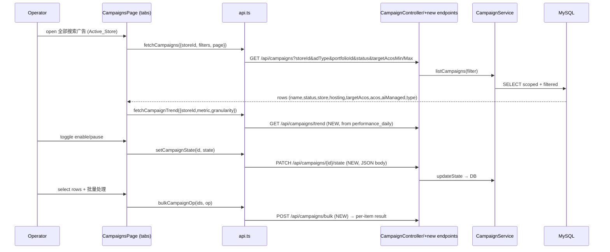
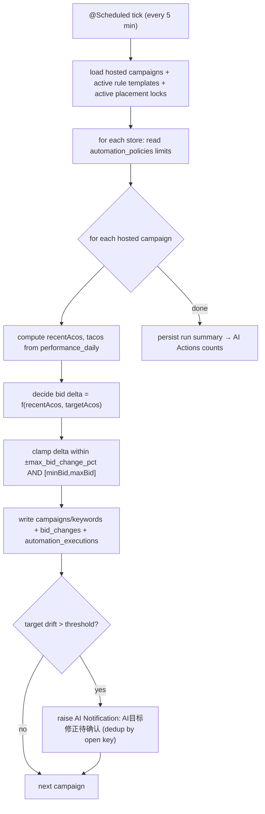
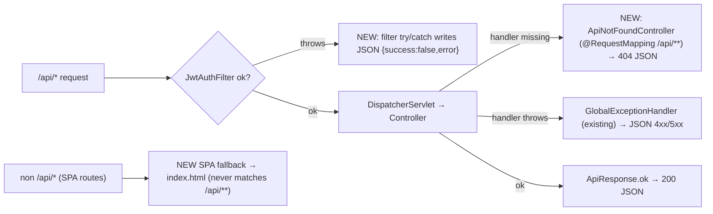

# Design Document

## Overview

This design completes the user-facing functionality of AdPilot AI and folds the SparkX / Xnurta AI advertising logic (`ai.sparkx.io`, the SparkX_Reference) into the platform's existing modules as the authoritative standard for the AI advertising module. It covers all 30 requirements: cross-cutting plumbing (Req 1, 16, 17), the existing-but-defective operator surfaces (Req 2–15), and the SparkX-modeled AI advertising module (Req 18–30).

**Guiding principle — this is not a greenfield build.** Investigation of the live code confirms the backend already exposes the large majority of the endpoints these pages need. The work is therefore mostly *wiring and fixing* rather than new construction:

- The shared response envelope (`ApiResponse<T>` = `{ success, data, error{code,message} }`) and a `@RestControllerAdvice` `GlobalExceptionHandler` already exist and already emit JSON. The frontend `request()` helper already expects exactly this shape.
- All advertising primitives have tables and controllers: `campaigns`, `goals`, `keywords`, `targets`, `search_terms`, `negative_keywords`, `recommendations`, `ad_groups`, plus `performance_daily` for trend/metric aggregation.
- The automation, keyword-intelligence, listing-AI, data-quality, Feishu, platform-connection, user/role/permission, audit, and login-log controllers are all present.

The defects therefore fall into the three categories the requirements define — **present** (works, only minor wiring), **present-but-broken** (endpoint exists but errors, returns 200-on-failure, returns empty/placeholder data, or the page doesn't render it), and **missing** (no backend endpoint/table yet). The SparkX surfaces that have no real Amazon Ads API data behind them in this project (live bid actuation, AMC, SQP market data) are scoped as **UI + stubbed-service** items that operate on the project's own stored data, rather than over-promising live optimization against Amazon.

The most important artifact in this document is the **Requirement → Module Mapping & Classification table** below. The task list is built directly from it.

### Key investigation findings that shape the design

1. **The "Unexpected token '<'" root cause is not a missing exception handler.** `GlobalExceptionHandler` (a `@RestControllerAdvice`) already converts controller exceptions to JSON. The HTML leaks from two gaps it cannot cover: (a) there is **no SPA fallback controller and no custom `ErrorController`**, so an unknown `/api` route or an exception thrown *inside a servlet filter* (`JwtAuthFilter`) falls through to Spring Boot's `BasicErrorController`, which content-negotiates to the **Whitelabel HTML page** when the request `Accept` header includes `text/html`; and (b) **many controllers `try/catch` and return `ApiResponse.fail(...)` with HTTP 200**, which violates Req 1.2's 4xx/5xx requirement and masks real failures. Both are addressed in Req 1.
2. **The campaigns table has no AI-hosting columns** (`hosting_enabled`, `hosting_goal`, `target_acos`, `ai_managed`), and **`portfolio` is only a `VARCHAR(100)` column on `campaigns`** — there is no `ad_portfolios` table. AI Hosting (Req 21) and Ad Portfolios (Req 20) need additive schema.
3. **A scheduled poller already exists** — `ScheduleEngine` runs `@Scheduled(fixedDelayString = "${adpilot.scheduler.poll-ms:30000}")`. The AI Hosting optimization loop (Req 21) and rule-template evaluation (Req 25) reuse this cadence pattern with a dedicated `@Scheduled` optimizer bean.
4. **`automation_rules` exists** (`rule_type`, `condition_json`, `min_bid`, `max_bid`) but has **no create/list controller** and **no template metadata** (name, type, linked-object count, status). The Automation Rules page (Req 9/25) needs a thin controller + additive columns/table rather than a new subsystem.
5. **`feishu_chat_bindings` already exists** as a table; the Feishu page is a pure frontend stub (`ErpFeatureUnderConstruction`, `setTimeout` save). Group binding is mostly a wiring job plus a small binding endpoint.
6. **The `alerts` table already uses a generated `open_dedup_key` unique column** for dedup — the same pattern is reused for AI Notification dedup (Req 23), keeping behavior consistent with existing code.
7. **Schema is a single consolidated Flyway `V1__init_schema.sql` with no `ALTER` statements remaining.** Per the project convention, all new tables and all new columns on existing tables in this spec go into **new additive migrations** (`V2__ai_advertising_module.sql`, etc.). V1 is never edited.

---

## Requirement → Module Mapping & Classification

Legend: **P** = present (works, only minor FE wiring), **PBB** = present-but-broken (endpoint/table exists but errors, returns 200-on-error, empty/placeholder, or FE doesn't render), **M** = missing (no backend endpoint/table). "FE-stub" is a PBB sub-case where the backend is fine and only the page is a placeholder.

| Req | Surface | Module(s) | Backend controller / endpoint (verified) | Frontend page / component | Class |
|----|---------|-----------|-------------------------------------------|---------------------------|-------|
| 1 | JSON error contract | common/api, common/exception, common/config, common/security | `ApiResponse`, `GlobalExceptionHandler` (BusinessException / validation / generic → JSON); **no `ErrorController`, no SPA fallback in `WebConfig`**; `SecurityConfig` entry/deny points already JSON; many controllers return `fail()` at HTTP 200 | `lib/api.ts` `request()` (calls `res.json()`); `AppErrorBoundary` | PBB |
| 2 | Keyword Intelligence Center | keyword | `KeywordIntelligenceController` `GET /overview,/insights,/summary`, `POST /analyze`,`/{id}/apply,/watch,/dismiss` | `KeywordIntelligencePage.tsx` (fully wired) | PBB |
| 3 | Role permission editing | user | `RoleController` `GET/POST /api/roles/{id}/permissions` | `RolesPage.tsx` | PBB |
| 4 | Permission catalog page | user | `PermissionController` `GET /api/permissions` | `PermissionsPage.tsx` | PBB |
| 5 | User creation | user | `UserController` `POST /api/users` (`user:manage`); `createUser` in api.ts | `UsersPage.tsx` / `UserManagement.tsx` | PBB |
| 6 | Skeleton pages (今日待办, 审批中心, 广告目标, 广告活动, AI优化建议, 产品列表, 库存健康, 补货, 仓库, 采购, 供应商, FBA货件, 利润看板, SKU利润, 结算, Review, Feedback, 全部任务, 报表中心) | dashboard, approval, advertising, product, inventory/warehouse, procurement, supplier, logistics, profit/finance, settlement, review, task, report | endpoints exist per page (`/tasks`, `/approvals`, `/goals`, `/campaigns`, `/recommendations`, `/products`, `/inventory/health`, `/replenishment/plans`, `/warehouse/locations`, `/procurement/purchase-orders`, `/suppliers`, `/logistics/shipments`, `/profit/dashboard`, `/profit/products`, `/settlements`, `/reviews`, `/feedback`, `/tasks`, `/reports`) | one page each (see column 4) | PBB (mix of FE-stub + 200-on-error) |
| 7 | AI Listing Studio | listing | `ListingController` `POST /api/listing-ai/products/{id}/{generate,score,compliance-check}` (UUID-guarded → empty on bad id) | `ListingAIPage.tsx` | PBB |
| 8 | Product upload navigation | upload | `ProductUploadController` `/api/product-upload/jobs` (present) | `ProductUploadPage.tsx`, nav item `/product-upload` | PBB (FE nav/context) |
| 9 | Automation rule creation | automation | `AutomationController` `POST /api/automation/policies` (policy, not rule); **no `automation_rules` CRUD endpoint** | `AutomationRulesPage.tsx` | PBB + M (rule CRUD missing) |
| 10 | Feishu binding & notification rules | feishu | `FeishuController` connect/list/update/test-message; table `feishu_chat_bindings` exists; **no explicit group-binding / notification-rule endpoint** | `FeishuIntegrationPage.tsx` (stub: `ErpFeatureUnderConstruction` + `setTimeout`) | FE-stub + M |
| 11 | Human-readable audit log | audit | `AuditLogController` `GET /api/audit-logs` + filters; `AuditLogVo` | `AuditRollbackPage.tsx` | PBB (label mapping) |
| 12 | Data Quality reliability | dataquality | `DataQualityController` `/issues`,`/check`,`/issues/{id}/{resolve,ignore}` (user id now via `SecurityUtils`) | `DataQualityPage.tsx` | PBB |
| 13 | Dynamic platform connections | apisync | `ApiSyncController` full: list/create/update, `/{platform}/{fields,config,connect,disconnect,test}` | `ApiConnectionsPage.tsx` (hardcoded 5 platforms) | FE-stub |
| 14 | Store ↔ connection relationship | apisync, store | `platform_connections` (store-scoped, `seller_account_id`); `POST /api/stores/{id}/bind` | `StoresPage.tsx`, `ApiConnectionsPage.tsx` | PBB (FE relationship view) |
| 15 | Login log display | user | `LoginLogController` `GET /api/login-logs`; table `login_logs` | `LoginLogsPage.tsx` | PBB |
| 16 | Nav menu categorization (SparkX taxonomy) | frontend | n/a | `Layout.tsx` `navSections`, `navVisibility.ts` | FE-stub (restructure) |
| 17 | Complete Chinese localization | frontend | n/a | `i18n/{menu,pages,forms,enums,errors,actions,toast}.ts` | PBB |
| 18 | AI advertising dashboard (Sales Overview / AI Actions / AI Usage / AI Notifications) | dashboard, advertising, automation | `DashboardController` `/api/dashboard/summary`,`/command-center`; `performance_daily` table | `DashboardPage.tsx` / `CommandCenterPage.tsx` | PBB + M (AI Actions/Usage/Notifications aggregation) |
| 19 | All Search Ads workspace (tabs + filters + trend + table) | advertising | `CampaignController` list/get/update (**no create, no bulk, no enable/pause toggle, update via query params**); `KeywordController`, `SearchTermController`, targets/negatives tables | `CampaignsPage.tsx`, `SearchTermsPage.tsx`, `KeywordsPage.tsx` | PBB + M |
| 20 | Ad portfolios | advertising | **no `ad_portfolios` table, no controller**; `campaigns.portfolio` is a VARCHAR only | none (new) | M |
| 21 | AI Hosting (Target ACoS auto-optimization) | advertising + automation + scheduler | **no hosting columns on `campaigns`, no optimizer**; `ScheduleEngine` cadence reusable | new tab in `CampaignsPage.tsx` | M |
| 22 | Smart Diagnosis | recommendation + advertising | **no `smart_diagnosis_tasks` table/controller**; `RecommendationEngineService` reusable | none (new) | M |
| 23 | AI Notifications work-items | recommendation + automation | **no `ai_notifications` table**; `recommendations` table + `alerts` dedup pattern reusable | none (new) | M |
| 24 | Insight Agent | ai + recommendation/report | `AiClient`/`AiSettings` present; **no conversational endpoint** | none (new) | M (UI + AI/stub service) |
| 25 | Automation rule templates (condition→action) | automation | `automation_rules` table exists (no template metadata, no CRUD endpoint) | `AutomationRulesPage.tsx` | PBB + M |
| 26 | Ad Placement Lock | advertising + automation | **no table/controller** | none (new) | M |
| 27 | Keyword Library + recommendations | keyword + recommendation | recs present (`/recommendations`, keyword insights); **no `keyword_libraries` table** | `KeywordsPage.tsx` | PBB + M |
| 28 | Rank Monitoring | keyword + report | **no `rank_monitor_tasks` table/controller** | none (new) | M |
| 29 | Creative Asset Library | advertising + media | **no `creative_assets` table**; `product_images`, `FileStorageUtils` reusable | none (new) | M |
| 30 | Data Insights / SQP / AMC | report + recommendation | product list (`/products`), reports (`/reports`) present; **brand metrics / market insights / SQP / AMC missing** | new pages | PBB + M (UI + stubbed) |

---

## Architecture

### How the AI advertising module fits together

The AI advertising module is not a new service — it is a coordinated set of surfaces layered over the existing `advertising`, `automation`, `keyword`, `recommendation`, `dashboard`, and `report` modules. The SparkX taxonomy maps onto them as follows:

```mermaid
flowchart TB
  subgraph FE["Frontend (React SPA)"]
    Home["首页 AI Dashboard<br/>Sales Overview / AI Actions / AI Usage / AI Notifications"]
    ASA["全部搜索广告 All Search Ads<br/>(tabbed campaign workspace)"]
    Port["全部广告组合 Ad Portfolios"]
    Host["AI托管 AI Hosting tab"]
    Diag["智能诊断 Smart Diagnosis"]
    Notif["AI通知 AI Notifications"]
    Insight["Insight Agent"]
    Rules["自动化规则 Rule Templates"]
    Lock["广告位锁定 Placement Lock"]
    Kw["关键词 词库+推荐 / 排名监控 Rank Monitor"]
    Assets["创意素材 Creative Assets"]
    DI["数据洞察 / SQP / AMC"]
  end

  subgraph BE["Backend (Spring Boot, /api)"]
    AdvC["advertising: Campaign/Goal/Keyword/Recommendation/SearchTerm + NEW Portfolio/Hosting/PlacementLock"]
    AutoC["automation: Policy + NEW RuleTemplate + Optimizer"]
    KwC["keyword: KeywordIntelligence + NEW Library/RankMonitor"]
    RecC["recommendation + NEW SmartDiagnosis / AiNotification"]
    DashC["dashboard: summary + NEW AI Actions/Usage aggregation"]
    RepC["report + NEW SQP/Brand/Market/AMC (stubbed)"]
    AiC["ai: AiClient + NEW Insight Agent"]
  end

  subgraph SCHED["Scheduler (@Scheduled cadence, reuses ScheduleEngine pattern)"]
    Opt["AiHostingOptimizer (Target ACoS loop)"]
    RuleEval["RuleTemplateEvaluator (condition→action)"]
    RankPoll["RankMonitorPoller"]
  end

  subgraph DB[("MySQL 8.0 (Flyway V1 + additive V2+)")]
    T1["campaigns (+hosting cols) / goals / keywords / targets / search_terms / negative_keywords"]
    T2["ad_portfolios / automation_rule_templates / ad_placement_lock_strategies"]
    T3["ai_notifications / smart_diagnosis_tasks / keyword_libraries / rank_monitor_tasks / creative_assets"]
    T4["performance_daily / recommendations / automation_executions / alerts"]
  end

  Home --> DashC --> T4
  ASA --> AdvC --> T1
  Port --> AdvC --> T2
  Host --> AdvC
  Rules --> AutoC --> T2
  Lock --> AdvC --> T2
  Diag --> RecC --> T3
  Notif --> RecC --> T3
  Insight --> AiC
  Kw --> KwC --> T3
  Assets --> AdvC --> T3
  DI --> RepC

  Opt --> AdvC
  RuleEval --> AutoC
  RankPoll --> KwC
  Opt --> T4
```

### Campaign-management flow (All Search Ads — Req 19)



### AI-hosting / optimization flow (Req 21, 25, 26)

The optimization loop runs on the **existing scheduler cadence**. A new `AiHostingOptimizer` Spring bean carries a `@Scheduled(fixedDelayString = "${adpilot.hosting.optimize-ms:300000}")` annotation (default 5 min, configurable like the `ScheduleEngine` poller). Each tick it loads hosted campaigns, computes recent ACoS from `performance_daily`, and emits clamped bid/budget adjustments bounded by the store's `automation_policies` limits (`max_bid_change_pct`, `max_budget_change_pct`). The same evaluator drives rule templates (Req 25) and placement-lock strategies (Req 26). **Bid/budget "actuation" writes to the project's own `campaigns`/`keywords`/`bid_changes` tables** (and to `automation_executions` for audit/rollback); pushing to the live Amazon Ads API is out of scope and represented by a `PlatformConnector` seam that is stubbed when no live connection exists.



### Cross-cutting: JSON error contract (Req 1)



### New tables vs reuse

Reuse wherever possible: `performance_daily` (all dashboard/trend metrics, ACoS/TACoS), `recommendations` (feeds AI Notifications + Smart Diagnosis), `automation_executions` + `rollback_plans` (audit/rollback of AI actions), `alerts` (dedup pattern), `product_images` + `FileStorageUtils` (creative assets storage), `keyword_insights`/`keyword_ngrams` (keyword recommendations). New schema is **additive only**, in `V2__ai_advertising_module.sql` and later `Vnn` files — `V1__init_schema.sql` is never modified. New columns on existing tables (e.g. AI-hosting columns on `campaigns`) are added via `ALTER TABLE` in the new `Vnn` migration.

---

## Components and Interfaces

Each area lists **existing endpoints to fix** and **new endpoints to add**, plus the frontend pages/components. All endpoints return the standard `ApiResponse<T>` envelope.

### Cross-cutting: JSON error contract (Req 1)

- **Fix:** Sweep controllers that `try/catch` and return `ApiResponse.fail(...)` at HTTP 200 (e.g. `CampaignController`, `GoalController`, `KeywordController`, `RecommendationController`, `SearchTermController`). Remove the broad catches and let `GlobalExceptionHandler` set the status; or use the `fail(int httpStatus, ...)` overload so failures carry 4xx/5xx. Throw `BusinessException` (already carries a status) for domain errors.
- **Add:** `ApiNotFoundController` mapped to `/api/**` as the lowest-priority handler returning `404` JSON `{success:false,error:{code:"NOT_FOUND",message}}` for undefined `/api` routes (Req 1.5).
- **Add:** SPA fallback for non-`/api` routes — a forwarding `@Controller` (or `WebMvcConfigurer` view controller) that forwards unmatched non-API paths to `index.html`. It MUST be scoped so it never intercepts `/api/**`.
- **Add:** wrap `JwtAuthFilter`'s `doFilter` body in a `try/catch` that serializes a JSON error via the injected `ObjectMapper` (mirrors `SecurityConfig`'s existing entry/deny-point JSON), so filter-thrown exceptions never reach the Whitelabel page.
- **Frontend:** harden `request()` in `api.ts` so that when `res.json()` throws (non-JSON body), it constructs a readable error from `res.status` + `res.statusText` instead of surfacing the raw parse error (Req 1.4).

### Keyword Intelligence (Req 2)

- **Fix:** `KeywordIntelligenceService.getOverview/getInsights/getSummary` for the empty-store path (return empty VO, not throw); confirm `storeId` scoping. Harvest = existing `POST /api/keyword-intelligence/analyze`.
- **Frontend:** `KeywordIntelligencePage` already wired; add per-panel error/retry and empty states (Req 2.4, 2.7), re-fetch after harvest (Req 2.6).

### RBAC pages (Req 3, 4, 5)

- **Fix:** `RolesPage` to load `GET /api/roles/{id}/permissions`, render an editable selector, save via `POST` (Req 3). `PermissionsPage` to render `GET /api/permissions` grouped by category with loading/empty/error states (Req 4); verify the `permissions` seed is non-empty. `UsersPage`/`UserManagement` to fix create-user payload + FE validation + optimistic list update (Req 5).

### Skeleton pages (Req 6)

- Per-page wiring of the existing `fetch*` functions, with empty-state + error/retry. No new backend endpoints expected; any page that turns out to hit a 200-on-error endpoint is fixed under Req 1.

### Listing AI (Req 7) & Product Upload (Req 8)

- **Fix:** `ListingAIPage` must resolve and pass a valid product UUID (route param / selected product), and prompt to select a product when none is resolvable instead of showing "ASIN: N/A" (Req 7.6). Product upload entry navigates to `/product-upload` carrying store/product context (Req 8).

### Automation (Req 9, 25)

- **Add:** `AutomationRuleTemplateController` — `GET /api/automation/rule-templates?storeId`, `POST /api/automation/rule-templates` (`automation:manage`), `PUT /{id}`, `POST /api/automation/rule-templates/bulk`, `POST /{id}/links` (link campaigns/targets). Backed by `automation_rule_templates` + `automation_rule_template_links` (additive). Condition→action evaluation runs in `RuleTemplateEvaluator` on the scheduler cadence.
- **Fix:** `AutomationRulesPage` create form wired to the new endpoint with FE validation (Req 25.5) and the existing `automation:manage` guard (Req 9.4, 25.6).

### Feishu (Req 10)

- **Add:** `POST /api/integrations/feishu/{id}/chat-bindings` + `GET` (backed by existing `feishu_chat_bindings`), and notification-rule endpoints `GET/POST /api/integrations/feishu/{id}/notification-rules` (additive `feishu_notification_rules`).
- **Fix:** replace `FeishuIntegrationPage` stub (`ErpFeatureUnderConstruction`, `setTimeout`) with real binding/rule UI calling the backend (Req 10.1–10.5); enforce `feishu:manage` (Req 10.6).

### Audit (Req 11) & Login logs (Req 15) & Data Quality (Req 12)

- **Fix:** audit action/entity-type label mapping (prefer enriching `AuditLogVo` on the backend; FE i18n fallback), filter wiring (Req 11). Confirm login attempts are recorded and `LoginLogsPage` consumes the shape (Req 15). `DataQualityPage` — fix list endpoint and empty state; resolve/ignore already pass the acting user via `SecurityUtils` (Req 12.4).

### Platform connections (Req 13, 14)

- **Fix:** `ApiConnectionsPage` to render `GET /api/platform-connections` dynamically, build the add-connection form from `GET /{platform}/fields`, support many connections per platform, test/disconnect (Req 13). Surface the Store↔connection relationship in `StoresPage` using store-scoped connections + `POST /api/stores/{id}/bind` (Req 14). Backend already complete.

### AI advertising dashboard (Req 18)

- **Add:** `GET /api/dashboard/sales-overview`, `GET /api/dashboard/sales-trend?granularity=day|week|month`, `GET /api/dashboard/ai-actions`, `GET /api/dashboard/ai-usage`, `GET /api/dashboard/ai-notifications-summary` — all store/marketplace/currency/date-range scoped, aggregating `performance_daily`, `automation_executions`, and `ai_notifications`. ACoS/TACoS computed in a pure `AdMetrics` helper (PBT target).
- **Frontend:** `DashboardPage` renders the four SparkX panels + dual-axis trend chart with granularity toggle, per-panel empty/error states (Req 18.7, 18.8).

### All Search Ads workspace (Req 19)

- **Add:** `POST /api/campaigns` (create), `PATCH /api/campaigns/{id}/state` (enable/pause, JSON body — replaces the query-param `updateCampaign`), `POST /api/campaigns/bulk` (per-item result), `GET /api/campaigns/trend`. Extend `GET /api/campaigns` filters: `adType`, `portfolioId`, `parentAsin`, `targetingGoal`, `status`, `targetAcosMin/Max`, `smartFilter`.
- **Frontend:** `CampaignsPage` becomes the tabbed workspace (广告活动 / AI托管 / 广告组 / 推广商品 / 投放 / 否定投放 / 搜索词 / 购买的其他商品 / 竞价调整 / SP预算上限 / 操作日志), reusing `KeywordsPage`/`SearchTermsPage` data for sub-tabs.

### Ad Portfolios (Req 20)

- **Add:** `AdPortfolioController` — `GET /api/ad-portfolios?storeId`, `POST`, `PUT /{id}`. Backed by new `ad_portfolios`; campaigns reference it via `portfolio_id`. Portfolio rollup metrics aggregate member campaigns.

### AI Hosting (Req 21)

- **Add:** `PUT /api/campaigns/{id}/hosting` (assign/update Hosting_Goal + Target_ACoS; validation requires Target_ACoS — Req 21.6), `DELETE /api/campaigns/{id}/hosting` (un-host). `AiHostingOptimizer` scheduled bean performs the optimization loop. Hosting state stored on `campaigns` (new columns).

### Smart Diagnosis (Req 22)

- **Add:** `SmartDiagnosisController` — `POST /api/smart-diagnosis/tasks` (parent ASIN, store-scoped), `GET /api/smart-diagnosis/tasks?storeId`, `GET /{id}`. Diagnosis result produced by reusing `RecommendationEngineService` analysis over the product's ad structure. Backed by `smart_diagnosis_tasks`.

### AI Notifications (Req 23)

- **Add:** `AiNotificationController` — `GET /api/ai-notifications?storeId&category&state`, `POST /{id}/apply` (one-click optimization → closed), `POST /{id}/confirm` & `POST /{id}/reject` (AI target correction), `GET/PUT /api/ai-notifications/config`. Four categories; pending/closed states; dedup via generated `open_dedup_key` (same pattern as `alerts`). Backed by `ai_notifications` + `ai_notification_config`.

### Insight Agent (Req 24)

- **Add:** `InsightAgentController` — `POST /api/insight-agent/query` (store-scoped; `source`, `premium` flags), `GET /api/insight-agent/suggestions`. Uses `AiClient` when enabled; otherwise a deterministic stubbed analyst that summarizes the store's stored metrics so the page is functional without a live LLM. Optional `insight_agent_conversations` table for history.

### Ad Placement Lock (Req 26)

- **Add:** `AdPlacementLockController` — `GET/POST /api/placement-locks` (strategy with target placement + keyword bid range; validation rejects min>max — Req 26.4), `GET /api/placement-locks/tasks`, `GET /api/placement-locks/ams` (real-time data; stubbed from stored data). Enforcement runs in the scheduled evaluator. Backed by `ad_placement_lock_strategies` + `ad_placement_lock_tasks`.

### Keyword Library & Rank Monitoring (Req 27, 28)

- **Add:** `KeywordLibraryController` — `GET/POST /api/keyword-libraries?storeId`, plus recommendation actions `POST /api/keyword-libraries/recommendations/{id}/{harvest,negate}` (reuse existing harvest/negative flows). `RankMonitorController` — `POST /api/rank-monitor/tasks` (quota-checked — Req 28.4), `GET /api/rank-monitor/tasks?storeId`, `GET /api/rank-monitor/quota`. Backed by `keyword_libraries`, `keyword_library_items`, `rank_monitor_tasks`, `rank_monitor_snapshots`.

### Creative Assets (Req 29)

- **Add:** `CreativeAssetController` — `GET /api/creative-assets?storeId&search`, `POST /api/creative-assets` (multipart upload via `FileStorageUtils`), search by name/tag/ASIN/creator. Backed by `creative_assets`.

### Data Insights / SQP / AMC (Req 30)

- **Add (UI + stubbed-service):** `GET /api/insights/product-list`, `/brand-metrics`, `/market-insights`, `/sqp`, `/amc/models`, `/amc/audiences`. Product list reuses `products` + `performance_daily`. Brand/market/SQP/AMC compute from stored data where available and otherwise return an explicit "requires activation"/empty payload (Req 30.7, 30.8) rather than fabricating Amazon-side data.

### Navigation & localization (Req 16, 17)

- **Frontend only:** restructure `navSections` in `Layout.tsx` to the SparkX taxonomy (首页, 自定义看板, AI广告优化, Insight Agent, 高阶广告设置, 效率工具, 数据洞察, AMC数据工作室, 帮助中心), keeping permission gating + empty-section omission (`navVisibility.ts`). Add missing strings to the `i18n` catalog and route all new UI text through `t()` (Req 17).

---

## Data Models

All new schema is **additive**, placed in `V2__ai_advertising_module.sql` (and later `Vnn` files), never editing `V1`. Conventions follow V1: `CHAR(36)` ids defaulting to `UUID()`, `DATETIME(3) DEFAULT CURRENT_TIMESTAMP(3)`, `JSON` for structured blobs, `DECIMAL(18,4)` for money / `DECIMAL(10,4)` for rates, `VARCHAR` status enums. Tables below are only those confirmed missing after checking V1.

### New columns on `campaigns` (Req 21 — AI Hosting)

```sql
-- V2: additive ALTERs (campaigns already exists in V1)
ALTER TABLE campaigns
  ADD COLUMN hosting_enabled TINYINT(1) NOT NULL DEFAULT 0,
  ADD COLUMN hosting_goal    VARCHAR(40) NULL,          -- e.g. maximize_sales_at_target
  ADD COLUMN target_acos     DECIMAL(10,4) NULL,        -- percentage; required when hosting_enabled=1
  ADD COLUMN ai_managed      TINYINT(1) NOT NULL DEFAULT 0,  -- AI入格 indicator
  ADD COLUMN portfolio_id    CHAR(36) NULL;             -- FK → ad_portfolios(id)
CREATE INDEX idx_campaigns_hosting ON campaigns(store_id, hosting_enabled);
```

### `ad_portfolios` (Req 20)

```sql
CREATE TABLE IF NOT EXISTS ad_portfolios (
    id CHAR(36) PRIMARY KEY DEFAULT (UUID()),
    store_id CHAR(36) NOT NULL REFERENCES stores(id),
    name VARCHAR(255) NOT NULL,
    state VARCHAR(20) DEFAULT 'enabled',          -- 投放状态
    budget_type VARCHAR(20) DEFAULT 'none',       -- none|recurring|date_range; none => 无预算上限
    budget DECIMAL(18,4) NULL,
    start_date VARCHAR(10) NULL,
    end_date VARCHAR(10) NULL,
    external_id VARCHAR(100) NULL,
    created_by CHAR(36) REFERENCES users(id),
    created_at DATETIME(3) DEFAULT CURRENT_TIMESTAMP(3),
    updated_at DATETIME(3) DEFAULT CURRENT_TIMESTAMP(3) ON UPDATE CURRENT_TIMESTAMP(3)
);
CREATE INDEX idx_ad_portfolios_store ON ad_portfolios(store_id);
```

### `automation_rule_templates` + links (Req 9, 25)

```sql
CREATE TABLE IF NOT EXISTS automation_rule_templates (
    id CHAR(36) PRIMARY KEY DEFAULT (UUID()),
    store_id CHAR(36) NOT NULL REFERENCES stores(id),
    name VARCHAR(255) NOT NULL,                   -- 模板名称
    template_type VARCHAR(50) NOT NULL,           -- 模板类型: bid_adjustment|negative_keyword|budget|dayparting
    condition_json JSON NOT NULL,                 -- condition tree
    action_json JSON NOT NULL,                    -- action (bid delta / add negative / etc.)
    status VARCHAR(20) DEFAULT 'enabled',         -- enabled|disabled
    created_by CHAR(36) REFERENCES users(id),
    created_at DATETIME(3) DEFAULT CURRENT_TIMESTAMP(3),
    updated_at DATETIME(3) DEFAULT CURRENT_TIMESTAMP(3) ON UPDATE CURRENT_TIMESTAMP(3)
);
CREATE TABLE IF NOT EXISTS automation_rule_template_links (
    id CHAR(36) PRIMARY KEY DEFAULT (UUID()),
    template_id CHAR(36) NOT NULL REFERENCES automation_rule_templates(id) ON DELETE CASCADE,
    object_type VARCHAR(30) NOT NULL,             -- campaign|target|keyword
    object_id CHAR(36) NOT NULL,
    created_at DATETIME(3) DEFAULT CURRENT_TIMESTAMP(3),
    UNIQUE KEY uk_template_object (template_id, object_type, object_id)
);
CREATE INDEX idx_rule_templates_store ON automation_rule_templates(store_id, status);
```

### `ai_notifications` + config (Req 23)

```sql
CREATE TABLE IF NOT EXISTS ai_notifications (
    id CHAR(36) PRIMARY KEY DEFAULT (UUID()),
    store_id CHAR(36) NOT NULL REFERENCES stores(id),
    category VARCHAR(40) NOT NULL,                -- core_ops|one_click_optimize|high_potential|target_correction
    title VARCHAR(255) NOT NULL,
    detail_json JSON NULL,                        -- payload (proposed change, affected object, metrics)
    subject_id VARCHAR(255) NULL,                 -- campaign/target id the item concerns
    state VARCHAR(20) NOT NULL DEFAULT 'pending', -- pending(待处理)|closed(已结束)
    resolution VARCHAR(20) NULL,                  -- applied|confirmed|rejected|dismissed
    created_at DATETIME(3) DEFAULT CURRENT_TIMESTAMP(3),
    closed_at DATETIME(3) NULL,
    open_dedup_key VARCHAR(512) GENERATED ALWAYS AS (
        CASE WHEN state = 'pending'
             THEN CONCAT(store_id, ':', category, ':', COALESCE(subject_id, ''))
             ELSE NULL END
    ) STORED,
    UNIQUE KEY uk_open_ai_notification (open_dedup_key)
);
CREATE INDEX idx_ai_notifications_store ON ai_notifications(store_id, category, state);

CREATE TABLE IF NOT EXISTS ai_notification_config (
    id CHAR(36) PRIMARY KEY DEFAULT (UUID()),
    store_id CHAR(36) NOT NULL REFERENCES stores(id),
    config_json JSON NOT NULL,                    -- which core-ops items are raised
    updated_at DATETIME(3) DEFAULT CURRENT_TIMESTAMP(3) ON UPDATE CURRENT_TIMESTAMP(3),
    UNIQUE KEY uk_ai_notif_config_store (store_id)
);
```

### `smart_diagnosis_tasks` (Req 22)

```sql
CREATE TABLE IF NOT EXISTS smart_diagnosis_tasks (
    id CHAR(36) PRIMARY KEY DEFAULT (UUID()),
    store_id CHAR(36) NOT NULL REFERENCES stores(id),
    parent_asin VARCHAR(20) NOT NULL,
    update_frequency VARCHAR(20) DEFAULT 'manual',-- manual|daily|weekly
    status VARCHAR(20) DEFAULT 'pending',         -- pending|running|completed|failed
    result_json JSON NULL,                        -- diagnosis result
    created_by CHAR(36) REFERENCES users(id),
    last_diagnosed_at DATETIME(3) NULL,
    created_at DATETIME(3) DEFAULT CURRENT_TIMESTAMP(3)
);
CREATE INDEX idx_smart_diagnosis_store ON smart_diagnosis_tasks(store_id);
```

### `ad_placement_lock_strategies` + tasks (Req 26)

```sql
CREATE TABLE IF NOT EXISTS ad_placement_lock_strategies (
    id CHAR(36) PRIMARY KEY DEFAULT (UUID()),
    store_id CHAR(36) NOT NULL REFERENCES stores(id),
    campaign_id CHAR(36) NOT NULL REFERENCES campaigns(id),
    target_placement VARCHAR(40) NOT NULL,        -- top_of_search_1_1 | page1_5_8 | ...
    bid_min DECIMAL(18,4) NOT NULL,
    bid_max DECIMAL(18,4) NOT NULL,               -- CHECK bid_min <= bid_max enforced in service
    status VARCHAR(20) DEFAULT 'active',
    created_by CHAR(36) REFERENCES users(id),
    created_at DATETIME(3) DEFAULT CURRENT_TIMESTAMP(3)
);
CREATE TABLE IF NOT EXISTS ad_placement_lock_tasks (
    id CHAR(36) PRIMARY KEY DEFAULT (UUID()),
    strategy_id CHAR(36) NOT NULL REFERENCES ad_placement_lock_strategies(id) ON DELETE CASCADE,
    keyword_id CHAR(36) NULL,
    last_bid DECIMAL(18,4) NULL,
    last_run_at DATETIME(3) NULL,
    created_at DATETIME(3) DEFAULT CURRENT_TIMESTAMP(3)
);
CREATE INDEX idx_placement_lock_store ON ad_placement_lock_strategies(store_id, status);
```

### `keyword_libraries` + items (Req 27)

```sql
CREATE TABLE IF NOT EXISTS keyword_libraries (
    id CHAR(36) PRIMARY KEY DEFAULT (UUID()),
    store_id CHAR(36) NOT NULL REFERENCES stores(id),
    name VARCHAR(255) NOT NULL,
    library_type VARCHAR(40) NOT NULL,            -- 词库类型: harvest|negative|brand|competitor
    schedule_cron VARCHAR(64) NULL,               -- execution schedule
    last_run_at DATETIME(3) NULL,
    next_run_at DATETIME(3) NULL,
    created_at DATETIME(3) DEFAULT CURRENT_TIMESTAMP(3)
);
CREATE TABLE IF NOT EXISTS keyword_library_items (
    id CHAR(36) PRIMARY KEY DEFAULT (UUID()),
    library_id CHAR(36) NOT NULL REFERENCES keyword_libraries(id) ON DELETE CASCADE,
    product_id CHAR(36) NULL REFERENCES products(id),
    keyword_text VARCHAR(255) NOT NULL,
    created_at DATETIME(3) DEFAULT CURRENT_TIMESTAMP(3)
);
CREATE INDEX idx_keyword_libraries_store ON keyword_libraries(store_id);
```

### `rank_monitor_tasks` + snapshots (Req 28)

```sql
CREATE TABLE IF NOT EXISTS rank_monitor_tasks (
    id CHAR(36) PRIMARY KEY DEFAULT (UUID()),
    store_id CHAR(36) NOT NULL REFERENCES stores(id),
    product_id CHAR(36) NULL REFERENCES products(id),
    keyword_text VARCHAR(255) NOT NULL,
    status VARCHAR(20) DEFAULT 'active',
    created_at DATETIME(3) DEFAULT CURRENT_TIMESTAMP(3)
);
CREATE TABLE IF NOT EXISTS rank_monitor_snapshots (
    id CHAR(36) PRIMARY KEY DEFAULT (UUID()),
    task_id CHAR(36) NOT NULL REFERENCES rank_monitor_tasks(id) ON DELETE CASCADE,
    organic_rank INT NULL,                        -- 自然排名
    ad_rank INT NULL,                             -- 广告排名
    captured_at DATETIME(3) DEFAULT CURRENT_TIMESTAMP(3)
);
CREATE INDEX idx_rank_monitor_store ON rank_monitor_tasks(store_id, status);
-- Quota: configurable per store via a row in ai_notification_config-style table or a
-- store-scoped setting; default 400. Consumed = COUNT(active rank_monitor_tasks).
```

### `creative_assets` (Req 29)

```sql
CREATE TABLE IF NOT EXISTS creative_assets (
    id CHAR(36) PRIMARY KEY DEFAULT (UUID()),
    store_id CHAR(36) NOT NULL REFERENCES stores(id),
    name VARCHAR(255) NOT NULL,
    asset_type VARCHAR(40) NOT NULL,              -- lifestyle|scene|hd_group|marketing
    media_kind VARCHAR(20) NOT NULL,              -- image|video
    storage_url VARCHAR(1024) NOT NULL,           -- from FileStorageUtils
    asin VARCHAR(20) NULL,
    tags JSON NULL,
    created_by CHAR(36) REFERENCES users(id),
    created_at DATETIME(3) DEFAULT CURRENT_TIMESTAMP(3)
);
CREATE INDEX idx_creative_assets_store ON creative_assets(store_id, asset_type);
```

### Reused tables (no change)

`performance_daily` (dashboard metrics, ACoS/TACoS, trend), `recommendations` (AI Notifications + Smart Diagnosis source), `automation_executions` + `rollback_plans` (AI action audit/rollback), `alerts` (dedup pattern reference), `feishu_chat_bindings` (Feishu binding), `platform_connections` (store↔connection), `keyword_insights`/`keyword_ngrams` (keyword recommendations), `products`/`product_images` (product list, creative reuse). New `feishu_notification_rules` and optional `insight_agent_conversations` follow the same conventions and are added in `V2` if needed.

### Phase migration mapping

`V2__ai_advertising_module.sql` carries the campaign hosting columns + `ad_portfolios` (Phase 2). `V3__ai_workitems.sql` carries `ai_notifications`/`ai_notification_config`/`smart_diagnosis_tasks`/`ad_placement_lock_*` (Phase 3). `V4__keyword_rank_creative.sql` carries `keyword_libraries*`/`rank_monitor_*`/`creative_assets` (Phase 3/4). Splitting by phase keeps each migration small and lets phases ship independently.

---

## Phased Delivery Plan

The scope is large, so work is grouped into ordered waves. Each phase is independently shippable and ends with a working, verifiable increment. Within a phase, frontend and backend tracks can run in parallel once the endpoint contract is agreed.

### Phase 0 — Cross-cutting foundation (blocks nothing else, unblocks everything)
- Req 1: JSON error contract — controller 200-on-error sweep, `ApiNotFoundController`, SPA fallback, `JwtAuthFilter` JSON guard, FE `request()` hardening.
- Req 16: navigation restructure to SparkX taxonomy.
- Req 17: localization catalog completion + `t()` routing for new strings.
- **Why first:** Req 1 fixes the exact error blocking many pages; Req 16/17 are pure frontend and independent. Phase 0 backend (Req 1) and Phase 0 frontend (Req 16/17) run **in parallel**.

### Phase 1 — RBAC + skeleton-page data wiring (depends on Phase 0 Req 1)
- Req 3, 4, 5: role permissions, permission catalog, user creation.
- Req 6: wire all skeleton pages to existing endpoints with empty/error/retry states.
- Req 7, 8: Listing AI product-id resolution; product upload navigation.
- Req 11, 12, 15: audit labels, data quality reliability, login logs.
- Req 13, 14: dynamic platform connections + store↔connection relationship.
- Req 10: Feishu binding/notification-rule UI + small binding endpoints.
- **Parallelism:** these are largely independent pages; multiple can proceed concurrently. No new advertising schema yet.

### Phase 2 — Core AI advertising (depends on Phase 0; `V2` migration)
- Req 18: AI dashboard panels (Sales Overview, AI Actions, AI Usage, AI Notifications summary, trend).
- Req 19: All Search Ads tabbed workspace + campaign create/state/bulk/trend/filters.
- Req 20: Ad Portfolios.
- Req 21: AI Hosting + `AiHostingOptimizer` scheduled loop.
- Req 25: Automation rule templates + `RuleTemplateEvaluator`.
- **Ordering:** Req 19/20 (schema + workspace) land before Req 21 (hosting columns/loop) and Req 25 (evaluator), since hosting and rule evaluation act on campaigns. Req 18 can proceed in parallel (read-only aggregation).

### Phase 3 — AI work-items & advanced settings (depends on Phase 2; `V3`/`V4` migrations)
- Req 22: Smart Diagnosis.
- Req 23: AI Notifications work-item workflow (apply / confirm / reject; dedup).
- Req 26: Ad Placement Lock strategies + enforcement.
- Req 27: Keyword Library + recommendations actions.
- Req 28: Rank Monitoring + quota.
- **Parallelism:** Req 22/23 (recommendation/automation) and Req 26 (advertising) and Req 27/28 (keyword) are in different modules and can run concurrently once their migrations land.

### Phase 4 — Insight Agent & data surfaces (depends on Phase 2 data)
- Req 24: Insight Agent (AI-backed when enabled, deterministic stub otherwise).
- Req 29: Creative Asset Library.
- Req 30: Data Insights / SQP / AMC (UI + stubbed services).
- **Parallelism:** all three are independent and can run concurrently; they are last because they consume the metrics and structures established in Phases 2–3.

**Parallel-track summary:** Phase 0 backend ∥ Phase 0 frontend → Phase 1 (many pages ∥) → Phase 2 (Req 18 ∥ {Req 19→21,25}) → Phase 3 (4 module tracks ∥) → Phase 4 (3 tracks ∥).

---

## Correctness Properties

*A property is a characteristic or behavior that should hold true across all valid executions of a system — essentially, a formal statement about what the system should do. Properties serve as the bridge between human-readable specifications and machine-verifiable correctness guarantees.*

These correctness properties apply to the **pure logic core** of this feature — the AI advertising optimization math and decision logic, the cross-cutting error contract, and validation/filter/state-machine invariants. UI rendering, page wiring, CRUD persistence, and external-service behavior are covered by example and integration tests (see Testing Strategy) and are intentionally excluded here. The properties below are the de-duplicated set produced by the prework reflection.

### Property 1: Response envelope contract

*For any* outcome of an `/api` request — a success carrying any payload, or any thrown error / undefined route — the serialized response is valid JSON in which a success sets `success = true` with the payload under `data`, and a failure sets `success = false` with an `error.code` that is a non-empty string and an `error.message` whose length is between 1 and 500 characters, accompanied by an HTTP status in the 4xx range for client errors or 5xx for server errors.

**Validates: Requirements 1.1, 1.2, 1.3, 1.5**

### Property 2: Frontend renders a readable error for any non-JSON body

*For any* HTTP status and any response body that cannot be parsed as JSON, the API client's `request()` helper produces an error whose message includes the HTTP status and a fallback description, and never surfaces the raw JSON-parse error text.

**Validates: Requirements 1.4**

### Property 3: Ad-metric computation (ACoS / TACoS / AI coverage)

*For any* non-negative ad spend, ad sales, and total sales, the computed ACoS equals spend divided by ad sales and TACoS equals spend divided by total sales (as percentages), each result is non-negative, a zero denominator yields a defined sentinel rather than NaN or an exception, and the AI coverage percentage always lies within the inclusive range 0 to 100.

**Validates: Requirements 18.1, 18.3, 18.4**

### Property 4: AI-hosting bid adjustment moves toward Target ACoS within bounds

*For any* hosted campaign with a current bid, a recent ACoS, a Target_ACoS, a permitted bid range `[minBid, maxBid]`, and a maximum change percentage, the adjusted bid always lies within `[minBid, maxBid]` and within ±maxPct of the current bid; the direction of change moves toward the target (the bid does not increase when recent ACoS exceeds the target, and does not decrease when recent ACoS is below the target); and when recent ACoS equals the Target_ACoS the adjusted bid equals the current bid (a fixpoint / no-op). This same clamp guarantees a placement-lock bid always remains within its configured `[bid_min, bid_max]` range.

**Validates: Requirements 21.2, 26.3**

### Property 5: Condition-to-action rule evaluation is sound

*For any* linked object with arbitrary metrics and any rule template with a condition and an action, the template's action is applied to the object exactly when the condition evaluates true for that object's metrics, and is never applied when the condition evaluates false.

**Validates: Requirements 25.3**

### Property 6: Filter soundness and completeness

*For any* dataset of campaigns (or creative assets) and any combination of active filters, the returned result contains every item that satisfies all active filters and contains no item that fails any active filter, scoped to the active store.

**Validates: Requirements 19.4, 29.3**

### Property 7: AI notification pending-to-closed transition is idempotent and terminal

*For any* pending AI notification, applying a one-click optimization, or confirming or rejecting an AI target correction, transitions the item to the closed state with the corresponding resolution; once closed, repeating any of these operations leaves the item closed and applies no further effect.

**Validates: Requirements 23.3, 23.4**

### Property 8: AI notification dedup uniqueness

*For any* sequence of notification-raising operations for a store, at most one pending AI notification exists for a given (store, category, subject) open key at any time.

**Validates: Requirements 23.1, 23.3**

### Property 9: Rank-monitor quota boundary

*For any* quota state with a consumed count and a total quota, adding a monitoring task is permitted if and only if the consumed count is strictly less than the total; at the point where consumed equals total, any further add is rejected.

**Validates: Requirements 28.4**

### Property 10: User input validation with case-insensitive email dedup

*For any* submitted name and email, the system accepts the user exactly when the name length is between 1 and 255 characters and the email is syntactically valid (a single "@" with non-empty local and domain parts, total length at most 320), and rejects it otherwise; and *for any* email differing from an existing user's email only by letter case, the create request is rejected as a duplicate.

**Validates: Requirements 5.1, 5.3, 5.4**

### Property 11: Audit code-to-label mapping is total

*For any* audit action code or entity-type code — including unrecognized codes — the label mapping returns a non-empty human-readable label, and a recognized code is never rendered as its raw code.

**Validates: Requirements 11.1, 11.2**

### Property 12: Navigation visibility structural invariant

*For any* navigation configuration and any user permission set, each navigation item the user is permitted to see appears under exactly one section, and any section left with no visible items is omitted entirely.

**Validates: Requirements 16.2, 16.3**

---

## Error Handling

**Backend (the Req 1 contract is the spine):**
- Domain errors throw `BusinessException` (carries `code` + HTTP status); `GlobalExceptionHandler` already serializes these to JSON with the right status. Validation errors continue to flow through the `MethodArgumentNotValidException` handler (422 + field map).
- Remove broad `try/catch → ApiResponse.fail(...)` at HTTP 200 in the advertising controllers (and any like them); let exceptions reach `GlobalExceptionHandler`, or use the `fail(int httpStatus, …)` overload so the status reflects the failure class (Req 1.2).
- Add `ApiNotFoundController` for `/api/**` fall-through (404 JSON, Req 1.5) and wrap `JwtAuthFilter` so filter-thrown exceptions serialize JSON instead of reaching the Whitelabel page. The SPA fallback must be scoped to non-`/api` paths only.
- The scheduled optimizers (`AiHostingOptimizer`, `RuleTemplateEvaluator`, `RankMonitorPoller`) must isolate per-store/per-campaign failures: one campaign's error is logged and skipped, never aborting the whole tick (mirrors `ApprovalExpirationSweeper`'s per-item `try/catch`). Every applied AI action writes an `automation_executions` row so it is auditable and rollback-able.
- AI Hosting / placement-lock bid math must never emit a bid outside `[minBid, maxBid]` and must guard zero denominators in ACoS/TACoS (Property 3, 4).

**Frontend:**
- `request()` hardened so a non-JSON body becomes a readable status-based error (Req 1.4, Property 2). Pages render three explicit states — loading, empty, and error-with-retry — instead of blank screens or crashes (Req 2, 4, 6, 12, 15, 18, 19, 20, 22, 23, 27, 28, 29, 30 empty/error criteria).
- Form pages do client-side validation before submit (Req 5.3, 9.3, 21.6, 25.5, 26.4, 28.4) and surface field-level messages.
- All user-facing error/empty text sourced from the `i18n` catalog (Req 17).

## Testing Strategy

**Dual approach.** Property-based tests verify the universal logic invariants (the 12 properties above); example and integration tests verify concrete wiring, rendering, CRUD persistence, and external-service behavior. Both are required for coverage.

**Property-based testing (where it applies).**
- **Backend:** use **jqwik** (already the project's PBT library — see `.jqwik-database` and existing property tests). Targets: Property 1 (envelope contract), 3 (ad metrics), 4 (hosting/placement bid clamp), 5 (rule evaluation), 6 (filter soundness), 7 (notification transition), 8 (dedup uniqueness), 9 (quota boundary), 10 (user validation/dedup), 11 (audit label mapping). These exercise **pure helpers** — `AdMetrics`, `HostingBidOptimizer`, `RuleConditionEvaluator`, a `CampaignFilter` predicate, the notification state machine, the quota check, the user-validation helper, the audit label map — extracted so the logic is unit-testable without a database or Amazon connection.
- **Frontend:** use **fast-check** (consistent with existing `navVisibility.property.test.ts` / `storeSwitcher.property.test.ts`). Targets: Property 2 (readable error), Property 12 (nav visibility — extend the existing test).
- **Configuration:** every property test runs a **minimum of 100 iterations**. Each is tagged with a comment referencing its design property, in the format: **Feature: app-functionality-completion, Property {number}: {property_text}**. Each correctness property is implemented by a **single** property-based test.

**Example / unit tests** for: page load/empty/error/retry per page (Req 2, 4, 6, 12, 15, 18–30 rendering criteria), product-id resolution (Req 7), navigation (Req 8, 16.4), portfolio budget-cap label (Req 20.3), AMC activation gating (Req 30.7), and the specific create/apply happy paths.

**Integration tests** (1–3 representative examples, not PBT) for: authorization guards (`user:manage`, `automation:manage`, `feishu:manage`, `advertising:manage`), the scheduled optimizer end-to-end against an in-memory/test DB, platform-connection test/disconnect, Feishu binding persistence, login-attempt recording, and the JSON-on-404 / JSON-on-filter-error paths (servlet-level, since these escape the controller layer that PBT covers).

**Explicitly NOT property-tested:** Insight Agent AI responses (non-deterministic; Req 24), live Amazon Ads actuation (out of scope — stubbed connector), SQP/AMC market data and other UI+stubbed surfaces (Req 30), snapshot-style UI rendering, and pure CRUD persistence — these have no meaningful "for all inputs" invariant beyond what Properties 1, 6, and the validation properties already cover.

## Review and Approval

`requirements.md` exists for this requirements-first spec. This design maps all 30 requirements to existing modules with present / present-but-broken / missing classifications grounded in the live code, defines the additive-only schema for the missing surfaces, and sequences the work into five phases. If gaps in the requirements surface during review (for example, the exact Target_ACoS optimization curve, the rank-monitor quota source, or how deep the SQP/AMC stubs should go), I can return to requirements clarification before implementation.
