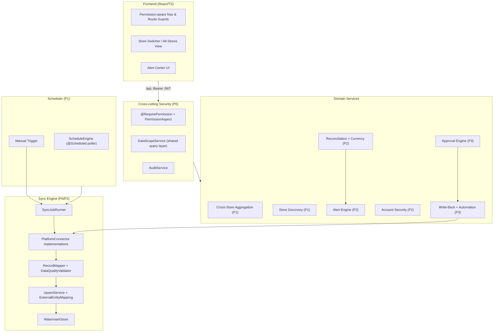
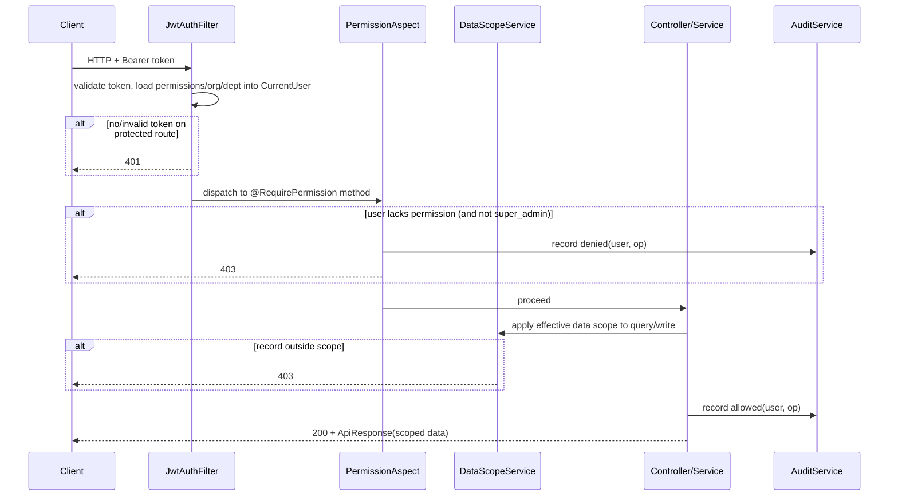

# Design Document

## Overview

This design turns AdPilot AI from a CRUD shell with stored credentials into a live, automated, access-controlled operations platform. It is organized by the same capability areas as the requirements and sequenced by phase (P0 → P3), so design and tasks can be delivered incrementally without rework.

The design deliberately builds on what already exists rather than introducing parallel structures:

- **Sync** reuses `platform_connections`, `api_sync_jobs`, `api_sync_logs`, `external_entity_mappings`, `channel_orders`, `channel_products`, `channel_inventory_sync`, and the existing `PlatformConnector` (which already performs real credential validation against WooCommerce, Shopify, Amazon LWA, and TikTok). It adds a connector contract for *pulling* data (today the connector only *tests* connectivity), a watermark store, and a job runner.
- **Permission enforcement** reuses the existing `PermissionChecker`, `CurrentUser`, `SecurityConfig` (`@EnableMethodSecurity` is already on), `data_scopes`, `user_stores`, and `audit_logs`. The gap is that controllers do not enforce anything and the JWT principal is not populated with permissions/org/department. This design closes both.
- **Scheduling** introduces a Spring scheduling engine driving the existing `sync_schedules` table.
- **Finance, alerts, account security, approvals, and AI write-back** extend existing tables (`settlements`, `settlement_transactions`, `approval_policies`, `login_logs`, `recommendations`, `automation_policies`) and add the few tables that are genuinely missing.

The guiding end-to-end flow remains: encrypted credential → scheduled sync → validation + normalization → analytics → AI/automation → one-click apply / auto-execute → write-back → audit + alerts.

### Existing-System Facts That Constrain This Design

These were confirmed by reading the codebase and materially shape the design:

1. **The JWT principal is thin.** `JwtAuthFilter` builds `CurrentUser` with only `userId`, `email`, and `roles`; `permissions`, `orgId`, and `departmentId` are never set. `PermissionChecker.hasPermission` reads `user.getPermissions()`, which is therefore always null today. Enforcement (Req 2.1) requires populating these fields per request.
2. **No controller enforces permissions or data scope.** `PermissionChecker` exists but is referenced nowhere. `SecurityUtils.isStoreAdmin()` hard-codes role names and is the only scoping primitive in use.
3. **No scheduler exists.** There is no `@EnableScheduling`, Quartz, or ShedLock anywhere; `sync_schedules` is a dormant table.
4. **The connector tests but does not pull.** `PlatformConnector` validates credentials but has no method to retrieve orders/products. `ApiSyncServiceImpl.createApiSyncJob` records a job row but performs no real retrieval.
5. **Credentials are encrypted at rest** in `platform_connections.config` (via `CryptoUtil`) and decrypted on demand; this design preserves that and never logs secrets.
6. **IDs are `CHAR(36)` UUIDs**, entities are MyBatis-Plus `@TableName` + JPA-annotated, responses use `ApiResponse`/`PageResponse`, and the frontend talks to `/api/**` through a single `request()` client.

## Architecture

### High-Level Component Map



### Request Lifecycle With Enforcement (P0)



### Key Architectural Decisions

- **Enforce permissions with a method annotation + AOP aspect**, not by editing every controller body. A `@RequirePermission("campaign:update")` annotation read by a `PermissionAspect` keeps enforcement declarative and consistent, and centralizes the audit write. Spring's `@EnableMethodSecurity` is already enabled, but a custom annotation lets us reuse the existing `PermissionChecker` and emit audit entries uniformly. **Rationale:** minimizes churn across the ~30 existing controllers and gives one choke point for Req 2.1.5 auditing.
- **Populate the principal once per request.** `JwtAuthFilter` (or a small `UserContextService` it calls) loads the user's effective permission set, `orgId`, and `departmentId` and places them on `CurrentUser`. The permission set is cached in Redis (already configured) keyed by user id with a short TTL and explicit invalidation on role/permission change, satisfying Req 3.1.5's "without re-login" requirement.
- **Data scope as a shared query layer.** A `DataScopeService` produces a reusable MyBatis-Plus `QueryWrapper` fragment (`applyScope(wrapper, ctx)`) and a single-record guard (`assertCanAccess(entity)`), so every module enforces the same rules (Req 7.1.5). It resolves the **effective data scope** by precedence all-company → department → assigned-store/assigned-product → own.
- **Sync uses a connector SPI + a single job runner.** The existing `PlatformConnector` is refactored toward a `PlatformDataConnector` interface with `pullOrders`, `pullProducts`, etc., returning a normalized stream of `ExternalRecord`. A `SyncJobRunner` owns job lifecycle, watermarking, validation, upsert, and logging so the same orchestration serves WooCommerce/Shopify (P0) and Amazon (P2).
- **Idempotency via `external_entity_mappings`.** Every upsert is keyed on `(store_id, platform, internal_entity_type, external_entity_id)`; this existing unique key is the idempotency anchor (Req 1.2).
- **Scheduling via a DB-polled engine.** A `@Scheduled` poller scans `sync_schedules` for due, enabled rows and dispatches to `SyncJobRunner`, updating `last_run_at`/`next_run_at`. A DB row lock (or Redis lock) guards against double execution if more than one instance runs. **Rationale:** avoids adding Quartz while remaining horizontally safe.
- **Currency conversion is a pure service over an `exchange_rates` table**, returning both original and converted amounts plus the rate/effective-date used, and flagging unconvertible amounts rather than guessing (Req 9.2, Req 5.1.5).
- **Approval interception mirrors permission interception.** An `@RequiresApproval` annotation + aspect checks enabled policies/thresholds and, when triggered, persists an `approval_request` and short-circuits execution into a pending state (Req 12.1).

## Components and Interfaces

### Capability Area 1–2 reuse note
New code lives under `com.adpilot.modules.*` following the existing `controller / service / service.impl / entity / mapper / vo / dto` layout, and cross-cutting code under `com.adpilot.common.*`.

### Sync (P0/P2): `com.adpilot.modules.apisync`

```java
// SPI implemented per platform; WooCommerce + Shopify first, Amazon in P2.
public interface PlatformDataConnector {
    String platform(); // "woocommerce", "shopify", "amazon_sp_api", ...
    // Pull records changed since `since` (null => full pull). Streams to avoid memory blowups.
    ExternalPage pullOrders(ConnectionContext ctx, Instant since, PageCursor cursor);
    ExternalPage pullProducts(ConnectionContext ctx, Instant since, PageCursor cursor);
    // Amazon-only extensions (P2)
    default ExternalPage pullInventory(ConnectionContext ctx, Instant since, PageCursor cursor) { ... }
    default ExternalPage pullAdReports(ConnectionContext ctx, Instant since, PageCursor cursor) { ... }
    default List<DiscoveredStore> discoverStores(ConnectionContext ctx) { ... } // P1, Req 6.1
}

public record ExternalRecord(String externalId, String entityType, Instant changedAt,
                             String status, Map<String,Object> fields) {}
public record ExternalPage(List<ExternalRecord> records, PageCursor next, boolean hasMore) {}
```

```java
public interface SyncJobRunner {
    // Req 1.1.2 on-demand; Req 1.3 lifecycle; Req 1.3.6 single-flight per (store, entityType).
    ApiSyncJobVo startSync(UUID connectionId, String entityType, boolean fullResync, UUID triggeredBy);
    void execute(UUID jobId); // invoked async by runner or scheduler
}

public interface UpsertService {            // Req 1.2
    // Returns CREATED or UPDATED; never duplicates for a known externalId.
    UpsertResult upsert(SyncContext ctx, MappedRecord record);
}

public interface DataQualityValidator {     // Req 1.4
    ValidationResult validate(String entityType, MappedRecord record);
}

public interface WatermarkStore {            // Req 1.1.6-8
    Optional<Instant> get(UUID storeId, String entityType);
    void advance(UUID storeId, String entityType, Instant newWatermark);
}
```

New endpoints (additive; existing `ApiSyncController` retained):
- `POST /api/stores/{storeId}/sync` body `{ entityType, fullResync }` → start on-demand sync (Req 1.1.2).
- `GET /api/stores/{storeId}/sync-jobs` → sync history, most-recent-first (Req 1.3.5).
- `GET /api/api-sync/jobs/{id}/logs` → record-level logs (Req 1.3.4).

### Permission Enforcement (P0): `com.adpilot.common.security`

```java
@Target(ElementType.METHOD) @Retention(RetentionPolicy.RUNTIME)
public @interface RequirePermission { String value(); }

@Aspect @Component
public class PermissionAspect {              // Req 2.1
    // Around @RequirePermission: if !checker.hasPermission(v) -> audit + throw 403.
    // super_admin bypass handled by PermissionChecker. Missing auth -> 401 via filter.
}

public interface UserContextService {        // populates principal per request
    CurrentUser load(String userId); // permissions + orgId + departmentId, Redis-cached
    void invalidate(String userId);  // Req 3.1.5 on role/permission change
}
```

`DataScopeService` (also serves P1 Area 7):

```java
public interface DataScopeService {
    EffectiveScope resolve(CurrentUser user);                  // Req 7.1.4 precedence union
    <T> void applyScope(QueryWrapper<T> wrapper, ScopeTarget target, CurrentUser user); // Req 2.2.1 / 7.1.5
    void assertCanRead(Object entity, CurrentUser user);       // Req 2.2.2 -> 403
    void assertCanWrite(Object entity, CurrentUser user);      // Req 2.2.3 -> 403
}

public enum ScopeType { ALL_COMPANY, DEPARTMENT, ASSIGNED_STORE, ASSIGNED_PRODUCT, OWN }
```

### Frontend Permission UX (P0): `frontend/src/app`

- `PermissionContext` (React context) loads the permission set from `GET /api/auth/me` after login and exposes `can(permission)`.
- `<RequirePermission permission="...">` wrapper hides/disables action controls (Req 3.1.2).
- Route guard `<ProtectedRoute permission="...">` blocks direct navigation and renders an access-denied view (Req 3.1.4).
- Navigation config maps each menu item to a required permission; the menu renders only allowed items (Req 3.1.1).
- A lightweight re-fetch of `/api/auth/me` on navigation refreshes permissions without logout (Req 3.1.5).

### Scheduler (P1): `com.adpilot.modules.scheduler`

```java
public interface ScheduleEngine {
    @Scheduled(fixedDelayString="${adpilot.scheduler.poll-ms:30000}")
    void tick();                                  // Req 4.1.1: run due+enabled schedules
    SyncScheduleVo upsertSchedule(SyncScheduleDto dto);   // Req 4.1.4 validate cron
    SyncScheduleVo setEnabled(UUID id, boolean enabled);  // Req 4.2.2
    ApiSyncJobVo triggerNow(UUID scheduleId, UUID userId);// Req 4.2.3 manual run
}

public interface CronEvaluator {                  // Req 4.1.4 validate, 4.1.2/4.1.5 next-run
    boolean isValid(String expression);
    Instant nextRunAfter(String expression, Instant from);
}
```

### Cross-Store Aggregation (P1): `com.adpilot.modules.dashboard`
`AggregationService.aggregate(user, dateRange)` returns `{ totals, byStore[] }` over accessible stores only (Req 5.1.1–5.1.3), converting via `CurrencyService` and emitting per-currency subtotals with an `unconverted` flag when a rate is missing (Req 5.1.4–5.1.5).

### Store Discovery (P1): `com.adpilot.modules.store`
`StoreDiscoveryService.discover(connectionId, user)` calls `connector.discoverStores`, then creates-or-reuses internal stores keyed on the platform marketplace identifier (Req 6.1).

### Finance (P2): `com.adpilot.modules.finance` / `settlement`
`ReconciliationService.reconcile(settlementId)` aggregates fees from `settlement_transactions`, compares to expected, and flags discrepancies beyond tolerance (Req 9.1). `CurrencyService.convert(amount, from, to, date)` returns `ConvertedAmount(original, converted?, rate?, rateDate?, unconverted)` (Req 9.2).

### Alerts (P2): `com.adpilot.modules.alert`
`AlertEngine.evaluate(...)` generates/updates/resolves alerts in a unified `alerts` table with dedup on `(store_id, alert_type, subject_id, status=open)` (Req 10.1.7–10.1.8) and dispatches to Feishu via the existing `feishu` module, recording push failures without losing the alert (Req 10.1.6/10.1.9).

### Account Security (P2): `com.adpilot.modules.auth`
`LoginSecurityService` enforces a per-account failed-attempt counter and lockout (Req 11.1.1–11.1.6); `PasswordPolicyService.validate(password)` enforces strength (Req 11.1.3); session control adds a token denylist in Redis for logout/admin invalidation (Req 11.2).

### Approval (P3) & Write-Back/Automation (P3)
`@RequiresApproval` + `ApprovalAspect` intercept governed actions; `ApprovalService` routes, sequences levels, blocks self-approval, expires (Req 12.1). `WriteBackService.apply(recommendationId)` submits through the connector and audits (Req 13.1); `AutomationRunner` evaluates rules on schedule, clamps to bounds, and submits/audits (Req 13.2).

## Data Models

Existing tables are reused as-is unless noted. New tables are additive Flyway migrations (`V3__core_platform_completion.sql`, etc.), MySQL 8, `CHAR(36)` UUID PKs, `DATETIME(3)` timestamps, matching existing conventions.

### Reused tables (no change)
`platform_connections`, `api_sync_jobs`, `api_sync_logs`, `api_error_logs`, `external_entity_mappings`, `channel_orders`, `channel_products`, `channel_inventory_sync`, `sync_schedules`, `data_scopes`, `user_stores`, `roles`, `role_permissions`, `permissions`, `audit_logs`, `login_logs`, `settlements`, `settlement_transactions`, `approval_policies`, `recommendations`, `automation_policies`, `automation_executions`, `marketplaces`, `stores`.

### New / extended tables

```sql
-- Req 1.1.6-8: per (store, entity_type) sync watermark
CREATE TABLE IF NOT EXISTS sync_watermarks (
    id CHAR(36) PRIMARY KEY DEFAULT (UUID()),
    store_id CHAR(36) NOT NULL REFERENCES stores(id),
    entity_type VARCHAR(50) NOT NULL,
    watermark_at DATETIME(3),
    cursor_token VARCHAR(512),
    updated_at DATETIME(3) DEFAULT CURRENT_TIMESTAMP(3) ON UPDATE CURRENT_TIMESTAMP(3),
    UNIQUE KEY uk_watermark (store_id, entity_type)
);

-- Req 1.4: per-record data-quality errors captured during mapping
CREATE TABLE IF NOT EXISTS sync_record_errors (
    id CHAR(36) PRIMARY KEY DEFAULT (UUID()),
    job_id CHAR(36) NOT NULL REFERENCES api_sync_jobs(id),
    external_entity_id VARCHAR(255),
    field VARCHAR(100),
    error_code VARCHAR(100),
    error_message TEXT,
    created_at DATETIME(3) DEFAULT CURRENT_TIMESTAMP(3)
);

-- Req 9.2: exchange rates by currency pair and effective date
CREATE TABLE IF NOT EXISTS exchange_rates (
    id CHAR(36) PRIMARY KEY DEFAULT (UUID()),
    base_currency VARCHAR(10) NOT NULL,
    quote_currency VARCHAR(10) NOT NULL,
    rate DECIMAL(18,8) NOT NULL,
    effective_date DATE NOT NULL,
    source VARCHAR(50),
    created_at DATETIME(3) DEFAULT CURRENT_TIMESTAMP(3),
    UNIQUE KEY uk_rate (base_currency, quote_currency, effective_date)
);

-- Req 10.1: unified alert center
CREATE TABLE IF NOT EXISTS alerts (
    id CHAR(36) PRIMARY KEY DEFAULT (UUID()),
    store_id CHAR(36) NOT NULL REFERENCES stores(id),
    alert_type VARCHAR(50) NOT NULL,        -- stockout|acos|buybox|negative_review
    subject_id VARCHAR(255),                -- product/campaign identifier
    severity VARCHAR(20) DEFAULT 'warning',
    status VARCHAR(20) DEFAULT 'open',      -- open|resolved
    message TEXT,
    feishu_pushed TINYINT(1) DEFAULT 0,
    first_seen_at DATETIME(3) DEFAULT CURRENT_TIMESTAMP(3),
    last_seen_at DATETIME(3) DEFAULT CURRENT_TIMESTAMP(3),
    resolved_at DATETIME(3),
    UNIQUE KEY uk_open_alert (store_id, alert_type, subject_id, status)
);

-- Req 12.1: approval requests (policies already exist)
CREATE TABLE IF NOT EXISTS approval_requests (
    id CHAR(36) PRIMARY KEY DEFAULT (UUID()),
    policy_id CHAR(36) REFERENCES approval_policies(id),
    module VARCHAR(100) NOT NULL,
    action_type VARCHAR(100) NOT NULL,
    payload JSON,
    amount DECIMAL(18,4),
    initiated_by CHAR(36) NOT NULL,
    status VARCHAR(20) DEFAULT 'pending',   -- pending|approved|rejected|expired|cancelled
    current_level INT DEFAULT 1,
    expires_at DATETIME(3),
    created_at DATETIME(3) DEFAULT CURRENT_TIMESTAMP(3),
    updated_at DATETIME(3) DEFAULT CURRENT_TIMESTAMP(3) ON UPDATE CURRENT_TIMESTAMP(3)
);

CREATE TABLE IF NOT EXISTS approval_decisions (
    id CHAR(36) PRIMARY KEY DEFAULT (UUID()),
    request_id CHAR(36) NOT NULL REFERENCES approval_requests(id),
    level INT NOT NULL,
    approver_id CHAR(36) NOT NULL,
    decision VARCHAR(20) NOT NULL,          -- approved|rejected
    comment TEXT,
    created_at DATETIME(3) DEFAULT CURRENT_TIMESTAMP(3)
);

-- Req 13.2: automation rules with bid bounds (distinct from existing automation_policies)
CREATE TABLE IF NOT EXISTS automation_rules (
    id CHAR(36) PRIMARY KEY DEFAULT (UUID()),
    store_id CHAR(36) NOT NULL REFERENCES stores(id),
    rule_type VARCHAR(50) NOT NULL,         -- bid_adjustment|negative_keyword
    enabled TINYINT(1) DEFAULT 1,
    condition_json JSON,
    min_bid DECIMAL(18,4),
    max_bid DECIMAL(18,4),
    created_at DATETIME(3) DEFAULT CURRENT_TIMESTAMP(3),
    updated_at DATETIME(3) DEFAULT CURRENT_TIMESTAMP(3) ON UPDATE CURRENT_TIMESTAMP(3)
);

-- Req 5.2 store grouping + default store; Req 11.1 account lockout state
ALTER TABLE stores            ADD COLUMN store_group VARCHAR(100) NULL;
ALTER TABLE users             ADD COLUMN default_store_id CHAR(36) NULL;
ALTER TABLE users             ADD COLUMN failed_login_count INT NOT NULL DEFAULT 0;
ALTER TABLE users             ADD COLUMN locked_until DATETIME(3) NULL;
ALTER TABLE users             ADD COLUMN twofa_enabled TINYINT(1) NOT NULL DEFAULT 0;
ALTER TABLE users             ADD COLUMN twofa_secret VARCHAR(255) NULL;
-- Req 9.2.2/9.2.6: amounts retain original + converted + rate metadata
ALTER TABLE settlements       ADD COLUMN reporting_currency VARCHAR(10) NULL;
ALTER TABLE settlements       ADD COLUMN converted_amount DECIMAL(18,4) NULL;
ALTER TABLE settlements       ADD COLUMN exchange_rate DECIMAL(18,8) NULL;
ALTER TABLE settlements       ADD COLUMN rate_effective_date DATE NULL;
ALTER TABLE settlements       ADD COLUMN reconciliation_status VARCHAR(20) NULL; -- matched|discrepancy
-- Req 8.1.5: connection re-auth flagging
ALTER TABLE platform_connections ADD COLUMN seller_account_id VARCHAR(255) NULL;
```

### Core domain value objects

```mermaid
classDiagram
    class EffectiveScope { ScopeType type; Set~UUID~ storeIds; Set~UUID~ productIds; UUID departmentId; UUID userId }
    class MappedRecord { String externalId; String entityType; String status; Map fields; Instant changedAt }
    class ConvertedAmount { BigDecimal original; String fromCurrency; BigDecimal converted; BigDecimal rate; LocalDate rateDate; boolean unconverted }
    class UpsertResult { enum Outcome CREATED|UPDATED; UUID internalId }
    class ValidationResult { boolean valid; List~FieldError~ errors }
```



## Correctness Properties

*A property is a characteristic or behavior that should hold true across all valid executions of a system — essentially, a formal statement about what the system should do. Properties serve as the bridge between human-readable specifications and machine-verifiable correctness guarantees.*

PBT applies strongly to this feature's pure logic: idempotent upserts, watermark selection, data-scope resolution, permission decisions, currency conversion, fee/profit math, alert deduplication, lockout state, approval rules, and bid clamping. External integrations (platform pulls, Amazon request signing, Feishu push), security-config behaviors (401/403 routing), and UI bootstrap flows are covered by integration/example tests in the Testing Strategy instead.

Following the prework, overlapping criteria were consolidated: the four scope dimensions (Req 2.2.4, 7.1.1–7.1.3) collapse into one scope-filtering property; all idempotent upsert criteria (Req 1.2.1–1.2.3, 8.1.4) into one; the continue-on-error and validation criteria (Req 1.3.2/1.3.4/1.4.1–1.4.3) into one; and the conversion-retention criteria (Req 9.2.1/9.2.2/9.2.6) into one.

### Property 1: External-record mapping populates internal fields and store association

*For any* external order or product record retrieved through a connection, mapping it produces an internal record whose required fields are populated with correctly typed values and whose store id equals the store that owns the originating connection.

**Validates: Requirements 1.1.3, 1.1.4, 8.1.3**

### Property 2: Incremental retrieval selects only post-watermark records

*For any* set of external records each carrying a change timestamp and any watermark value, the records selected for an incremental sync are exactly those whose change timestamp is strictly after the watermark; when no watermark exists or a full resync is requested, all records are selected.

**Validates: Requirements 1.1.6, 1.1.7**

### Property 3: Successful sync advances the watermark monotonically to the latest processed record

*For any* batch of successfully processed records, the resulting watermark equals the maximum change timestamp among them and is never less than the prior watermark.

**Validates: Requirements 1.1.8**

### Property 4: Upsert is idempotent and keyed on the external identifier

*For any* set of external records, processing them once produces the same set of internal records and external-to-internal mappings as processing them two or more times; a record whose external id already maps updates the existing internal record, and a record with an unmapped external id creates exactly one internal record plus its mapping.

**Validates: Requirements 1.2.1, 1.2.2, 1.2.3, 8.1.4**

### Property 5: Externally removed records are status-marked, never physically deleted

*For any* previously-mapped internal record reported as deleted or cancelled by the platform, after processing the internal row still exists and its status is marked cancelled/inactive.

**Validates: Requirements 1.2.4**

### Property 6: Validation excludes invalid records, logs each, and processing continues with consistent counts

*For any* batch containing a mix of valid and invalid records, every invalid record is excluded from upsert and produces exactly one recorded data-quality/record error, every valid record is upserted, and processed-count plus failed-count equals the number of records attempted.

**Validates: Requirements 1.3.2, 1.3.4, 1.4.1, 1.4.2, 1.4.3**

### Property 7: Sync history is ordered most-recent-first

*For any* set of sync jobs for a store, the history returned is ordered by start time descending.

**Validates: Requirements 1.3.5**

### Property 8: At most one running sync per store and entity type

*For any* sequence of sync-start requests for the same store and entity type, at no point are two jobs simultaneously in the running state for that pair; additional requests are rejected or queued.

**Validates: Requirements 1.3.6**

### Property 9: Authorization permits exactly authorized callers and audits every decision

*For any* user and required permission, the operation is permitted if and only if the user holds that permission or has the super-administrator role; otherwise it is rejected with 403, and in all cases exactly one audit entry recording the user identity and requested operation is written.

**Validates: Requirements 2.1.1, 2.1.2, 2.1.4, 2.1.5**

### Property 10: Data-scope filtering restricts reads and writes to permitted records across every scope dimension

*For any* user with an effective data scope (all-company, department, assigned-store, assigned-product, or own) and any dataset, the records returned by a scoped query are exactly those permitted by that scope, and a single-record read or a create/modify targeting a record outside that scope is rejected; a super-administrator is granted access to all records.

**Validates: Requirements 2.2.1, 2.2.3, 2.2.4, 2.2.5, 7.1.1, 7.1.2, 7.1.3, 7.1.5, 10.1.5**

### Property 11: Effective data scope is the broadest applicable across a user's roles

*For any* user holding a set of roles with assorted data scopes, the resolved effective scope equals the broadest by the precedence all-company → department → assigned-store/assigned-product → own, and the records it permits equal the union of the records permitted by each individual role's scope.

**Validates: Requirements 7.1.4**

### Property 12: Navigation and action controls expose only permitted items

*For any* permission set, the set of rendered navigation items and enabled action controls equals exactly the set of items whose required permission is held by the user.

**Validates: Requirements 3.1.1, 3.1.2**

### Property 13: Recurrence validation and next-run computation are well-defined

*For any* recurrence expression, validation accepts it if and only if it is well-formed, and for any well-formed expression and base time the computed next run time is strictly after the base time (so a failed or completed execution never blocks subsequent runs).

**Validates: Requirements 4.1.2, 4.1.4, 4.1.5**

### Property 14: Schedule enable-state round-trips and manual triggers preserve recurrence

*For any* schedule, persisting an enabled flag and reading it back yields the same value, and a manual trigger executes the job while leaving the configured recurrence expression and computed next run time unchanged by the manual run.

**Validates: Requirements 4.2.2, 4.2.3**

### Property 15: All-stores aggregation equals the sum over accessible stores only

*For any* set of stores with per-store metrics, the all-stores totals equal the sum of the per-store metrics across exactly the stores the user may access (converted to the reporting currency where a rate exists), and no inaccessible store contributes to either the totals or the per-store breakdown.

**Validates: Requirements 5.1.1, 5.1.2, 5.1.3, 5.1.4**

### Property 16: Store search returns exactly the name-matching stores

*For any* set of store names and any search text, the filtered switcher list contains every accessible store whose name matches the text and no store whose name does not.

**Validates: Requirements 5.2.2**

### Property 17: Store grouping is a complete, correct partition

*For any* set of stores with assigned groups, each store appears under exactly its assigned group and every accessible store appears exactly once.

**Validates: Requirements 5.2.4**

### Property 18: Store discovery is idempotent and links the marketplace identifier

*For any* set of discovered marketplaces, discovery creates one internal store per previously-unseen marketplace (linked to the originating seller account and carrying the reported marketplace identifier) and reuses the existing store for already-known marketplaces, so repeated discovery never creates duplicates.

**Validates: Requirements 6.1.2, 6.1.3, 6.1.4**

### Property 19: Fee aggregation, discrepancy flagging, and profit inclusion are exact

*For any* settlement with a set of transactions, the aggregated fees equal the sum of the transaction fee amounts, the settlement is flagged as a discrepancy if and only if the absolute difference between reported and computed expected amount exceeds the configured tolerance, and the computed profit is reduced by exactly the aggregated fees.

**Validates: Requirements 9.1.1, 9.1.2, 9.1.3, 9.1.4**

### Property 20: Currency conversion uses the date-effective rate and retains full provenance

*For any* amount, currency pair, and transaction date for which a rate exists, the converted amount equals the amount times the rate effective on that date, and the result retains the original amount, the converted amount, the rate value, and the rate's effective date; when no rate exists the amount is flagged unconverted and no rate is applied.

**Validates: Requirements 9.2.1, 9.2.2, 9.2.4, 9.2.6**

### Property 21: Alert generation is deduplicated and resolves when the condition clears

*For any* store and alert condition, repeatedly evaluating the condition while it remains active yields exactly one open alert (the existing one is updated, not duplicated), and once the condition is no longer met the corresponding alert is marked resolved.

**Validates: Requirements 10.1.1, 10.1.2, 10.1.7, 10.1.8**

### Property 22: Login lockout counter is threshold-correct, resets on success, and is per-account

*For any* interleaved sequence of login attempts across accounts, an account becomes locked exactly when its consecutive failure count reaches the configured limit, a successful login resets that account's counter to zero, and one account's failures never affect another account's lock state.

**Validates: Requirements 11.1.1, 11.1.5, 11.1.6**

### Property 23: Password acceptance matches the strength policy

*For any* candidate password, it is accepted if and only if it satisfies the configured password strength policy.

**Validates: Requirements 11.1.3**

### Property 24: Every login attempt is logged with its outcome

*For any* login attempt, exactly one login-log entry recording the attempt outcome is written.

**Validates: Requirements 11.1.4**

### Property 25: Approval gating, completion, rejection, ordering, and self-approval prohibition

*For any* governed action and policy, the action is placed in a pending state instead of executing when the policy is enabled and its threshold is met (and executes immediately otherwise); the action executes exactly once only after all required levels approve in their defined order; any rejection cancels the action without executing it; and the user who initiated the action can never record an approval for it.

**Validates: Requirements 12.1.1, 12.1.3, 12.1.4, 12.1.5, 12.1.6**

### Property 26: Approval-governed write-back and automation submit only after approval

*For any* recommendation application or automated change governed by an enabled policy whose threshold is met, no change is submitted to the live platform until the approval is complete.

**Validates: Requirements 13.1.4, 13.2.6**

### Property 27: Platform rejection leaves internal state unchanged and records the reason

*For any* applied or automated change that the live platform rejects, the affected internal record is identical to its pre-submission state and a failure reason is recorded.

**Validates: Requirements 13.1.3, 13.2.7**

### Property 28: Applied and automated changes are fully audited

*For any* change submitted to the live platform, the audit trail contains the change, the submitting user (or the automation source for automated changes), and the platform response.

**Validates: Requirements 13.1.2, 13.2.4**

### Property 29: Adjusted bids are always clamped within the rule's bounds

*For any* desired bid value and any rule with a minimum and maximum bound, the value actually submitted lies within the inclusive range and equals the nearest bound whenever the desired value falls outside it.

**Validates: Requirements 13.2.2, 13.2.5**

## Error Handling

The design reuses the existing `GlobalExceptionHandler`, `BusinessException`, and `ApiResponse`/`ResultCode` conventions. Specific handling:

- **Authentication/authorization**: missing/invalid token on a protected route returns 401 (via `SecurityConfig` entry point); insufficient permission or out-of-scope access returns 403 (via `PermissionAspect`/`DataScopeService` raising `BusinessException` mapped to 403, consistent with the existing access-denied handler). Each decision is audited.
- **External platform failures**: rejected credentials (Req 1.1.5) and expired/invalid Amazon tokens (Req 8.1.5) mark the job failed and the connection `requires_reauth`, recording the reason in `api_error_logs`; secrets are never logged. Transient HTTP errors are retried with bounded backoff before the job is failed.
- **Record-level errors** (Req 1.3.4, 1.4.2): captured in `sync_record_errors`, the failed counter is incremented, and the runner continues with remaining records — a single bad record never aborts the batch.
- **Concurrency** (Req 1.3.6): a duplicate sync request for a busy (store, entity) returns a clear "sync already running" business error or is queued; guarded by a DB/Redis lock.
- **Currency without a rate** (Req 9.2.4, 5.1.5): the amount is flagged `unconverted` and aggregation degrades to per-currency subtotals rather than failing.
- **Feishu push failure** (Req 10.1.9): recorded against the alert (`feishu_pushed=0` plus a logged reason); the alert is retained in the center.
- **Approval rejection/expiration** (Req 12.1.4, 12.1.7): the action is cancelled and the outcome recorded; expired requests are swept by the scheduler.
- **Write-back rejection** (Req 13.1.3, 13.2.7): internal state is left untouched and the platform's rejection reason is persisted in the audit trail.

## Testing Strategy

### Dual approach
- **Property-based tests** validate the 29 universal properties above (the pure-logic core).
- **Unit tests** cover specific lifecycle transitions and edge cases (e.g., job start/complete state, 2FA flow, route guards).
- **Integration tests** cover external boundaries that are not amenable to PBT.

### Property-based testing
- **Library**: backend uses **jqwik** (JUnit 5 property testing) for Java; frontend permission/aggregation logic uses **fast-check** with Vitest/Jest for TypeScript.
- Each property test runs a **minimum of 100 iterations**.
- Each test is tagged with a comment referencing its design property in the form: **Feature: core-platform-completion, Property {number}: {property_text}**.
- Each correctness property is implemented by a **single** property-based test.
- Pure services (`DataScopeService`, `CurrencyService`, `CronEvaluator`, `UpsertService`, `ReconciliationService`, lockout/password/approval/clamping logic) are tested directly; DB-touching properties (idempotent upsert, watermark, alert dedup, single-flight) run against an in-memory or Testcontainers MySQL with mocked connectors so 100+ iterations stay fast and external calls are never made.

Map of properties to implementation:
- Sync: Properties 1–8 (`RecordMapper`, `WatermarkStore`, `UpsertService`, `DataQualityValidator`, `SyncJobRunner`).
- Access control: Properties 9–12 (`PermissionAspect`, `DataScopeService`, frontend `PermissionContext`).
- Scheduling: Properties 13–14 (`CronEvaluator`, `ScheduleEngine`).
- Aggregation/discovery: Properties 15–18 (`AggregationService`, store switcher logic, `StoreDiscoveryService`).
- Finance: Properties 19–20 (`ReconciliationService`, `CurrencyService`).
- Alerts: Property 21 (`AlertEngine`).
- Account security: Properties 22–24 (`LoginSecurityService`, `PasswordPolicyService`).
- Approval & write-back: Properties 25–29 (`ApprovalService`, `WriteBackService`, `AutomationRunner`).

### Integration tests (1–3 examples each, not PBT)
- WooCommerce/Shopify pulls (Req 1.1.1) and Amazon SP-API/Ads pulls + request signing (Req 8.1.1, 8.1.2) against mock platform servers (e.g., WireMock).
- Rejected-credentials and expired-token error paths (Req 1.1.5, 8.1.5).
- Feishu push success/failure (Req 10.1.6, 10.1.9).
- Exchange-rate source wiring (Req 9.2.5) — smoke test.

### Unit / example tests
- Job lifecycle states (Req 1.3.1, 1.3.3), on-demand job creation (Req 1.1.2).
- 401 on protected route without token (Req 2.1.3).
- Frontend permission bootstrap and route guard (Req 3.1.3, 3.1.4, 3.1.5).
- Schedule due/disabled dispatch with a controlled clock (Req 4.1.1, 4.1.3), schedule view projection (Req 4.2.1).
- Default-store selection (Req 5.2.3), BuyBox/negative-review alert creation (Req 10.1.3, 10.1.4).
- Logout/session invalidation, 2FA, sensitive-action re-confirmation, admin session termination (Req 11.2.1–11.2.4).
- Approval routing (Req 12.1.2) and expiration (Req 12.1.7); VAT inclusion (Req 9.2.3).
