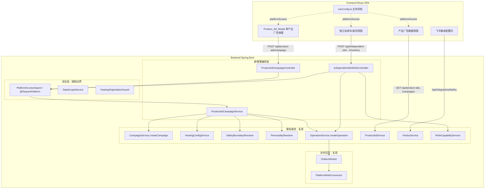
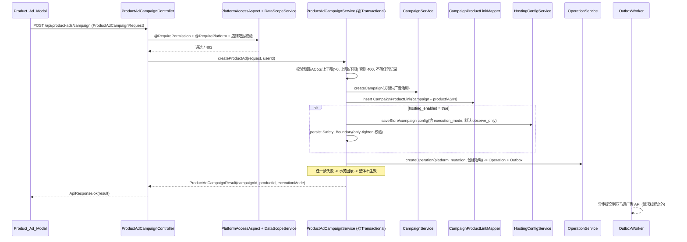

# Design Document

## Overview

本设计为 `multistore-ai-ads-operations`（多店铺 AI 广告运营）规格提供技术方案。如需求文档所强调，**这是一个"扩展/复用"规格**：平台（`backend-java` Spring Boot 单体 + `frontend` React/Vite SPA）已经实现了报表生命周期、广告活动创建、托管配置、安全边界、AI 人格、Operation-Outbox 异步回写、RBAC（Platform_Access / Store_Group_Scope / Data_Scope_Service）、飞书集成等底层能力。本设计只补齐尚未成形的"连接层"：

1. **以产品为入口的广告创建弹窗**（Req 1）——新增一个前端弹窗 + 一个把"建活动 + 关联产品 + 落托管配置 + 落安全边界 + 异步回写"打包成单事务的后端编排端点。
2. **亚马逊广告数据可见性**（Req 2）——以产品为视角聚合活动与表现数据、暴露报表同步可观测性、用文案讲清 T+1 与初步/最终数据。
3. **独立站 Google Ads 权限门控**（Req 3）——把既有的导航渲染规则与后端 `@RequirePlatform` 一致化。
4. **独立站库存/发货回写**（Req 4）——在有有效连接时，经 Operation-Outbox 通过 `PlatformWriteConnector` 异步回写；暴露连接状态；无凭据绝不伪造成功。
5. **TikTok 独立菜单**（Req 5）——新增第五个 Nav_Block 与第五个 `PlatformFamily`（`tiktok`），把 TikTok 从独立站中移出。
6. **渠道隔离与多店铺切换**（Req 6）——把"按平台族隔离"形式化为连接、读取、切换的一致约束。
7. **按账号、按店铺的飞书通知**（Req 7）——形式化通知只走该店铺绑定的飞书集成、绝不跨账号/跨店铺串。
8. **巡检、指引与 README**（Req 8）——验收维度 + 后台内分步指引 + README。

### 设计原则

- **复用优先**：除非确有缺口，否则不新建表/服务，而是在既有端点与服务上增加薄编排层与 VO。
- **后端强制安全边界**：所有标注【安全边界】的隔离规则由后端的 `PlatformAccessAspect`、`DataScopeService`、`HostingOrgIsolationGuard` 强制执行，前端隐藏控件只是体验优化，绝不作为安全手段。
- **绝不在请求线程内同步调用外部平台**：所有外部写入都经 `OperationService.createOperation` 落 Operation + Outbox，由 `OutboxWorker` 异步提交（复用既有契约）。
- **诚实呈现能力边界**：缺 API/缺凭据时，界面如实标注"暂不支持"或"未授权"，绝不提供会静默失败的入口。

### 关键缺口（研究发现）

研究既有代码后发现两个需要小幅扩展的点，本设计会显式处理：

1. **`tiktok` 平台族尚不存在**。`PlatformFamily` 枚举（`com.adpilot.modules.rbac.PlatformFamily`）与前端 `PlatformFamily` 类型只有四个值；`account_platform_access.platform_family` 的 CHECK 约束限定为 `('amazon','independent_site','logistics','finance')`。新增 TikTok 需扩展枚举、前端类型、CHECK 约束与导航配置。
2. **`feishu_integrations` 缺少显式账号列**。该表有 `store_id`、`connection_type`，但没有 `created_by`/`owner_account_id` 列。Req 7 的"按账号"隔离需要补一个 `owner_account_id` 列（幂等迁移），否则"账号"维度只能间接由 Data_Scope 推断。

## Architecture

### 系统上下文

本规格横跨前后端，落在既有分层中：



### 单产品广告创建编排流（Req 1）

新增端点 `POST /api/product-ads/campaign` 是本规格唯一的"重量级"新增逻辑。它在**一个事务**内编排既有服务，把外部写入留给 Outbox 异步执行：



### 安全边界强制点

| 边界 | 强制机制 | 复用组件 |
|------|----------|----------|
| Platform_Access（能进哪个 Nav_Block） | 方法级 `@RequirePlatform(family)` → 403 | `PlatformAccessAspect` |
| Store_Group_Scope（能读/写哪些店铺） | 列表查询注入谓词 + 单记录 `assertCanRead/assertCanWrite` → 403 | `DataScopeService` |
| 跨平台族操作（声明族与目标店铺族不一致） | 在编排服务中比对 `store.platform_family` 与目标族 → 403 | `StoreEntity.platformFamily` + `PlatformFamily` |
| 组织隔离（托管/报表） | 既有守卫 | `HostingOrgIsolationGuard` |

## Components and Interfaces

### 1. 单产品 AI 广告创建弹窗（Req 1）

#### 1.1 前端：`ProductAdModal`（新增组件）

- 位置：`frontend/src/app/`（商品管理/产品详情入口）。
- 仅当 `currentUser.platformAccess` 含产品所属店铺的平台族、且持有 `advertising:view` 与广告创建权限（`advertising:manage`）时渲染"创建广告"动作（Req 1.1）。这是体验门控；真正的拒绝由后端 403 保证。
- 采集字段（Req 1.2）：预算金额、预算类型、AI 人格、`hosting_enabled`、安全边界（目标 ACoS、出价上下限、预算上下限）、执行模式。执行模式可不选（提交时后端按 `observe_only` 处理，Req 1.3）。
- 提交前做轻量前端校验（非正数、上限<下限即时提示），但权威校验在后端（Req 1.4）。
- 新增 API 客户端函数 `createProductAdCampaign(req)`（`frontend/src/app/lib/api.ts`），调用 `POST /api/product-ads/campaign`，复用既有 `request<T>` 错误解包。

#### 1.2 后端：`ProductAdCampaignController`（新增）

```java
@RestController
@RequestMapping("/api/product-ads")
@RequiredArgsConstructor
public class ProductAdCampaignController {

    private final ProductAdCampaignService productAdCampaignService;

    /** 单产品广告创建编排端点（Req 1.5–1.10）。 */
    @PostMapping("/campaign")
    @RequirePermission("advertising:manage")
    @RequirePlatform(PlatformFamily.AMAZON) // 单产品关键词广告目前限定亚马逊族
    public ApiResponse<ProductAdCampaignResultVo> createProductAdCampaign(
            @Valid @RequestBody ProductAdCampaignRequest request) {
        String userId = SecurityUtils.getCurrentUserIdOrNull();
        return ApiResponse.ok(productAdCampaignService.createProductAd(request, userId));
    }
}
```

- `@RequirePermission` + `@RequirePlatform` 复用既有切面；额外的店铺范围校验在服务内用 `DataScopeService.assertCanWrite`（Req 1.8）。

#### 1.3 后端：`ProductAdCampaignService`（新增，编排既有服务）

```java
public interface ProductAdCampaignService {
    /**
     * 在单个事务内：校验输入 -> 经 CampaignService 建关键词广告活动 ->
     * 落 CampaignProductLink -> （若 hosting_enabled）落 HostingConfig + Safety_Boundary ->
     * 经 OperationService 落 Operation+Outbox 异步回写。任一步失败整体回滚（Req 1.9）。
     */
    ProductAdCampaignResultVo createProductAd(ProductAdCampaignRequest request, String userId);
}
```

实现要点：
- 方法标注 `@Transactional`，保证活动、关联、托管配置、安全边界四类记录的原子性（Req 1.9）。
- **输入校验**（Req 1.4）：预算、目标 ACoS、出价/预算上下限必须为正；上限不得小于下限。任一不满足抛 `BusinessException(400)`，指明具体字段，事务不开始写入。复用 `SafetyBoundaryValidator` 做 only-tighten 校验。
- **执行模式默认**（Req 1.3）：`ExecutionMode.parse(request.executionMode)`，为 `null` 时用 `ExecutionMode.DEFAULT`（`observe_only`）。
- **建活动**：调用既有 `CampaignService.createCampaign(CampaignCreateRequest, userId)`，活动类型为关键词广告（手动定向 SP）。
- **关联产品**：插入 `CampaignProductLinkEntity`（`campaignId`、`storeId`、`parentAsin`/`productId`）。
- **托管 + 边界**：`hosting_enabled` 为真时，经 `HostingConfigService` 持久化 campaign 级配置（含 `execution_mode`），并持久化 `SafetyBoundaryEntity`（Req 1.6）。
- **异步回写**：经 `OperationService.createOperation(CreateOperationCommand)` 落 `platform_mutation` Operation 与 Outbox 条目，绝不在请求线程内调用亚马逊 API（Req 1.7）。
- 返回 `ProductAdCampaignResultVo{ campaignId, productId/parentAsin, executionMode }`（Req 1.10）。

### 2. 亚马逊广告数据可见性与产品关联（Req 2）

- **产品↔活动列出**（Req 2.1）：扩展查询，按 `campaign_product_links` + `CampaignEntity.parentAsin` 返回与某产品（ASIN）关联的活动。复用 `CampaignService.listCampaigns` 的 `parentAsin` 过滤（已存在）。
- **表现数据**（Req 2.2）：复用 `ProductAdService.listPromotedProducts` 与 `performance_daily`，VO 至少含花费、点击、订单、销售额、ACoS。
- **数据状态标注**（Req 2.3）：`PerformanceDailyEntity.dataStatus`（`preliminary`/`finalized`）透传到 VO，前端按值显示标签。
- **T+1 文案**（Req 2.4）：前端静态说明文案（与 Req 8.4 一致）。
- **同步可观测性**（Req 2.5、2.6）：新增只读端点 `GET /api/product-ads/sync-status?storeId=`，返回 `ReportSyncRunEntity` 的最近一次 `last_success_at`/`reportStatus` 与 `ReportSyncErrorEntity` 的可读失败原因。失败时如实呈现失败状态，绝不伪造成功。
- **数据范围隔离**（Req 2.7）：所有读取经 `DataScopeService.applyScope` 注入店铺范围谓词，非超管只返回其 `Store_Group_Scope` 内店铺数据。

新增只读 VO：

```java
public record ProductAdSyncStatusVo(
    String storeId, String reportType,
    String reportStatus,            // completed | running | failed
    LocalDateTime lastSuccessAt,
    String lastError) {}            // 失败原因可读文本；成功时为 null
```

### 3. 独立站 Google Ads 按权限显示（Req 3）

- **前端渲染规则**（Req 3.1、3.2）：`navConfig.ts` 中 `google_ads/*` 项已归属 `independent_site` 块且带 `advertising:view`。导航壳按 `platformAccess.includes('independent_site')` 且持 `advertising:view` 决定是否渲染。本规格把该规则固化为可测试的纯函数 `visibleNavBlocks(user)`（若尚未抽出则抽出）。
- **后端访问规则**（Req 3.3）：Google Ads 路由对应的控制器方法加 `@RequirePlatform(PlatformFamily.INDEPENDENT_SITE)`，无权限 → 403，独立于前端是否隐藏。
- **权限变化即时生效**（Req 3.4）：前端每次从 `GET /api/auth/me` 拉取 `platformAccess`，不依赖登录态缓存（既有 `fetchCurrentUser` 已如此）。

### 4. 独立站库存更新与发货回写（Req 4）

#### 4.1 后端：`IndependentSiteWriteController`（新增）

```java
@RestController
@RequestMapping("/api/independent-site")
@RequiredArgsConstructor
public class IndependentSiteWriteController {

    private final IndependentSiteWriteService writeService;

    @PostMapping("/products/{productId}/inventory")
    @RequirePermission("product:manage")
    @RequirePlatform(PlatformFamily.INDEPENDENT_SITE)
    public ApiResponse<OperationActionVo> updateInventory(
            @PathVariable String productId, @Valid @RequestBody InventoryUpdateRequest req) { ... }

    @PostMapping("/orders/{orderId}/fulfillment")
    @RequirePermission("order:manage")
    @RequirePlatform(PlatformFamily.INDEPENDENT_SITE)
    public ApiResponse<OperationActionVo> markFulfillment(
            @PathVariable String orderId, @Valid @RequestBody FulfillmentRequest req) { ... }

    /** 暴露每个独立站店铺的写入能力与连接状态（Req 4.4、4.7）。 */
    @GetMapping("/connection-state")
    @RequirePermission("store:view")
    @RequirePlatform(PlatformFamily.INDEPENDENT_SITE)
    public ApiResponse<List<IndependentSiteConnectionStateVo>> connectionState(
            @RequestParam(required = false) String storeId) { ... }
}
```

#### 4.2 后端：`IndependentSiteWriteService`（新增，编排）

- **连接校验**（Req 4.1、4.3）：用 `WriteCapabilityService.isWriteCapable(storeId)` + 查询该店铺 `shopify`/`woocommerce` 连接状态。无有效连接或缺凭据（`not_authorized`）→ 返回未授权（HTTP 403/409），**绝不返回成功、绝不记录已发生的回写**。
- **异步回写**（Req 4.2）：经 `OperationService.createOperation` 落 Operation+Outbox，由 `OutboxWorker` 调用 `PlatformWriteConnector`（shopify/woocommerce 实现）异步提交，不在请求线程内同步调用外部平台。
- **失败处理**（Req 4.5）：回写失败时 Operation 置 `failed` 并保留可读失败原因（复用既有 `SyncState.FAILED` + 失败原因字段）。
- **能力边界标注**（Req 4.7）：当某平台目标能力（库存或发货 API）尚不可用（连接器未注册 / 能力缺失），`connection-state` 返回该能力为 `unsupported`，前端把入口标注为"暂不支持"而非提供静默失败入口。
- **范围隔离**（Req 4.6）：`DataScopeService.assertCanWrite` + 平台族比对。

连接状态 VO：

```java
public record IndependentSiteConnectionStateVo(
    String storeId, String platform,        // shopify | woocommerce
    String connectionState,                  // not_authorized | syncing | failed | connected
    boolean inventoryWriteSupported,         // 平台/连接器能力（Req 4.7）
    boolean fulfillmentWriteSupported,
    LocalDateTime lastSuccessAt) {}
```

### 5. TikTok 独立菜单与隔离（Req 5）

- **新增第五个 `PlatformFamily`**：
  - 后端 `com.adpilot.modules.rbac.PlatformFamily` 增加 `TIKTOK("tiktok")`。
  - 前端 `navConfig.ts` 的 `PlatformFamily` 类型增加 `'tiktok'`；`defaultExpandState()` 增加 `tiktok: true`。
  - 数据库 `account_platform_access.platform_family` 的 CHECK 约束扩展为含 `'tiktok'`（幂等迁移）。
- **新增第五个 Nav_Block**（Req 5.1、5.2）：在 `navBlocks` 末尾追加 `key: 'tiktok'` 块；把 TikTok 店铺连接入口从独立站块移出，连接入口 `to: '/data-sync?platform=tiktok'`（Req 5.3，连接入口平台范围限定 `tiktok`，只创建 `tiktok_shop` 族连接）。
- **可见性与 403**（Req 5.4、5.5）：导航壳按 `platformAccess.includes('tiktok')` 渲染该块；后端 TikTok 路由加 `@RequirePlatform(PlatformFamily.TIKTOK)` → 无权限 403。
- **能力边界标注**（Req 5.6）：块内对已支持能力（店铺连接、订单/商品数据同步）与未支持能力（TikTok 广告管理动作）如实标注，未实现路由因 `RESOLVABLE_ROUTES` 未收录而不渲染（既有 `routeResolves` 机制）。

### 6. 店铺渠道隔离与多店铺管理（Req 6）

- **每店铺唯一平台族**（Req 6.1）：`StoreEntity.platformFamily` 已是单值列。本规格确保 TikTok 店铺写入 `platform_family='tiktok'`。
- **连接同族约束**（Req 6.2）：连接入口的 `?platform=` 参数限定该块平台族；`IndependentSiteConnectionService.connectStore` 与数据同步连接服务校验所建连接平台键属于该族（amazon 族 / independent_site 族 / tiktok 族）。
- **读取同族 + 范围内**（Req 6.3）：店铺范围读取经 `DataScopeService` 注入谓词，并按当前 Nav_Block 平台族过滤。
- **切换同族**（Req 6.4、6.6）：前端店铺切换器按平台族分组，仅在当前块平台族内切换。
- **跨族操作 403**（Req 6.5）：编排服务比对目标店铺 `platform_family` 与声明族，不一致 → 403。

### 7. 按账号、按店铺独立的飞书通知（Req 7）

- **绑定**（Req 7.1）：`feishu:manage` 账号经 `POST /api/integrations/feishu/connect` 为指定 `storeId` 绑定其自有飞书凭据。**扩展**：为 `feishu_integrations` 增加 `owner_account_id`（创建账号）列，绑定时写入当前用户，使隔离"按账号"可强制。
- **发送只走本店铺绑定**（Req 7.2）：`HostingNotificationServiceImpl` 已调用 `feishuService.pushAiNotification(storeId, ...)`，由 `FeishuService` 按 `store_id` 解析 `feishu_chat_bindings` → 该店铺绑定的集成。本规格收紧解析：只选 `store_id` 匹配且（扩展后）`owner_account_id` 匹配该店铺所属账号的集成。
- **绝不跨账号/跨店铺复用**（Req 7.3）：解析逻辑严格按 `(store_id[, owner_account_id])` 过滤；无匹配即不发送。
- **无绑定优雅跳过**（Req 7.4）：`pushAiNotification` 返回 `false` 表示无目的地 → 记录可读跳过原因，不报错中断其他店铺通知（既有行为，强化日志）。
- **测试连接**（Req 7.5）：复用 `POST /api/integrations/feishu/{id}/test-message`。
- **范围隔离**（Req 7.6）：飞书集成的查看/管理经 `DataScopeService` 限定在账号 `Store_Group_Scope` 内店铺。

### 8. 巡检、指引与 README（Req 8）

- **功能巡检**（Req 8.1、8.2）：以集成测试/冒烟测试覆盖关键端到端流程（店铺连接、报表同步与产品广告数据展示、单产品广告创建提交、独立站回写、TikTok 连接、飞书发送），逐项记录通过/失败与可读原因。
- **后台内分步指引**（Req 8.3、8.4、8.6）：在相关页面增加分步引导文案，含亚马逊数据来源与 T+1/初步数据说明，并对"暂不支持"能力如实标注。
- **README**（Req 8.5、8.6）：更新 `README.md`，含能力概览、各 Nav_Block（含 TikTok）用途、各平台族连接方式、单产品广告创建与飞书配置指引、当前限制。

## Data Models

本规格以复用既有表为主，仅有两处幂等的小幅 schema 扩展。

### 复用的既有表（无结构变更）

| 表 | 用途 | 关键列 |
|----|------|--------|
| `campaigns` | 关键词广告活动 | `id`, `store_id`, `parent_asin`, `hosting_enabled`, `execution_mode` |
| `campaign_product_links` | 活动↔产品关联 | `campaign_id`, `store_id`, `parent_asin`, `product_id` |
| `hosting_configs` | 托管配置（含 execution_mode） | `store_id`, `scope`, `scope_id`, JSON 配置 |
| `safety_boundaries` | 安全边界（only-tighten 四级继承） | 目标 ACoS、出价/预算上下限 |
| `performance_daily` | 活动/关键词/天指标 | `spend`,`clicks`,`orders`,`sales`,`acos`,`data_status` |
| `advertised_product_report` | 按 ASIN 广告表现 | ASIN 聚合指标 |
| `report_sync_runs` / `report_sync_errors` | 同步可观测性 | `report_status`,`completed_at`,`error` |
| `operations` / `operation_outbox` | 异步回写状态机 | `sync_state`, `entity_type`, `entity_id` |
| `platform_connections` | 平台连接与状态 | `store_id`, `platform`, `status` |
| `stores` | 店铺与平台族 | `platform_family` |
| `feishu_integrations` / `feishu_chat_bindings` | 飞书集成与会话绑定 | `store_id`, `connection_type` |

### Schema 扩展 1：新增 `tiktok` 平台族（Req 5）

幂等迁移（MySQL，遵循文件内既有 `adpilot_*` 辅助过程风格）：

```sql
-- 扩展 account_platform_access 的 CHECK 约束以允许 'tiktok'
ALTER TABLE account_platform_access
  DROP CHECK <existing_check>,
  ADD CONSTRAINT chk_apa_family
    CHECK (platform_family IN ('amazon','independent_site','logistics','finance','tiktok'));
-- stores.platform_family 为自由 VARCHAR(20)，无需改约束，新值 'tiktok' 直接可用。
```

> 注：`store_groups.platform_family` 的 CHECK 仍限 `('amazon','independent_site')`，与既有 `PlatformFamily.isStoreGroupFamily()` 一致。TikTok 店铺是否需要 Store_Group 归属取决于既有连接流；本规格沿用 `independent-site/connect/store` 流（其已支持 TikTok 店铺创建），暂不把 TikTok 纳入 Store_Group 约束，避免越界改动 `platform-workspace-rbac` 的范围。

### Schema 扩展 2：飞书集成的账号归属（Req 7）

```sql
-- 为 feishu_integrations 增加创建账号列，支撑"按账号"隔离
ALTER TABLE feishu_integrations
  ADD COLUMN owner_account_id CHAR(36) NULL;
CALL adpilot_create_index_if_missing(
  'feishu_integrations', 'idx_feishu_integrations_owner', '(owner_account_id, store_id)');
```

### 新增的 DTO / VO（无表）

- `ProductAdCampaignRequest`：`storeId`, `productId`/`parentAsin`, `budget`, `budgetType`, `personality`, `hostingEnabled`, `targetAcos`, `bidMin`, `bidMax`, `budgetMin`, `budgetMax`, `executionMode`(可选)。
- `ProductAdCampaignResultVo`：`campaignId`, `productId`/`parentAsin`, `executionMode`。
- `ProductAdSyncStatusVo`、`IndependentSiteConnectionStateVo`、`InventoryUpdateRequest`、`FulfillmentRequest`（见上文）。

## Correctness Properties

*A property is a characteristic or behavior that should hold true across all valid executions of a system—essentially, a formal statement about what the system should do. Properties serve as the bridge between human-readable specifications and machine-verifiable correctness guarantees.*

下列属性来自上一步对每条验收标准的 prework 分类，并经过"属性反思"去重：把同一不变量在不同端点的多次出现合并为一条全称属性，并标注其覆盖的全部需求条款。属性聚焦于**本规格新增/收紧的后端业务逻辑**（输入校验、默认值解析、范围/平台族隔离、异步回写编排、飞书路由、导航可见性纯函数），不为 IaC、纯 UI 文案、外部服务连通性、文档编写编写属性测试。

### Property 1: 输入校验拒绝非法预算/边界

*For any* 单产品广告创建请求，若其预算、目标 ACoS、出价上下限或预算上下限中存在非正数，或任一上限小于其对应下限，则编排服务必须以校验错误（HTTP 400，指明具体字段）拒绝，且不创建任何活动、产品关联、托管配置或安全边界记录。

**Validates: Requirements 1.4**

### Property 2: 执行模式缺省回落到 observe_only

*For any* 执行模式输入字符串（包括 null、空白、非法值、合法枚举值），编排服务解析出的执行模式满足：当输入为 null/空白/不可识别时结果恒为 `observe_only`（`ExecutionMode.DEFAULT`），当输入为合法枚举值时结果恒等于该值。

**Validates: Requirements 1.3**

### Property 3: 合法提交产生一致的编排结果

*For any* 合法的单产品广告创建请求，提交成功后系统必须创建一个关键词广告活动、建立一条指向该请求所指产品（ASIN/productId）的 `CampaignProductLink`，并且返回结果中的 `campaignId`、`productId`/`parentAsin` 与实际创建的记录一致、`executionMode` 等于按 Property 2 解析出的执行模式。

**Validates: Requirements 1.5, 1.10**

### Property 4: 托管条件下持久化托管配置与安全边界

*For any* 合法的单产品广告创建请求，当且仅当 `hosting_enabled` 为真时，系统持久化该活动的 HostingConfig（其 `execution_mode` 等于解析出的执行模式）与对应的 Safety_Boundary；当 `hosting_enabled` 为假时，不写入任何托管配置或安全边界记录。

**Validates: Requirements 1.6**

### Property 5: 提交原子性（全有或全无）

*For any* 单产品广告创建请求，若活动创建、产品关联、托管配置、安全边界四个持久化步骤中的任意一步失败，则系统不得保留其中任何一步的部分写入——该次提交对这四类记录整体生效或整体不生效。

**Validates: Requirements 1.9**

### Property 6: 外部写入只经 Operation+Outbox 异步提交

*For any* 触发对外部平台写入的有效提交（单产品广告创建或独立站库存/发货回写），系统必须创建对应的 Operation 与 Outbox 条目，且在请求处理线程内绝不调用 `PlatformWriteConnector`（即外部平台 API 的同步调用次数为零）。

**Validates: Requirements 1.7, 4.2**

### Property 7: 写入操作的店铺范围与平台族隔离

*For any* 写入操作（单产品广告创建、独立站库存/发货回写、任意跨族操作），若目标店铺不在登录账号的 `Store_Group_Scope` 内，或目标店铺的 `platform_family` 与账号的 `Platform_Access`/声明的平台族不一致，则系统必须以 HTTP 403 拒绝，且不持久化任何更改。

**Validates: Requirements 1.8, 4.6, 6.5**

### Property 8: 店铺范围读取隔离

*For any* 店铺范围的数据读取（产品广告与表现数据、店铺列表与切换候选、飞书集成查看/管理），对任意非超级管理员账号，返回结果只包含其 `Store_Group_Scope` 内、且与当前 Nav_Block 平台族一致的店铺数据，绝不包含任何其他店铺组或其他平台族的数据。

**Validates: Requirements 2.7, 6.3, 6.4, 7.6**

### Property 9: 后端平台族门控

*For any* 受 `@RequirePlatform(family)` 保护的后端操作与任意账号，若账号的 `Platform_Access` 不含该 `family`，则请求被拒以 HTTP 403；若含该 `family`（或为超级管理员），则放行——该判定独立于前端是否隐藏控件。

**Validates: Requirements 3.3, 5.5**

### Property 10: 导航可见性是 Platform_Access 的纯函数

*For any* 账号身份与其 `Platform_Access` 集合，导航解析函数返回的可见 Nav_Block 与 Nav_Item 集合满足：某 Nav_Block（含 Google Ads 所在的 `independent_site` 块、`tiktok` 块）可见当且仅当账号的 `Platform_Access` 含该块平台族且持有该项所需功能权限；同一身份在不同 `Platform_Access` 输入下产生相应不同的可见性（无需重新登录）。

**Validates: Requirements 3.1, 3.2, 3.4, 5.4**

### Property 11: 产品↔活动关联查询完备且不泄漏

*For any* 产品与后台活动/关联数据集合，按某产品查询其关联广告活动返回的集合恰为通过 `CampaignProductLink` 或 `CampaignEntity.parentAsin` 与该产品关联的全部活动，既不遗漏关联活动，也不包含未关联活动。

**Validates: Requirements 2.1**

### Property 12: 表现数据与数据状态保真映射

*For any* `performance_daily`/`advertised_product_report` 行，映射为对外 VO 后必须包含花费、点击、订单、销售额与 ACoS 五项指标且数值与源行一致；若源行带 `data_status`，VO 必须忠实反映其为 `preliminary` 或 `finalized`，不得改写或丢失。

**Validates: Requirements 2.2, 2.3**

### Property 13: 同步失败永不映射为成功

*For any* 报表同步运行记录，若其为失败状态，则其同步状态 VO 的 `reportStatus` 不得为任何成功值（`completed`/`success`），且必须携带非空、可读的失败原因；系统绝不为失败的同步呈现空白或伪造的成功状态。

**Validates: Requirements 2.6**

### Property 14: 独立站写入受连接状态门控且不可写时无副作用

*For any* 独立站库存更新或发货标记请求与目标店铺：当且仅当该店铺存在状态为已连接（`connected`）的 Shopify/WooCommerce 连接且具备所需凭据时，系统进入回写路径（创建 Operation+Outbox）；当店铺无有效连接或缺凭据（`not_authorized`）时，系统以未授权拒绝，绝不返回成功、绝不创建任何 Operation/Outbox 或记录已发生的回写。

**Validates: Requirements 4.1, 4.3**

### Property 15: 块内连接只能创建同平台族连接

*For any*（Nav_Block 平台族, 平台键）组合，块内发起的店铺连接创建当且仅当该平台键属于该块平台族时被允许；属于其他平台族的平台键一律被拒绝，不会在该块内创建跨族连接。

**Validates: Requirements 6.2**

### Property 16: 飞书通知按店铺与账号隔离

*For any* 店铺与系统中存在的多个飞书集成，为该店铺发送通知时所选用的集成必须满足其 `store_id` 等于该店铺、且（按账号归属）`owner_account_id` 等于该店铺对应账号；系统绝不使用某账号的凭据为其未绑定的店铺发送，亦不跨账号复用集成发送。

**Validates: Requirements 7.2, 7.3**

## Error Handling

| 场景 | 处理 | HTTP/状态 |
|------|------|-----------|
| 预算/ACoS/上下限非法（Req 1.4） | `BusinessException` 指明字段，事务未开始 | 400 |
| 店铺超出 Store_Group_Scope / 平台族不符（Req 1.8、4.6、6.5） | `DataScopeService.assertCanWrite` / 平台族比对抛 403 | 403 |
| 无 Platform_Access（Req 3.3、5.5） | `PlatformAccessAspect` 抛 403 并审计 | 403 |
| 独立站店铺无有效连接/缺凭据（Req 4.3） | 拒绝，返回未授权，不落 Operation | 403/409 |
| 平台回写失败（Req 4.5） | Operation→`failed`，保留可读原因，可重试 | Operation 状态 |
| 编排中任一持久化失败（Req 1.9） | `@Transactional` 回滚，整体不生效 | 500/400（视错因） |
| 飞书无绑定（Req 7.4） | `pushAiNotification` 返回 false，记录可读跳过原因，不中断其他店铺 | 无异常 |
| 同步失败（Req 2.6） | VO 呈现失败状态与原因，绝不伪造成功 | 正常返回带失败标记 |
| 外部平台调用 | 仅在 `OutboxWorker` 异步线程内，失败按既有重试/状态机处理 | 异步 |

错误响应统一经既有 `GlobalExceptionHandler` 序列化为 `ApiResponse` 错误信封；前端 `request<T>` 解包对非 2xx 与 `success:false` 均抛出可读错误，绝不静默吞错。

## Testing Strategy

### 双重测试策略

- **单元测试**：覆盖具体示例、边界与错误条件（如 connector 拒绝导致 Operation→failed 的 4.5、绑定写入 7.1）。
- **属性测试**：覆盖上节 16 条全称属性，验证校验、默认解析、范围/平台族隔离、异步编排、飞书路由、导航可见性等跨输入的不变量。
- **集成/冒烟测试**：覆盖外部连通性与端到端巡检（Req 7.5、8.1、8.2）与文档检查（Req 8.5、8.6），各 1–3 个代表性用例，不做属性化。

### 属性测试配置

- 使用既有 **jqwik**（后端，见 `TableViewIsolationPropertyTest` 范式：`@Property(tries = ...)` + Mockito mock mapper/服务 + `@Provide` 生成器）；前端导航可见性属性可用 **fast-check**。
- 每条属性测试最少运行 **100** 次迭代（`@Property(tries = 100)` 起）。
- 每条属性测试以注释标注其对应设计属性，格式：
  `Feature: multistore-ai-ads-operations, Property {number}: {property_text}`
- 每条设计属性用**单个**属性测试实现；不从零造测试框架。
- 隔离类属性（Property 7、8、9、16）沿用 `TableViewIsolationPropertyTest` 的"把 mapper 建模为按 scope 过滤的存储 + 校验下发查询条件含当前 scope 而不含他者"手法，确保既验证返回结果隔离、又验证查询谓词正确。

### 测试与既有契约的衔接

- 编排服务测试 mock `CampaignService`、`HostingConfigService`、`OperationService`、`PlatformWriteConnector`，以验证调用关系与"不在请求线程内同步调用 connector"（Property 6）。
- 原子性（Property 5）通过在某一 mock 步骤抛异常并断言其余 mapper 的 `insert` 从未提交（或事务回滚语义）来验证。
- 复用既有 `HostingOperationControllerTest`、`ReportSync*`、`WriteCapabilityService` 测试基线，避免重复覆盖既有能力。
