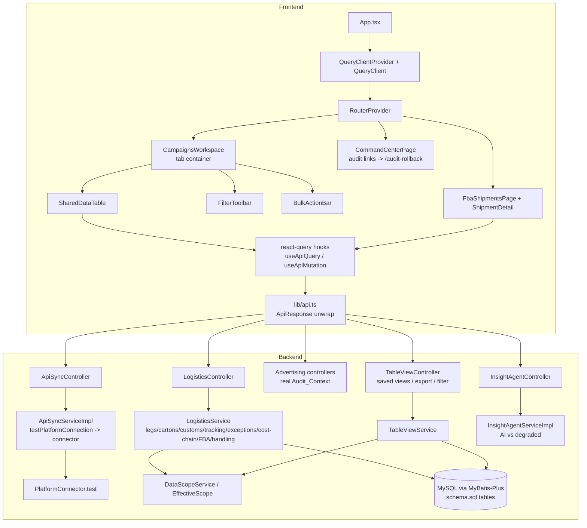

# Design Document

## Overview

This design delivers six coordinated platform enhancements for **AdPilot AI** across the React/TypeScript frontend (`frontend/`) and the Java 17 / Spring Boot 3.2.5 backend (`backend-java/`). The work is structural-quality, depth, reusability, and stub-cleanup focused; it deliberately does **not** redefine surfaces owned by sibling specs (see Reconciliation below).

The six areas, mapped to requirements:

1. **Advertising page decomposition** (Req 1) — break the monolithic `CampaignsPage.tsx` into a tab container plus three reusable building blocks: `SharedDataTable`, `FilterToolbar`, `BulkActionBar`, preserving the existing eleven-tab taxonomy.
2. **Logistics / FBA shipment depth** (Req 4–10, 16, 18) — extend the flat `shipments`/`shipment_items` model with multi-leg transport paths, carton specs, managed carriers, customs clearance, tracking trajectory, exceptions, FBA core fields, handling costs, and an aggregated end-to-end cost chain.
3. **Reusable table capabilities** (Req 2) — saved views, column configuration, bulk operations, server-side CSV export, pinned columns, and server-side advanced filtering, surfaced through `SharedDataTable` and backed by new endpoints.
4. **Data-fetching unification** (Req 3) — mount a single `@tanstack/react-query` `QueryClient`, define a query-key convention and default cache policy, and provide thin query/mutation hooks that unwrap the `ApiResponse` envelope, migrated page-by-page.
5. **Navigation bug fix** (Req 11) — repoint Command Center `/audit` links to the registered `/audit-rollback` route.
6. **Backend stub cleanup** (Req 12–15) — replace `userId = "system"` with the real `Audit_Context`, make `testPlatformConnection(id)` perform a real connector test, return real AI insights from the Insight Agent with a clear AI-vs-degraded distinction, and externalize/rotate the Amazon Ads LWA credentials.

Plus two cross-cutting concerns:

7. **Tenant/store isolation** (Req 17) — all new logistics entities are scoped via the existing `DataScopeService`/`EffectiveScope` model; saved views are scoped per user.
8. **Schema ownership** (Req 19) — all new tables are added to `backend-java/db/schema.sql`, consistent with the no-Flyway, `ddl-auto: none`, manually-imported-schema strategy.

### Reconciliation with sibling specs (no duplication)

- **`project-fix-and-cleanup`** owns schema *consolidation*, build, and deploy. This spec only **adds new feature tables** to the same `db/schema.sql` file using the established DDL conventions; it does not restructure existing tables or change build/deploy.
- **`core-platform-completion`** owns platform sync, RBAC, and the `PlatformConnector.test(...)` contract. Requirement 13 here **consumes** that contract (`platformConnector.test(platform, config)`) rather than redefining it; it only wires the second entry point (`testPlatformConnection(id)`) into the same connector call.
- **`app-functionality-completion`** owns the `CampaignsPage` tab taxonomy (its Req 19) and Insight Agent behavior (its Req 24). This spec **preserves** the eleven-tab taxonomy verbatim while decomposing the page, and **hardens** the Insight Agent's AI-vs-degraded contract without changing its query semantics.

## Architecture

### Current state (confirmed against the codebase)

- Frontend: `main.tsx` → `App.tsx` → `RouterProvider`. No `QueryClientProvider` is mounted even though `@tanstack/react-query@^5.101.0` is a declared dependency. Pages hand-roll `useEffect` + `loading`/`error` + manual reload. All HTTP goes through `lib/api.ts`, which unwraps the `ApiResponse<T>` envelope (`{ success, data, error }`).
- Backend: REST under `/api`, responses wrapped in `ApiResponse` by `GlobalResponseWrapper`. Security context exposes the acting user via `SecurityUtils.getCurrentUserId()` / `getCurrentUserIdOrNull()`. Row-level isolation is provided by `DataScopeService.applyScope(...)` / `assertCanRead(...)` / `assertCanWrite(...)` driven by `EffectiveScope`. Logistics today is `ShipmentEntity` + `ShipmentItemEntity` only.
- Schema: `db/schema.sql` is the single source of truth; `shipments` and `shipment_items` already exist with `CHAR(36)` UUID PKs, `DATETIME(3)` timestamps, and `REFERENCES` FKs.

### Target architecture



### Key architectural decisions

- **Decomposition over rewrite (Req 1, 3.10).** `CampaignsPage` is decomposed into standalone modules and pages migrate to react-query incrementally; the old `useEffect` pattern coexists during migration. No big-bang rewrite.
- **Server-side filtering, export, and "select all matching" (Req 2.7–2.9).** Advanced filtering, CSV export, and cross-page bulk selection are evaluated on the backend so they operate over the full filtered result set, not just the rendered page. The frontend sends filter conditions; the backend translates them into scoped queries.
- **Composition-based logistics model (Req 4–10).** New child tables (`shipment_legs`, `carton_specs`, `customs_clearance`, `tracking_events`, `shipment_exceptions`, `handling_costs`, `shipment_line_items`) reference `shipments(id)` with `ON DELETE CASCADE`; `carriers` is org-scoped and referenced by legs. The `Cost_Chain` is computed (not stored) from these components.
- **Reuse existing security primitives (Req 12, 17).** Acting-user resolution uses `SecurityUtils`; isolation uses `DataScopeService`. No parallel mechanisms are introduced.
- **Consume, don't redefine, the connector contract (Req 13).** Both test entry points converge on `platformConnector.test(...)`.

## Components and Interfaces

### Frontend

#### 1. Data Fetching Layer (Req 3)

Mount a single client at the app root and provide thin typed hooks.

```typescript
// app/lib/queryClient.ts
export const queryClient = new QueryClient({
  defaultOptions: {
    queries: {
      staleTime: 30_000,        // Req 3.9: default stale time 30s
      gcTime: 300_000,          // Req 3.9: default cache retention 300s
      retry: 3,                 // Req 3.5: up to 3 retries for reads
      refetchOnWindowFocus: false,
    },
    mutations: {
      retry: 0,                 // Req 3.6: never auto-retry mutations
    },
  },
});

// app/App.tsx wraps RouterProvider in <QueryClientProvider client={queryClient}>  (Req 3.1)

// app/lib/queryKeys.ts — Req 3.8 convention: [resource, storeId, ...params]
export const qk = {
  campaigns: (storeId?: string, params?: unknown) => ['campaigns', storeId, params] as const,
  shipments: (storeId?: string, params?: unknown) => ['shipments', storeId, params] as const,
  shipmentDetail: (id: string) => ['shipment', id] as const,
  carriers: (orgScope?: string) => ['carriers', orgScope] as const,
  savedViews: (tableKey: string) => ['saved-views', tableKey] as const,
  // ...
};

// app/lib/hooks/useApiQuery.ts
// Thin wrappers; data is already unwrapped from ApiResponse by lib/api.ts request().
export function useApiQuery<T>(key, fetcher, options?): UseQueryResult<T>;
export function useApiMutation<TData, TVars>(mutationFn, options?): UseMutationResult<TData, Error, TVars>;
```

- Loading/error/data: `useApiQuery` exposes `isLoading`, `isError`, `error` (human-readable message thrown by `request()` from `error.message`), and unwrapped `data` (Req 3.2, 3.4).
- On write success, hosts call `queryClient.invalidateQueries({ queryKey: [resource, storeId] })` to refresh affected reads (Req 3.3).
- Failed reads keep the last cached data (react-query default `keepPreviousData`/cache retention) (Req 3.4); mutation manual retry is the `mutate` re-invocation (Req 3.6).
- Migration is page-by-page; unmigrated pages keep working (Req 3.7, 3.10).

#### 2. SharedDataTable, FilterToolbar, BulkActionBar (Req 1, 2)

```typescript
// app/components/table/SharedDataTable.tsx
export interface ColumnDef<Row> {
  key: string;
  header: string;
  render?: (row: Row) => React.ReactNode;
  pinnable?: boolean;
  filterType?: 'text' | 'number' | 'enum' | 'date';
  enumOptions?: string[];
}

export interface SharedDataTableProps<Row> {
  rows: Row[];
  columns: ColumnDef<Row>[];
  rowId: (row: Row) => string;
  tableKey: string;                       // identity for saved views / column config
  total?: number;                         // for pagination + "select all matching"
  loading?: boolean;                      // -> skeleton (Req 1.5)
  error?: string | null;                  // -> error + retry (Req 1.7, 2 empty/err)
  onRetry?: () => void;
  emptyState?: React.ReactNode;           // Req 1.6 / 2.15
  bulkOperations?: BulkOperation<Row>[];  // drives BulkActionBar (Req 1.4, 2.5/2.6)
  filterState: FilterState;
  onFilterChange: (next: FilterState) => void;
}

// app/components/table/FilterToolbar.tsx  (Req 1.3, 2.9/2.10)
// app/components/table/BulkActionBar.tsx  (Req 1.4, 2.5/2.6)
// app/components/table/useColumnConfig.ts (Req 2.2/2.3 — >=1 visible column invariant)
// app/components/table/useSavedViews.ts    (Req 2.11/2.13/2.14)
```

- **Column configuration (Req 2.2, 2.3):** `useColumnConfig` enforces the invariant that at least one column stays visible; attempting to hide the last visible column is rejected with a message and no state change.
- **Pinned columns (Req 2.4):** 1–5 columns held fixed via sticky CSS at the table start; the rest scroll horizontally.
- **Selection (Req 2.5–2.7):** row checkboxes accumulate selected ids; "select all matching the current filter" stores the *filter descriptor* (not the page rows) so a bulk op resolves to all matching records server-side. Activating a bulk op with no selection is rejected with a message (Req 2.6).
- **Empty / loading / error (Req 1.5–1.7, 2.15):** skeleton while loading with refresh disabled; empty-state (not error) for zero rows; error indicator with retry that re-requests and leaves prior rows unchanged.
- **Standalone modules (Req 1.9):** all three components live under `app/components/table/` and are importable by any page.

#### 3. CampaignsWorkspace decomposition (Req 1)

```
app/pages/campaigns/
  CampaignsWorkspace.tsx     // tab container: exactly 11 tabs, in order (Req 1.1)
  tabs/CampaignsTab.tsx      // 广告活动 — uses SharedDataTable + FilterToolbar + BulkActionBar
  tabs/AiHostingTab.tsx      // AI托管
  tabs/AdGroupsTab.tsx       // 广告组
  ... (推广商品, 投放, 否定投放, 搜索词, 购买的其他商品, 竞价调整, SP预算上限, 操作日志)
```

The tab taxonomy and order are owned by `app-functionality-completion` Req 19 and are reproduced exactly: 广告活动, AI托管, 广告组, 推广商品, 投放, 否定投放, 搜索词, 购买的其他商品, 竞价调整, SP预算上限, 操作日志 (Req 1.1). Selecting a tab shows only that tab's content (Req 1.2). Behavior of each tab (filters, bulk pause/enable, refresh) is preserved.

#### 4. Command Center navigation fix (Req 11)

In `CommandCenterPage.tsx`, change the two `/audit` targets (the `审计日志` quick action `href` and the "查看全部" `<a href="/audit">`) to `/audit-rollback`, the route registered in `routes.tsx` and the sidebar in `Layout.tsx`. Activation by click or keyboard (Enter/Space) navigates to `/audit-rollback` (Req 11.1, 11.2). No remaining target equals `/audit` (Req 11.3, 11.4).

#### 5. Shipment detail UI (Req 4.4, 4.8, 5.3/5.4, 7.5/7.6, 8.7/8.8, 9.6, 10.3, 16.4)

A `ShipmentDetailPage` with sections for legs (ordered by sequence, empty-leg state), carton specs (with computed totals), customs clearance (not-started state when absent), tracking trajectory (most-recent-first, empty-trajectory state), exceptions (open-exception indicator), cost chain (itemized + total), and FBA fields + line items.

### Backend

#### 6. Logistics domain services (Req 4–10, 16, 18)

New entities, mappers, DTOs/VOs, and a `LogisticsService` extension (or focused sub-services) under `modules/logistics`. Every read/write resolves and enforces scope through `DataScopeService` (Req 17).

```java
public interface ShipmentLegService {
    ShipmentLegVo upsertLeg(String shipmentId, ShipmentLegDto dto);   // Req 4.3,4.5,4.6,4.7
    List<ShipmentLegVo> listLegs(String shipmentId);                  // Req 4.4 ordered by sequence
}
public interface CartonSpecService {
    CartonSpecVo addSpec(String shipmentId, CartonSpecDto dto);       // Req 5.2,5.5
    CartonTotalsVo totals(String shipmentId);                         // Req 5.3,5.4
}
public interface CarrierService {                                    // org-scoped (Req 6, 17.1)
    CarrierVo create(CarrierDto dto); CarrierVo update(String id, CarrierDto dto);
    List<CarrierVo> list();                                           // Req 6.4,6.5 empty array
}
public interface CustomsClearanceService {                           // Req 7
    CustomsClearanceVo update(String shipmentId, CustomsClearanceDto dto);
    CustomsClearanceVo get(String shipmentId);                        // Req 7.6 not-started default
}
public interface TrackingEventService {                              // Req 8
    TrackingEventVo add(String shipmentId, TrackingEventDto dto);
    List<TrackingEventVo> list(String shipmentId);                   // Req 8.4,8.5 ordering
}
public interface ShipmentExceptionService {                         // Req 9
    ShipmentExceptionVo raise(String shipmentId, ShipmentExceptionDto dto);
    ShipmentExceptionVo resolve(String exceptionId);                 // Req 9.4,9.5
    List<ShipmentExceptionVo> listForActiveStore();                  // Req 9.7
}
public interface HandlingCostService {                              // Req 18
    HandlingCostVo upsert(...); void delete(String id); List<HandlingCostVo> list(String shipmentId);
}
public interface CostChainService {                                 // Req 10
    CostChainVo compute(String shipmentId);                          // itemized + total in reporting currency
}
public interface FbaShipmentService {                               // Req 16
    FbaFieldsVo saveFields(String shipmentId, FbaFieldsDto dto);
    FbaFieldsVo getFields(String shipmentId);
}
```

**Validation** (Req 4.5/4.6/4.7, 5.5, 6.2, 7.3, 8.2, 9.3, 16.5, 18.4) is performed in the service layer using Jakarta Bean Validation annotations on DTOs plus explicit business checks (e.g., arrival ≥ departure, leg count ≤ 20, carton count ≤ 100, tracking count ≤ 1000). On any validation failure the service throws `BusinessException` with a code and a message identifying each invalid field, and persists nothing (transactional rollback), leaving prior data unchanged.

**Cost chain (Req 10):** `CostChainService.compute` sums leg costs + customs duties/taxes + handling-cost lines. Components recorded in a non-reporting currency are converted using the per-component exchange rate when present, else the documented store reporting-currency rate at the component's cost date, rounded to 2 dp half-up; original amount and currency are retained alongside (Req 10.4, 10.5). Missing amounts are treated as zero (Req 10.6). Shipment-level only; no SKU allocation (Req 10.7). Unknown/unauthorized shipment → not-found/denied with no cost data (Req 10.8).

#### 7. Table view, advanced filtering, and export (Req 2, 17.5)

```java
@RestController @RequestMapping("/api/table-views")
class TableViewController {
    // Saved views — scoped to (userId, tableKey), store-independent (Req 2.11,2.12,2.13,2.14,17.5)
    @GetMapping List<SavedViewVo> list(@RequestParam String tableKey);
    @PostMapping SavedViewVo save(@RequestBody SavedViewDto dto);     // name 1..100, unique per (user,tableKey)
    @DeleteMapping("/{id}") void delete(@PathVariable String id);
    // Column configuration — scoped to (userId, tableKey) (Req 2.12)
    @GetMapping("/columns") ColumnConfigVo getColumns(@RequestParam String tableKey);
    @PutMapping("/columns") ColumnConfigVo saveColumns(@RequestBody ColumnConfigDto dto);
}

// Advanced filtering + export are applied per-resource controller (e.g. campaigns, shipments):
//   POST /api/{resource}/query  { filters: FilterCondition[], sort, page, pageSize }  (Req 2.9,2.10)
//   POST /api/{resource}/export { filters, sort, visibleColumns } -> text/csv          (Req 2.8)
record FilterCondition(String field, String op, Object value) {}     // op: eq,ne,gt,gte,lt,lte,contains,in
```

- **Advanced filtering (Req 2.9, 2.10):** the backend validates each condition (field exists, operator valid for field type, value type matches); an invalid condition is rejected with an indication of which part is invalid and the current rows are unchanged. Valid conditions are combined with AND and translated into a scoped `LambdaQueryWrapper`.
- **Export (Req 2.8):** server produces a CSV over the *full filtered result set* (all pages), limited to the supplied visible columns, honoring the active filter and sort. Streaming/paged read avoids loading everything in memory at once.
- **Saved views & column config (Req 2.11–2.14, 17.5):** persisted in `saved_views` and `column_configs`, keyed by `(user_id, table_key)`, store-independent, never readable by another user. Name validation (1–100 chars, unique per user+table) is enforced; conflicts/limit violations are rejected without altering existing views.

#### 8. Real Audit_Context for advertising operations (Req 12)

Replace the four `String userId = "system"; // TODO` sites in `GoalController`, `KeywordController`, `RecommendationController`, `SearchTermController` with resolution from the security context **before** invoking the service:

```java
String userId = SecurityUtils.getCurrentUserId(); // throws AUTH_001 when unresolved (Req 12.3)
```

- The resolved unique user id is stored as acting-user attribution on the resulting audit record (Req 12.2), reusing the existing `audit_logs` / `AuditService` path.
- The literal `"system"` (or any placeholder) is never passed for authenticated requests (Req 12.4). When the context cannot resolve a user for a permission-gated op, the request is rejected with an authorization error and target data is unchanged (Req 12.3).
- Genuine non-interactive triggers (scheduled/background) record a reserved actor identifier (e.g. constant `SYSTEM_ACTOR` UUID) distinct from any authenticated user id (Req 12.5).

#### 9. Real platform connection test (Req 13)

Rewrite `ApiSyncServiceImpl.testPlatformConnection(String id)` to read the connection, decrypt its config, and call `platformConnector.test(platform, config)` — the same contract `testPlatformByKey` and `connectPlatform` already use. Surface a structured result (ok + message) within a 30s bound; both entry points (by key, by id) converge on the connector (Req 13.1). Success requires a connector success result (Req 13.6); credential rejection or unreachable/timeout returns a failure message and leaves stored credentials unchanged (Req 13.3, 13.5); unknown key/id returns not-found (Req 13.4). The `/test` endpoint will return the result object (not `void`) so the frontend `ApiConnectionsPage` can render the outcome.

#### 10. Real Insight Agent contract (Req 14)

Harden `InsightAgentServiceImpl.query`:

- When `AiAssistService.isEnabled()`, request analysis and return AI-generated insights with at most 10 recommended actions within 30s (Req 14.1); mark source `ai` (Req 14.5).
- Validate the AI output against the defined `InsightResultVo` structure (insights list, recommended-actions list, source marker); non-conforming output is treated as a **degraded** result (Req 14.3, 14.4).
- AI enabled but failing/timing out → degraded result marked `degraded` (currently `"stub"`), recording the failure reason and retaining the operator query (Req 14.6). AI not enabled → degraded, never `ai` (Req 14.7).
- No-data/no-action case under AI → zero actions plus a human-readable explanation (Req 14.2).
- Never include secrets/credentials in prompts or results (Req 14.8).
- Persist every result to saved-insights history; persistence failure still returns the result and records the reason (Req 14.9, 14.10).

The current `generatedBy` marker is normalized to a `source` indicator with values `ai` and `degraded` (mapping the legacy `"stub"` to `degraded`).

#### 11. LWA credential externalization & rotation (Req 15)

- In `application.yml`, set `adpilot.amazon-ads.client-id` and `client-secret` to empty defaults bound to env vars: `${ADPILOT_AMAZON_ADS_CLIENT_ID:}` / `${ADPILOT_AMAZON_ADS_CLIENT_SECRET:}` (Req 15.1, 15.2). The committed file contains no literal secret.
- Never log the secret or return it in any response body (Req 15.3).
- Operations requiring LWA credentials while blank fail with a 4xx "Amazon Ads credentials are not configured" (no unhandled 500) (Req 15.4).
- The previously committed secret must be rotated out-of-band so the value in source history is no longer valid (Req 15.5) — an operational task documented in tasks.

## Data Models

### New backend entities (MyBatis-Plus + JPA, mirroring `ShipmentEntity` conventions)

All use `CHAR(36)` UUID PKs, `DATETIME(3)` timestamps, `BigDecimal` for money, and are inserted via the existing UUID interceptor.

- **CarrierEntity** (`carriers`) — `id`, `org_id` (FK orgs, Req 17.1), `name` (1–200), `service_type` (1–100), timestamps.
- **ShipmentLegEntity** (`shipment_legs`) — `id`, `shipment_id` (FK, cascade), `leg_type`, `sequence_no`, `carrier_id` (FK carriers), `departure_date`, `arrival_date`, `leg_cost DECIMAL(14,2)`, timestamps.
- **CartonSpecEntity** (`carton_specs`) — `id`, `shipment_id`, `box_length_cm DECIMAL(6,1)`, `box_width_cm`, `box_height_cm`, `box_weight_kg DECIMAL(8,2)`, `units_per_box INT`, `box_count INT`, timestamps.
- **CustomsClearanceEntity** (`customs_clearance`) — `id`, `shipment_id` (unique), `clearance_status` (enum-as-string), `declaration_ref` (1–100), `duties_taxes DECIMAL(14,2)`, timestamps.
- **TrackingEventEntity** (`tracking_events`) — `id`, `shipment_id`, `leg_id` (nullable FK), `event_time DATETIME(3)`, `recorded_at DATETIME(3)` (tiebreaker), `description` (1–500), timestamps.
- **ShipmentExceptionEntity** (`shipment_exceptions`) — `id`, `shipment_id`, `exception_type` (delay|damage|customs_hold), `description` (1–1000), `resolution_state` (open|resolved), `resolved_by`, `resolved_at`, timestamps.
- **HandlingCostEntity** (`handling_costs`) — `id`, `shipment_id`, `amount DECIMAL(14,2)`, `currency_code CHAR(3)`, `description` (1–200), `exchange_rate DECIMAL(18,8)` nullable, `cost_date DATE` nullable, timestamps.
- **ShipmentLineItemEntity** (`shipment_line_items`) — `id`, `shipment_id`, `sku` (1–100), `asin` (1–20), `msku` (1–100), `quantity INT`, timestamps.
- **FBA fields on `shipments`** — add `fba_shipment_id VARCHAR(100)`, `amazon_shipment_status VARCHAR(50)`, `destination_fc_code VARCHAR(50)`, `reporting_currency CHAR(3)`.
- **SavedViewEntity** (`saved_views`) — `id`, `user_id` (Req 17.5), `table_key`, `name` (1–100), `config JSON` (columns+filters+sort), unique `(user_id, table_key, name)`, timestamps.
- **ColumnConfigEntity** (`column_configs`) — `id`, `user_id`, `table_key`, `config JSON`, unique `(user_id, table_key)`, timestamps.

### Schema additions (Req 19)

All of the above tables/columns are added to `backend-java/db/schema.sql` using `CREATE TABLE IF NOT EXISTS`, `CHAR(36)` PKs with `DEFAULT (UUID())`, `REFERENCES`/`ON DELETE CASCADE` for shipment children, and the tenant/store scoping columns required by Req 17 (`org_id` on `carriers`; child tables inherit store scope via `shipment_id → shipments.store_id`). No runtime migration or `ddl-auto` is relied upon (Req 19.2).

### Frontend types & query keys

New TS interfaces in `lib/api.ts` mirror the VOs (`ShipmentLeg`, `CartonSpec`, `Carrier`, `CustomsClearance`, `TrackingEvent`, `ShipmentException`, `HandlingCost`, `CostChain`, `FbaFields`, `SavedView`, `ColumnConfig`). Query keys follow `[resource, storeId, ...params]` (Req 3.8).

### Cost chain model

```
CostChainVo {
  shipmentId, reportingCurrency,
  legCosts: [{ legId, amount, originalAmount?, originalCurrency?, rate? }],
  customsDutiesTaxes: amount,
  handlingCosts: [{ id, amount, originalAmount?, originalCurrency?, rate? }],
  totalLandedCost   // arithmetic sum of all components in reporting currency, 2dp half-up
}
```

## Correctness Properties

*A property is a characteristic or behavior that should hold true across all valid executions of a system — essentially, a formal statement about what the system should do. Properties serve as the bridge between human-readable specifications and machine-verifiable correctness guarantees.*

The properties below were derived from the prework analysis. Acceptance criteria that are UI render/interaction details, one-time setup/config, process constraints, or external-service wiring are covered by example, smoke, or integration tests in the Testing Strategy rather than by properties. Redundant criteria were consolidated as noted in the prework reflection.

### Property 1: Cost chain total equals the sum of its components

*For any* shipment with any set of shipment-leg costs, a customs duties-and-taxes amount, and any set of handling-cost lines (all expressed in or converted to the shipment's reporting currency), the computed total landed logistics cost equals the arithmetic sum of those components, where a component with no recorded amount contributes zero.

**Validates: Requirements 10.1, 10.2, 10.6, 18.5**

### Property 2: Currency conversion preserves the original and rounds half-up

*For any* cost component recorded in a currency other than the shipment's reporting currency, the converted amount equals the original amount multiplied by the applicable exchange rate, rounded to 2 decimal places using round-half-up, and the original amount and original currency code are retained alongside the converted component.

**Validates: Requirements 10.4, 10.5**

### Property 3: Carton totals equal the per-spec sums

*For any* set of carton-spec entries on a shipment, the total box count equals the sum of box counts across all entries, and the total unit quantity equals the sum of (units per box × box count) across all entries; an empty set yields totals of 0 and 0.

**Validates: Requirements 5.3, 5.4**

### Property 4: Valid logistics records round-trip through persistence

*For any* valid shipment leg, carton spec, FBA-fields set, or handling-cost line, saving it and then reading it back returns a record whose field values equal those submitted (with a generated identifier assigned), and a newly created shipment exception is returned in the open state.

**Validates: Requirements 4.3, 5.2, 6.3, 9.2, 16.3, 18.2, 18.3**

### Property 5: Invalid logistics input is rejected without side effects

*For any* submitted shipment leg, carton spec, carrier, customs clearance, tracking event, shipment exception, FBA-fields set, or handling-cost line that violates its field constraints (missing required field; value outside the documented numeric/length bounds; arrival date earlier than departure date; leg count exceeding 20; carton count exceeding 100; tracking count exceeding 1000; customs status not in the permitted set; currency code not exactly 3 characters; reference to a non-existent carrier), the backend rejects the request, persists no change, leaves any previously persisted records for that shipment unchanged, and returns an error identifying each invalid field.

**Validates: Requirements 4.1, 4.5, 4.6, 4.7, 5.1, 5.5, 6.1, 6.2, 6.6, 7.1, 7.3, 8.1, 8.2, 9.1, 9.3, 16.1, 16.2, 16.5, 18.1, 18.4**

### Property 6: Customs status update round-trips for permitted values

*For any* shipment and any clearance status in the permitted set (not-started, declared, in-review, cleared, held), updating the customs clearance persists that status and returns the saved record with that status; reading a shipment that has no customs record returns a not-started state.

**Validates: Requirements 7.2, 7.6**

### Property 7: Resolving an exception is a one-way transition

*For any* shipment exception in the open state, resolving it transitions it to resolved and records the resolving actor; *for any* exception already in the resolved state, a further resolve request is rejected and the stored exception is unchanged.

**Validates: Requirements 9.4, 9.5**

### Property 8: Shipment legs are ordered by sequence

*For any* set of shipment legs on a shipment, listing them returns the legs in non-decreasing order of sequence number.

**Validates: Requirements 4.4**

### Property 9: Tracking events are ordered most-recent first with a stable tiebreaker

*For any* set of tracking events on a shipment, listing them returns the events ordered by event timestamp from newest to oldest, and events sharing the same timestamp are ordered from most-recently-recorded to least-recently-recorded (a total order).

**Validates: Requirements 8.4, 8.5**

### Property 10: Advanced filtering returns exactly the matching rows

*For any* dataset and any set of valid filter conditions (each a field, a supported operator, and a type-matching value), the server-evaluated result contains exactly those rows that satisfy the conjunction (AND) of all active conditions, and no others.

**Validates: Requirements 2.9**

### Property 11: Invalid filter conditions are rejected without changing displayed rows

*For any* filter condition with a missing field, a missing operator, or a value whose type does not match the selected field, the condition is rejected with an indication of the invalid part, and the currently displayed rows are left unchanged.

**Validates: Requirements 2.10**

### Property 12: Export reflects the full filtered, sorted result over visible columns

*For any* dataset, set of valid filter conditions, sort order, and set of visible columns, the exported CSV contains exactly the rows of the full filtered result set (across all pages) in the specified sort order, restricted to the visible columns in their configured order.

**Validates: Requirements 2.8**

### Property 13: Select-all-matching resolves to the full filtered set, not the current page

*For any* dataset under pagination and any active filter, activating "select all matching the current filter" defines the selection as every record satisfying the filter across all pages, so a subsequent bulk operation targets the full matching set rather than only the rendered page.

**Validates: Requirements 2.7**

### Property 14: A bulk operation receives exactly the selected row identifiers

*For any* set of selected rows, activating an exposed bulk operation invokes it with exactly that set of selected row identifiers.

**Validates: Requirements 2.5**

### Property 15: At least one column always remains visible

*For any* sequence of column-configuration changes (hide, show, reorder), the set of rendered columns equals the configured visible columns in their configured order and is never empty; an attempt to hide the last remaining visible column is rejected, that column stays visible, and an indication is presented.

**Validates: Requirements 2.2, 2.3**

### Property 16: Pinned columns are held at the start of the table

*For any* selection of 1 to 5 pinnable columns as pinned, those columns are rendered fixed at the start of the table in their configured order while the remaining columns scroll horizontally.

**Validates: Requirements 2.4**

### Property 17: Saved views round-trip and reject invalid or duplicate names

*For any* combination of columns, filters, and sort order saved under a valid name (1–100 characters, unique for the user and table key), selecting that saved view later reapplies exactly that column configuration, filter set, and sort order; *for any* save attempt with an empty name, a name exceeding 100 characters, or a name duplicating an existing view for the same user and table key, the save is rejected, existing views are unchanged, and the conflict or limit is indicated.

**Validates: Requirements 2.11, 2.13, 2.14**

### Property 18: Empty result sets render an empty state, never an error

*For any* table whose host supplies zero rows for the current filters and no error, the table renders an empty-state view rather than an error state.

**Validates: Requirements 1.6, 2.15**

### Property 19: The bulk-action bar is visible exactly when rows are selected

*For any* selection state, the bulk-action bar is displayed if and only if at least one row is selected, and it exposes the bulk operations applicable to the selection.

**Validates: Requirements 1.4**

### Property 20: Records are visible only within the requester's scope

*For any* requester scope and any stored set of carriers, shipments, and shipment child records (legs, carton specs, customs clearance, tracking events, exceptions, handling costs, FBA fields, line items), a list or read returns only the records the requester is authorized to access — carriers within the requester's organization and shipment-scoped records within the active store scope — and a request for a record outside that scope is rejected with a not-found/denied response that returns no record data.

**Validates: Requirements 8.6, 9.7, 10.8, 16.6, 17.1, 17.2, 17.3, 17.4**

### Property 21: Saved views and column configs are isolated per user

*For any* two distinct users, a saved view or column configuration persisted by one user (keyed by user identifier and table key, independent of any store) is never returned to the other user and follows its owner across stores.

**Validates: Requirements 2.12, 17.5**

### Property 22: Authenticated advertising operations are attributed to the acting user

*For any* authenticated goal, keyword, recommendation, or search-term operation that records an acting user, the acting user resolved and recorded on the resulting audit record equals the unique user identifier from the audit context, and is never the literal "system" or any other hardcoded placeholder.

**Validates: Requirements 12.1, 12.2, 12.4**

### Property 23: Operations with an unresolvable user are rejected without side effects

*For any* permission-gated goal, keyword, recommendation, or search-term operation whose audit context cannot resolve an authenticated user, the backend rejects the request with an authorization error, does not execute the operation under any placeholder identity, and leaves all target data unchanged.

**Validates: Requirements 12.3**

### Property 24: A connection test faithfully reflects the platform connector result

*For any* platform key or connection identifier referencing an existing connection, testing the connection (through either entry point) routes through the platform connector and reports success if and only if the connector returns a success result; *for any* test that the connector rejects, the stored credentials are left unchanged.

**Validates: Requirements 13.1, 13.3, 13.6**

### Property 25: A connection test for an unknown target returns not-found

*For any* platform key or connection identifier that does not correspond to an existing connection, the connection test returns an error indicating the connection was not found.

**Validates: Requirements 13.4**

### Property 26: Insight Agent results conform to the output structure and source marker

*For any* Insight Agent query, the produced result conforms to the defined output structure (an insights list, a recommended-actions list, and a source marker); the source marker is "ai" only when the AI provider is enabled and returns conforming output, and is "degraded" whenever the AI provider is not enabled or returns non-conforming output.

**Validates: Requirements 14.3, 14.4, 14.5, 14.7**

### Property 27: AI-generated insights return at most ten recommended actions

*For any* AI-generated Insight Agent result, the number of recommended actions is at most 10.

**Validates: Requirements 14.1**

### Property 28: Insight Agent never leaks secrets

*For any* Insight Agent query and the resulting prompt and returned result, no secret or credential value is included in the prompt sent to the AI provider or in the result returned to the operator.

**Validates: Requirements 14.8**

### Property 29: Every Insight Agent result is persisted to history

*For any* produced Insight Agent result, a corresponding entry is written to the saved-insights history.

**Validates: Requirements 14.9**

### Property 30: Read failures preserve the last cached data and surface a message

*For any* read issued through the data-fetching layer that has previously cached data, a subsequent failed request retains the last successfully cached data rather than clearing it and surfaces a human-readable error message derived from the response envelope.

**Validates: Requirements 3.4**

### Property 31: Query keys are unique per resource and store scope

*For any* two reads, their query keys are equal if and only if their (resource, storeId, params) tuples are equal, so distinct resources or stores never share a cache entry while identical reads do.

**Validates: Requirements 3.8**

### Property 32: Command Center audit links resolve to a registered route

*For any* audit-targeting link rendered in the Command Center, its navigation target equals the registered `/audit-rollback` route and resolves to a route registered in the application router; the count of links whose target equals `/audit` or otherwise resolves to no registered route is zero.

**Validates: Requirements 11.1, 11.2, 11.3, 11.4**

## Error Handling

### Backend

- **Validation failures (Req 4.5–4.7, 5.5, 6.2, 7.3, 8.2, 9.3, 16.5, 18.4):** DTOs carry Jakarta Bean Validation annotations; service-layer business rules (date ordering, count limits, enum membership, carrier existence) throw `BusinessException(code, message)` listing each invalid field. All mutating service methods are `@Transactional` so a thrown exception rolls back and leaves prior data unchanged. `GlobalExceptionHandler` maps these to a `4xx` `ApiResponse` with `success=false` and `error.message`.
- **Not-found / access-denied (Req 8.6, 10.8, 13.4, 17.4):** unknown identifiers and out-of-scope access resolve to a not-found/denied `BusinessException`; `DataScopeService.assertCanRead/assertCanWrite` throws `403` for out-of-scope records. No record/cost data is returned in these responses.
- **Authorization context (Req 12.3):** `SecurityUtils.getCurrentUserId()` throws `AUTH_001` when no authenticated user is present; permission-gated advertising operations resolve the user *before* invoking the service so unresolved context cannot mutate data.
- **External provider failures (Req 13.5, 14.6):** the connection test and the Insight Agent wrap connector/AI calls with timeouts (30s) and try/catch; failures map to a structured failure/degraded result with a human-readable reason, never an unhandled `500`. Stored credentials are never modified on a failed test.
- **LWA credentials blank (Req 15.4):** operations requiring LWA credentials check for blank values up front and return a `4xx` "Amazon Ads credentials are not configured" rather than throwing.
- **Persistence-after-result failures (Req 14.10):** saved-insights persistence is wrapped so a failure logs the reason and still returns the produced result.
- **Secret hygiene (Req 14.8, 15.3):** secrets are excluded from prompts, results, logs, and response bodies; config masking already exists for platform credentials and is reused.

### Frontend

- **Query errors (Req 3.4):** `useApiQuery` exposes `isError`/`error.message`; components show an error indicator with retry and keep the last cached rows. `lib/api.ts` already converts non-JSON/HTML error bodies into readable messages.
- **Mutation errors (Req 3.6):** mutations never auto-retry; the UI surfaces a manual retry that re-invokes `mutate`.
- **Table states (Req 1.5–1.7, 2.10, 2.15):** `SharedDataTable` renders skeleton (loading, refresh disabled), empty-state (zero rows), and error-with-retry (failed load) states; invalid advanced-filter conditions are surfaced inline without changing the displayed rows.

## Testing Strategy

### Property-based testing

PBT **is appropriate** for this feature: the logistics validation, cost-chain aggregation, currency conversion, ordering, filtering, export, isolation, audit-context, and connection-test mapping are pure-logic or clear input/output behaviors with large input spaces.

- **Backend (Java):** use **jqwik** (already present per `.jqwik-database` in `backend-java/`) for the backend properties. Pure aggregation/validation/ordering/conversion logic is tested directly; persistence/isolation properties use repository or service tests with an in-memory/mocked mapper or a test database, mocking `DataScopeService`/`SecurityUtils` to vary scope and acting user. Connector-mapping properties mock `PlatformConnector`; Insight Agent properties mock `AiAssistService`.
- **Frontend (TypeScript):** use **fast-check** with the existing test runner (Vitest) for `SharedDataTable`/hook properties (column-config invariant, bulk-selection, empty-state, query-key uniqueness, cache retention via a mocked QueryClient).
- **Configuration:** each property test runs a minimum of **100 iterations**. Each property test is tagged with a comment referencing its design property in the form **Feature: platform-ux-logistics-enhancements, Property {number}: {property_text}**. Each correctness property is implemented by a single property-based test.

Property-to-area mapping: Properties 1–9 and 20 → backend logistics (jqwik); Properties 10–19 and 21 → table capabilities (10/11/12/13/17/21 backend filtering/export/views via jqwik; 14/15/16/18/19 frontend via fast-check); Properties 22–29 → backend stub-cleanup (jqwik with mocks); Property 30–31 → frontend data-fetching (fast-check); Property 32 → frontend route-resolution (example-style assertion over the link set, runnable as a property over the audit-link collection).

### Example, edge-case, integration, and smoke tests

These cover criteria not amenable to PBT (per prework):

- **Examples (UI render/interaction):** tab taxonomy and order (Req 1.1), tab isolation (1.2), skeleton/refresh-disable (1.5), error-retry interaction (1.7, 1.8), detail-view rendering of legs/cartons/customs/tracking/exceptions/cost-chain/FBA (4.4 render, 4.8, 5.3 render, 7.5, 8.7, 9.6, 10.3, 16.4), nav activation by click/keyboard (11.1, 11.2), connection-test success/timeout messages (13.2, 13.5), Insight no-data and failure paths (14.2, 14.6, 14.10), env-var binding and blank-creds 4xx (15.2, 15.4), non-interactive actor (12.5), customs persist-failure (7.4), data-fetching loading/invalidate/retry behaviors (3.2, 3.3, 3.5, 3.6), migrated-page equivalence (3.7).
- **Edge cases (folded into property generators):** hide-last-column (2.3), empty bulk selection (2.6), zero-carton totals (5.4), unset tracking leg ref (8.3), empty carrier list (6.5), empty-trajectory state (8.8), not-started customs (7.6).
- **Integration:** end-to-end connection test against a mocked external endpoint (Req 13), schema load of `db/schema.sql` into a test MySQL to verify the new tables exist with scoping columns.
- **Smoke / static checks:** `QueryClientProvider` mounted once (3.1), default stale/gc config values (3.9), schema presence of new tables and scoping columns and disabled-migration config (19.1, 19.2, 19.3), committed config contains no literal LWA secret (15.1), components are standalone importable modules (1.9). Secret rotation (15.5) is an operational task verified out-of-band.

### Unit-test balance

Unit/example tests focus on concrete scenarios, integration points, and the listed edge cases; property tests carry the burden of broad input coverage. Property and example tests are complementary — property tests verify universal behavior, examples pin down specific rendered output and interaction flows.
