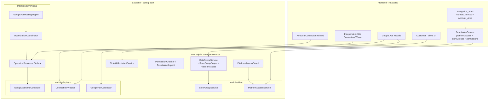
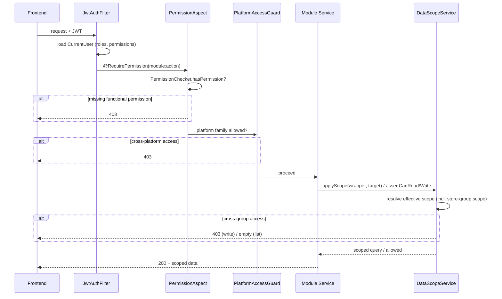

# Design Document

## Overview

This feature reworks the AdPilot AI platform across six coordinated areas — four-block navigation, merged store-connection flows, full Google Ads capability (including AI hosting), AI-assisted customer tickets under Amazon, a first-class Store Group concept with a three-dimensional RBAC model, and an all-button functional inspection. The unifying technical theme is **extending existing infrastructure rather than rebuilding it**: the design layers a Store-Group dimension and a Platform-Access dimension onto the already-shipped `com.adpilot.common.security` RBAC primitives (`DataScopeService`, `PermissionChecker`, `EffectiveScope`, `ScopeType`), routes Google Ads writes through the existing `advertising.operation` Outbox pipeline and `GoogleAdsWriteConnector`, and emits Google Ads AI decisions through the platform-generic `OptimizationCoordinator` from the `amazon-ads-ai-hosting-system` spec.

The most safety-critical part of this spec is **data isolation** (Requirement 16). Isolation is enforced server-side in the shared data-scope query layer, never by frontend filtering, and is proven by correctness-property tests that generate accounts, store groups, stores, and requests across group and platform boundaries.

### Design principles

1. **Extend, don't fork.** The Store-Group and Platform-Access dimensions are added to `EffectiveScope` and resolved by the existing `DataScopeServiceImpl.resolve()` precedence logic. The existing `data_scopes`, `user_stores`, and `permissions` tables are preserved.
2. **Single source of truth for schema.** Every new table/column (`store_groups`, `stores.store_group_id`, `account_platform_access`, `data_scopes` store-group rows) is added to `backend-java/db/schema.sql`; no Flyway, no runtime DDL.
3. **Reuse the write-back pipeline.** Google Ads manual and AI operations create `platform_mutation` Operations routed through the existing `OperationService` → `operation_outbox` → `OutboxWorker` → `GoogleAdsWriteConnector` path.
4. **Reuse the hosting pipeline.** The net-new `GoogleAdsHostingEngine` produces `CandidateDecision` objects for the existing `OptimizationCoordinator`, reusing decision storage (`ai_decisions`), approval routing, and `effect_attributions`.
5. **Server-authoritative permissions.** The frontend hides controls for UX, but every read and write is independently re-checked on the backend.

### Existing components reused (verified against the codebase)

| Concern | Existing component | Location |
|---|---|---|
| Functional permission check | `PermissionChecker`, `@RequirePermission`, `PermissionAspect` | `common/security` |
| Effective data scope resolution | `DataScopeService`, `DataScopeServiceImpl`, `EffectiveScope`, `ScopeType`, `ScopeTarget` | `common/security` |
| Principal load + permission cache | `UserContextService`, `CurrentUser` | `common/security` |
| Google Ads read | `GoogleAdsConnector` (GAQL search) | `apisync/connector` |
| Google Ads write | `GoogleAdsWriteConnector` (bid/budget/state mutate) | `apisync/connector` |
| Write-back pipeline | `OperationService`, `OutboxWorker`, `PendingOverlayService`, `OperationSource`, `OperationScope` | `advertising/operation` |
| AI hosting pipeline | `OptimizationCoordinator`, `CandidateDecision`, `DecisionRoutingPipeline`, `AiDecisionService`, `ExecutionModeResolver`, `AttributionWorker`, `DataQualityGate` | `advertising/hosting` |
| Amazon one-step connect | `AmazonAdsConnectWizard` / `AmazonAdsOAuthService` | `apisync/oauth` |
| Store + assignment | `StoreEntity`, `UserStoreEntity`, `StoreService` | `modules/store` |
| Customer tickets | `customer_tickets` table | `db/schema.sql` |

## Architecture

### High-level structure



### RBAC enforcement flow (every store-scoped request)



### Three RBAC dimensions

The RBAC model is composed of three **independently assignable** dimensions, all layered on the existing tables:

1. **Platform_Access** — which of the four Nav_Blocks (`amazon` / `independent_site` / `logistics` / `finance`) an account may enter. New dimension, stored per account.
2. **Store_Group_Scope** — which Store_Groups' stores an account may read/operate. Layered onto `data_scopes` as a new `scope_type = 'assigned_store_group'` row plus a join, resolved into `EffectiveScope`.
3. **Functional_Permission** — operation-level `module:action` permissions, evaluated unchanged by the existing `PermissionChecker`. Extended with distinct `advertising:*` codes for Amazon vs independent-site advertising.

Super_Administrator (`super_admin` role) bypasses all three, exactly as it bypasses the existing scope/permission checks today.

## Components and Interfaces

### 1. Navigation_Shell (Frontend — Requirements 1, 2, 3)

`Layout.tsx` is restructured from twelve flat `navSections` into a four-block, two-level model. Each `NavBlock` has a `platformFamily` and an ordered list of `NavItem`s; each `NavItem` keeps the existing `to` / `permission` / `platformScope` fields.

```typescript
type PlatformFamily = 'amazon' | 'independent_site' | 'logistics' | 'finance';

interface NavBlock {
  key: PlatformFamily;
  label: string;            // 亚马逊 / 独立站 / 物流 / 财务统计
  items: NavItem[];         // second-level entries in defined order
}

interface NavItem {
  to: string;
  icon: IconType;
  label: string;
  permission?: string;      // gates on Functional_Permission
}
```

Behavior:
- Renders exactly four blocks in the fixed order 亚马逊, 独立站, 物流, 财务统计 (Req 1.1).
- A block header toggles expand/collapse; multiple blocks may be open at once (Req 1.2, 1.4).
- Expand/collapse state persists to `localStorage` and is restored on reload (Req 1.6).
- A block is hidden when the account has no permitted item in it, or the block's platform family is outside the account's Platform_Access (Req 1.7, 12.2).
- Account_Area (avatar dropdown) hosts 系统设置, 飞书机器人, 审计回滚, CSV导入, each gated on its functional permission (Req 3).
- Every `NavItem.to` is validated against the route table at build/render time; an unresolved route is not rendered (Req 2.5).

Module-to-block assignment (Req 2.1–2.4) is encoded in a single `navConfig.ts` table so the mapping is data, not scattered JSX.

### 2. PlatformAccessGuard + PermissionContext (Requirements 12, 14, 15)

Backend: a new `@RequirePlatform(PlatformFamily)` annotation and `PlatformAccessAspect` mirror the existing `@RequirePermission` / `PermissionAspect` pattern. The aspect consults a new `PlatformAccessService.hasAccess(user, family)`; super-admins always pass (Req 15.4). A denial throws the same 403 `BusinessException` used by `PermissionAspect`.

```java
public interface PlatformAccessService {
    /** The platform families this account may enter. Super-admin => all four. */
    Set<PlatformFamily> accessibleFamilies(CurrentUser user);
    boolean hasAccess(CurrentUser user, PlatformFamily family);
}
```

Frontend: `PermissionContext` is extended to fetch `{ permissions, platformAccess, storeGroupScope }` from `/api/auth/me` (or the existing permissions endpoint). Navigation and store switcher re-render on the next permission fetch when the dimensions change, without re-login (Req 12.5).

### 3. StoreGroupService + Store-Group Data Scope (Requirements 10, 11, 13, 16)

```java
public interface StoreGroupService {
    StoreGroupVo create(CreateStoreGroupCommand cmd);   // validates name + platform family
    StoreGroupVo rename(UUID id, String name);
    void assignStore(UUID storeId, UUID storeGroupId);  // platform-family must match
    List<StoreGroupVo> listByFamily(PlatformFamily family);
    UUID defaultGroupFor(PlatformFamily family);        // fallback group
}
```

`DataScopeService` gains a store-group dimension. `EffectiveScope` is extended with `Set<UUID> storeGroupIds` and a new `ScopeType.ASSIGNED_STORE_GROUP`. `DataScopeServiceImpl.resolve()` unions store-group ids across the account's roles (Req 13.7), and `applyScope` adds a predicate that filters the queried entity's store to those whose `store_group_id` is in scope — implemented by extending `ScopeTarget` with a `storeGroupIdColumn` (resolved via the store's group) so every store-scoped module enforces the same restriction through the shared layer (Req 13.6).

For single-record reads/writes, `assertCanRead` / `assertCanWrite` resolve the record's store → store group and reject cross-group access with 403 (Req 13.3, 13.4). The read and write guards share one decision function so the allow/deny decision is identical for a given (account, record) pair (Req 16.4).

### 4. Connection Wizards (Requirements 4, 5)

- **Amazon_Connection_Wizard**: reuses `AmazonAdsConnectWizard` / `AmazonAdsOAuthService`. On OAuth success it creates/updates the `platform_connections` row and binds the resulting store, then assigns the store to a selected/created Amazon Store_Group within the same flow (Req 4.5). On failure/cancel, no connection is mutated and the failure reason is surfaced (Req 4.4).
- **Independent_Site_Connection_Wizard**: a single entry accepting Shopify / WooCommerce / TikTok credentials, creating the `PlatformConnectionEntity` and binding the store in one flow (Req 5.2). Google Ads binding from this wizard associates the Google Ads connection with a selected independent-site store rather than a standalone connection (Req 5.5). New independent-site stores join the independent-site Store_Group system (Req 5.4).

Both replace the prior two-step "API 连接 then store connection" flow; the old `ApiConnectionsPage` / `data-sync` connection entries are removed from navigation (Req 4.6, 5.6).

### 5. GoogleAds_Module (Requirements 6, 7)

Read (Req 6): a `GoogleAdsReadService` calls the existing `GoogleAdsConnector` for campaigns and reports, returning campaign name/status/budget/metrics and date-ranged performance. When no active connection exists, the frontend shows a connect prompt rather than an error (Req 6.6); retrieval failures show an error + retry control and leave prior data intact (Req 6.5).

Write (Req 7): campaign create and bid/budget/status changes create a `platform_mutation` Operation with `OperationSource.MANUAL` (or `OperationSource.CREATION` for campaign create) routed through `OperationService` → `operation_outbox` → `GoogleAdsWriteConnector`. The independent-site advertising functional permission is required; absence yields 403 with no Operation created (Req 7.5). Unsettled changes display through the existing `PendingOverlayService` (Req 7.6).

### 6. GoogleAdsHostingEngine (Requirement 8)

A net-new engine in `modules/advertising/hosting` that mirrors the `V1BidEngine` / `V2BudgetEngine` pattern: it reads Google Ads performance data over the resolved personality policy's lookback window and produces `CandidateDecision` objects (campaign-create and bid/budget/status adjustments) for the existing `OptimizationCoordinator` (Req 8.1, 8.2). It does not create Operations directly. Accepted candidates become `platform_mutation` Operations with `OperationSource.AI_HOSTING`, reusing the platform-generic decision storage (`ai_decisions`), `ExecutionModeResolver`, approval routing, `OutboxWorker`, and `AttributionWorker` (Req 8.3–8.7). Performance data failing the existing `DataQualityGate` causes the affected campaign to be skipped with a recorded reason (Req 8.8).

```java
@Service
public class GoogleAdsHostingEngine {
    List<CandidateDecision> produceCandidates(GoogleAdsCampaign campaign,
                                              DataSnapshot snapshot,
                                              SafetyBoundary boundary,
                                              HostingPhase phase);
}
```

### 7. TicketAiAssistantService (Requirement 9)

Customer tickets move under the 亚马逊 block (Req 9.1). When a buyer message is converted to a ticket, the ticket is associated with its originating store and that store's group (Req 9.2). `TicketAiAssistantService.assist(ticketId)` returns a draft reply, suggested classification, and suggested handling action as **proposals** — nothing is sent or applied until the operator confirms (Req 9.3, 9.4). On confirmation the system applies the action and records AI provenance in the audit trail (Req 9.5). Generation failure leaves the ticket unchanged and surfaces the reason (Req 9.6). Tickets whose store group is outside the operator's Store_Group_Scope are not displayed (Req 9.7), enforced through the shared data-scope layer.

### 8. Button_Audit (Requirement 17)

A page-by-page audit harness enumerates every interactive control reachable through the four blocks and the Account_Area, verifies each invokes the correct backend endpoint and responds on activation, and records broken controls (page, control, observed failure). Each enumerated broken control is repaired so it calls the correct endpoint and surfaces success/error feedback. The frontend's shared API client must surface an error indication on any failed request rather than failing silently (Req 17.4).

## Data Models

### New table: `store_groups` (Requirements 10, 11, 18)

```sql
CREATE TABLE IF NOT EXISTS store_groups (
    id CHAR(36) PRIMARY KEY DEFAULT (UUID()),
    org_id CHAR(36) NOT NULL REFERENCES organizations(id),
    name VARCHAR(100) NOT NULL,
    platform_family VARCHAR(20) NOT NULL
        CHECK (platform_family IN ('amazon', 'independent_site')),
    is_default TINYINT(1) NOT NULL DEFAULT 0,
    created_by CHAR(36) REFERENCES users(id),
    created_at DATETIME(3) DEFAULT CURRENT_TIMESTAMP(3),
    updated_at DATETIME(3) DEFAULT CURRENT_TIMESTAMP(3) ON UPDATE CURRENT_TIMESTAMP(3),
    UNIQUE KEY uk_store_group_name (org_id, platform_family, name)
);
```

The unique key enforces name uniqueness within a platform family (Req 10.4). Amazon groups are ordinary rows an administrator can add at runtime (Req 11.1, 11.2). A per-family `is_default` group provides the fallback for unassigned stores (Req 10.7, 18.2).

### Extend `stores` (Requirements 10, 18)

Add a first-class association column alongside the preserved legacy `store_group` label:

```sql
-- platform-workspace-rbac: first-class store-group association (Req 10.2).
-- The legacy free-text store_group label is retained and reconciled by migration (Req 18.2).
ALTER-equivalent in schema.sql:
    store_group_id CHAR(36) NULL REFERENCES store_groups(id),
    platform_family VARCHAR(20) NULL   -- derived from marketplace/platform; 'amazon' | 'independent_site'
```

Every store resolves to exactly one store group; the migration backfills `store_group_id` from the legacy `store_group` label + platform, defaulting to the family default group when absent (Req 10.2, 18.2).

### Store-Group Data Scope rows (Requirements 13, 18)

The Store_Group_Scope dimension reuses the existing `data_scopes` table with a new `scope_type` value and a JSON column holding the assigned group ids, preserving the existing dimensions unchanged (Req 18.3):

```sql
-- data_scopes.scope_type gains 'assigned_store_group'
-- store-group ids carried in a new JSON column, mirroring store_ids/product_ids
    store_group_ids JSON NULL
```

### New table: `account_platform_access` (Requirements 12, 18)

```sql
CREATE TABLE IF NOT EXISTS account_platform_access (
    id CHAR(36) PRIMARY KEY DEFAULT (UUID()),
    user_id CHAR(36) NOT NULL REFERENCES users(id) ON DELETE CASCADE,
    platform_family VARCHAR(20) NOT NULL
        CHECK (platform_family IN ('amazon', 'independent_site', 'logistics', 'finance')),
    created_at DATETIME(3) DEFAULT CURRENT_TIMESTAMP(3),
    UNIQUE KEY uk_account_platform (user_id, platform_family)
);
```

An account with no rows after migration receives a defined default Platform_Access so it does not lose all navigation (Req 18.5).

### Extend `customer_tickets` (Requirement 9)

```sql
-- platform-workspace-rbac: associate tickets with their store group for isolation (Req 9.2).
    store_group_id CHAR(36) NULL REFERENCES store_groups(id),
    ai_drafted TINYINT(1) NOT NULL DEFAULT 0,   -- provenance flag (Req 9.5)
    ai_classification VARCHAR(100) NULL
```

### Java model extensions

- `EffectiveScope`: add `Set<UUID> storeGroupIds`; `superAdmin()` remains unrestricted.
- `ScopeType`: add `ASSIGNED_STORE_GROUP` at the assigned-store/product precedence tier.
- `ScopeTarget`: add `storeGroupIdColumn` (or resolve store → group in the guard) so list queries and single-record guards both filter by store group.
- New entities: `StoreGroupEntity`, `AccountPlatformAccessEntity`; new enum `PlatformFamily`.

### Migration (Requirement 18)

A schema-level seed/backfill (consistent with `project-fix-and-cleanup` strategy) that:
1. Seeds per-family default `store_groups` rows.
2. Backfills `stores.store_group_id` from the legacy `store_group` label + platform, defaulting to the family default (Req 18.2).
3. Grants a default Platform_Access to accounts with none (Req 18.5).
4. Is idempotent — re-running yields the same assignments and default grants (Req 18.6), achieved with `INSERT ... ON DUPLICATE KEY` / existence-guarded updates keyed by the unique constraints.

## Correctness Properties

*A property is a characteristic or behavior that should hold true across all valid executions of a system — essentially, a formal statement about what the system should do. Properties serve as the bridge between human-readable specifications and machine-verifiable correctness guarantees.*

The properties below are the consolidated, non-redundant set derived from the prework analysis. The data-isolation invariants (Properties 1–4) are the security boundary mandated by Requirement 16 and are the highest-priority tests in this spec.

### Property 1: Store-group read isolation

*For any* non-Super_Administrator account and *any* store-scoped list query, the records returned by the Data_Scope_Service include only records whose store belongs to a Store_Group within the account's Store_Group_Scope, and never any record from a Store_Group outside that scope.

**Validates: Requirements 16.1, 13.2, 9.7**

### Property 2: Store-group write isolation

*For any* non-Super_Administrator account and *any* store-scoped create or modify request targeting a record whose store's Store_Group is outside the account's Store_Group_Scope, the system rejects the request with HTTP 403 and persists no change.

**Validates: Requirements 16.2, 13.3, 13.4**

### Property 3: Cross-platform rejection

*For any* non-Super_Administrator account and *any* operation or route scoped to a platform family outside the account's Platform_Access, the system rejects the request with HTTP 403 before the operation executes.

**Validates: Requirements 16.3, 12.3, 12.4**

### Property 4: Read/write isolation consistency

*For any* account and *any* single store-scoped record, the read guard and the write guard make the identical allow/deny decision for that (account, record) pair.

**Validates: Requirements 16.4**

### Property 5: Super-administrator bypass

*For any* operation, store-scoped record, and platform family, an account holding the Super_Administrator role is authorized — it passes the functional-permission check without an explicit grant, falls within data scope for every Store_Group, and is permitted across every platform family.

**Validates: Requirements 15.1, 15.2, 15.4**

### Property 6: Functional-permission gate

*For any* operation requiring a `module:action` permission and *any* account, the operation executes if and only if the account holds that permission (or is a Super_Administrator); otherwise the system rejects it with HTTP 403 and creates no Operation. This holds for the platform-specific advertising permissions, so an account holding only one platform family's advertising permission is rejected when operating on the other family's advertising.

**Validates: Requirements 14.4, 14.5, 14.2, 7.5**

### Property 7: Store-group scope is the union across roles

*For any* account holding multiple roles whose Store_Group_Scopes differ, the resolved effective Store_Group_Scope is exactly the union of the Store_Groups permitted across those roles.

**Validates: Requirements 13.7**

### Property 8: RBAC dimensions are independent

*For any* combination of a Platform_Access set, a Store_Group_Scope set, and a Functional_Permission set, the account is configurable with that exact combination, and each dimension's allow/deny decision is independent of the values of the other two.

**Validates: Requirements 14.7, 14.3**

### Property 9: Every store resolves to exactly one Store_Group of its platform family

*For any* store — whether created, connected through a Connection_Wizard, or migrated from legacy data — the store resolves to exactly one Store_Group, and that Store_Group's platform family matches the store's platform family.

**Validates: Requirements 10.2, 10.7, 4.5, 5.4**

### Property 10: Store-group platform-family match on assignment

*For any* store and *any* target Store_Group, assigning the store to the group succeeds if and only if the group's platform family equals the store's platform family; a mismatch is rejected with an error and no association change.

**Validates: Requirements 10.6, 11.4**

### Property 11: Store-group name validation

*For any* proposed Store_Group name and platform family, creation is rejected when the name is empty, exceeds 100 characters, or duplicates an existing Store_Group name within the same platform family, and is accepted otherwise.

**Validates: Requirements 10.1, 10.4**

### Property 12: Newly created Amazon group is immediately usable

*For any* Amazon Store_Group created at runtime, it is immediately available for store assignment and for Store_Group_Scope assignment without requiring a redeploy or restart.

**Validates: Requirements 11.1, 11.2, 11.3**

### Property 13: Manual Google Ads action produces a platform-mutation Operation

*For any* valid Google Ads campaign-create or bid/budget/status-change request from an authorized operator, the system creates exactly one Operation with `OperationScope.PLATFORM_MUTATION`, the expected `OperationSource` (`CREATION` for create, `MANUAL` for adjustments), and enqueues a corresponding Outbox entry routed to the GoogleAdsWriteConnector.

**Validates: Requirements 7.1, 7.2**

### Property 14: AI-hosting Google Ads decision produces an attributed platform-mutation Operation

*For any* GoogleAds_Hosting_Engine candidate accepted by the Optimization_Coordinator, the resulting Operation has `OperationScope.PLATFORM_MUTATION` and `OperationSource.AI_HOSTING`, and records the before value, the after value, and the decision snapshot.

**Validates: Requirements 8.3**

### Property 15: AI hosting respects execution mode

*For any* GoogleAds_Hosting_Engine candidate, no submission to Google Ads is created while the resolved Execution_Mode is `observe_only` or `recommend_only`; a submission is only routed through the platform-generic pipeline under `approval_required` (after approval) or `auto_execute`.

**Validates: Requirements 8.4**

### Property 16: AI hosting clamps to the safety boundary

*For any* proposed Google Ads change and *any* resolved Safety_Boundary, the value carried by the emitted candidate lies within the boundary's limits.

**Validates: Requirements 8.5**

### Property 17: AI hosting skips on data-quality failure

*For any* Google Ads performance dataset that fails the data-quality freshness or completeness check, the GoogleAds_Hosting_Engine produces no candidate for the affected campaign and records a skip reason.

**Validates: Requirements 8.8**

### Property 18: Customer ticket inherits its store's group

*For any* buyer message converted into a Customer_Ticket, the ticket's `store_group_id` equals the originating store's `store_group_id`.

**Validates: Requirements 9.2**

### Property 19: AI ticket outputs require explicit confirmation

*For any* Ticket_AI_Assistant result, until the operator explicitly confirms, no reply is sent and no ticket status or field is mutated.

**Validates: Requirements 9.4**

### Property 20: Navigation block visibility

*For any* account, a Nav_Block is rendered if and only if its platform family is within the account's Platform_Access (or the account is a Super_Administrator) and the block contains at least one Nav_Item the account is permitted to see; likewise an Account_Area utility is shown if and only if the account holds its required permission.

**Validates: Requirements 1.7, 3.2, 3.3, 12.2, 15.3**

### Property 21: Navigation expand/collapse state round-trips through persistence

*For any* set of per-block expanded/collapsed states, persisting the state and then restoring it on reload yields the same set of states.

**Validates: Requirements 1.6**

### Property 22: Every rendered Nav_Item resolves to a route and matches its block's family

*For any* Nav_Item in the navigation configuration, the item is rendered only if its route resolves in the route table, and the item's platform family equals its containing Nav_Block's platform family.

**Validates: Requirements 2.5, 2.6**

### Property 23: API client surfaces every error response

*For any* error HTTP status returned to the shared frontend API client, the client surfaces an error indication to the operator rather than resolving silently.

**Validates: Requirements 17.4**

### Property 24: Migration is deterministic and idempotent

*For any* starting dataset, running the backward-compatibility migration twice produces the same Store_Group assignments and the same default Platform_Access grants as running it once; every existing store is assigned a single Store_Group derived from its legacy label and platform (defaulting to the family default), and every account lacking Platform_Access receives the defined default.

**Validates: Requirements 18.6, 18.2, 18.5**

### Property 25: Backward-compatible assigned-store scope is preserved

*For any* account that holds an `assigned_store` data scope, the store access granted through `user_stores` continues to be honored after the Store_Group_Scope dimension is added.

**Validates: Requirements 18.4**

## Error Handling

| Scenario | Handling | Requirement |
|---|---|---|
| Missing functional permission | `PermissionAspect` throws 403 `BusinessException`; audit records the deny | 14.5, 7.5 |
| Cross-platform access | `PlatformAccessAspect` throws 403 before the method body executes | 12.3, 12.4, 16.3 |
| Cross-group read (single record) | `DataScopeService.assertCanRead` throws 403 | 13.3, 16.1 |
| Cross-group write | `DataScopeService.assertCanWrite` throws 403, transaction not committed | 13.4, 16.2 |
| Cross-group list query | Shared scope predicate yields no out-of-scope rows (no error, empty/filtered result) | 13.2, 16.1 |
| Store-group name invalid/duplicate | `StoreGroupService.create` throws a validation `BusinessException` with a naming-conflict/limit message | 10.4 |
| Store↔group platform mismatch | `StoreGroupService.assignStore` throws a platform-family-mismatch `BusinessException` | 10.6 |
| Amazon OAuth fail/cancel | Existing `platform_connections` row unchanged; failure reason surfaced to wizard | 4.4 |
| Independent-site credentials rejected | Existing connection unchanged; rejection reason surfaced | 5.3 |
| Google Ads read failure | `GoogleAdsConnector` translates 401/403 to `ReauthRequiredException`; UI shows error + retry, retains prior data | 6.5 |
| Google Ads write reject | `GoogleAdsWriteConnector` returns `permanentReject`; failure reason recorded, internal record unchanged | 7.4 |
| AI hosting data-quality failure | Engine skips the campaign and records the skip reason | 8.8 |
| Ticket AI generation failure | Ticket left unchanged; failure reason surfaced | 9.6 |
| Any failed backend request | Shared API client surfaces an error indication (never silent) | 17.4 |

All authorization failures reuse the existing 403 `BusinessException` and `ResultCode` conventions, and credentials/secrets are never logged (enforced by the existing `PlatformLogSanitizer`).

## Testing Strategy

### Property-based tests

Property-based testing applies strongly to this feature because the RBAC/isolation logic is pure decision logic with a large input space (accounts, roles, store groups, stores, requests). The project already uses **jqwik** for Java property tests (see `TableViewIsolationPropertyTest`), so these properties reuse that library and its mock-based store-modeling pattern (mock mappers as in-memory user/group-scoped stores, then assert the wrapper/decision).

- Library: **jqwik** (Java) for backend; **fast-check** for any frontend logic properties (nav visibility, state round-trip, API error surfacing).
- Each property test runs a **minimum of 100 iterations** (`@Property(tries = 100)` or higher; the existing isolation test uses 200).
- Each property test is tagged with a comment referencing its design property in the format:
  `Feature: platform-workspace-rbac, Property {number}: {property_text}`
- Each correctness property (Properties 1–25) is implemented by a **single** property-based test.
- The isolation properties (1–4) generate accounts, store groups, stores, and records across group and platform boundaries, satisfying Requirement 16.6 explicitly.
- Properties that depend on external services (Google Ads create/adjust/hosting submission) use **mocks** for the connector and Outbox so the logic (Operation construction, execution-mode gating, boundary clamping) is tested without live API calls — mirroring the existing hosting engine tests.

### Unit tests (examples and edge cases)

- Navigation rendering: four blocks in fixed order (1.1), toggle behavior (1.2–1.5), module-to-block mapping (2.1–2.4), Account_Area placement (3.1, 3.4).
- Connection-wizard happy path and the no-connection connect prompt (6.6), and error paths (4.4, 5.3) as edge-case tests.
- Google Ads display rendering of campaigns/reports (6.3, 6.4) and pending overlay (7.6).
- `StoreGroupService.create` success (10.3) and reassignment applying to scope (10.5).
- Ticket AI confirmation applying the action and recording provenance (9.5).

### Integration tests (1–3 representative examples each)

- Amazon one-step OAuth + bind + group assignment end-to-end against a mocked OAuth endpoint (4.2, 4.3).
- Independent-site credential submission + bind + group assignment (5.2).
- Google Ads campaign/report retrieval through `GoogleAdsConnector` (6.1, 6.2) and write submission through `GoogleAdsWriteConnector` advancing Sync_States (7.3).
- AI hosting Operation becoming effective triggers `AttributionWorker` (8.6).

### Smoke / migration tests

- `schema.sql` imports cleanly with the new `store_groups`, `account_platform_access` tables and `stores` / `customer_tickets` / `data_scopes` extensions, without removing existing RBAC tables (18.1, 18.3).
- Migration backfill runs against a seeded legacy dataset and is verified idempotent (covered as Property 24, plus a smoke run confirming a clean second execution).

### Button audit

Requirement 17 is primarily a remediation activity, not an automated property: a page-by-page enumeration of controls produces a broken-control list (17.1–17.3, 17.5), and each broken control is repaired. The one automated guarantee extracted from it — that the shared API client never swallows an error — is covered by Property 23.
