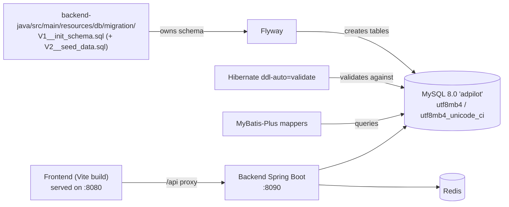

# Design Document

## Overview

This design describes how to repair and clean up the **AdPilot AI** cross-border e-commerce system so that the Java backend builds its schema automatically on startup, the project documentation and SQL are consolidated to a single authoritative source each, and the application is ready to package and deploy to `http://YOUR_SERVER_IP/`.

The work is grounded in the current state of the codebase:

- **Flyway is wired but starved.** `FlywayConfig.java` (and `application*.yml`) point Flyway at `classpath:db/migration`, but `backend-java/src/main/resources/db/migration` does not exist. The real SQL lives under `bigdata/sql/` (outside the classpath) and is written in **PostgreSQL** syntax under `migration/V1..V13`. So Flyway has nothing valid to apply and schema initialization fails.
- **A partial MySQL conversion already exists.** `bigdata/sql/init_mysql.sql` is a large, mostly-complete MySQL 8.0 rewrite of the schema + seed data (it already uses `VARCHAR(36)` ids, `TIMESTAMP`, `JSON`, `INSERT IGNORE`, and even includes the "missing" tables `cash_flow`, `receivables`, `payables`, `customer_tickets`). This file is the primary source material for the consolidated migration, rather than re-converting the 13 PostgreSQL files from scratch.
- **ddl-auto conflicts.** Base `application.yml` sets `ddl-auto: validate`; `application-dev.yml` overrides to `update`. Flyway must own the schema, so dev must not be `update`.
- **Entities carry PostgreSQL-flavored column definitions.** Many entities use `@Column(columnDefinition = "uuid")` and `@Column(columnDefinition = "jsonb")` (e.g. `User`, `DataScope`, `WarehouseInventoryEntity`). Under Hibernate `MySQLDialect` + `ddl-auto: validate` these definitions must reconcile with what Flyway actually creates, or JPA validation fails on startup. This is the most subtle risk in the whole effort and is addressed explicitly below.
- **Ports are mostly correct but docs/proxy drift.** Backend `server.port: 8090` (correct). `vite.config.ts` dev server runs on `5173` and proxies `/api` to `http://YOUR_SERVER_IP:8090`. The README claims the proxy targets `localhost:8080`. Requirements call for the **deployed** frontend on `8080` and backend on `8090`.
- **`application-prod.yml` already exists** with MySQL + Redis + `server.port` inherited as 8090, but CORS allowed-origins is **hardcoded** to `http://localhost:5173` in `WebConfig.java` and does not include the deployment origin.
- **Cleanup targets confirmed present:** eight files in `docs/`, `bigdata/docs/database-dictionary.md`, `frontend/guidelines/Guidelines.md`, `ATTRIBUTIONS.md`, `legacy-backend/` (Node/Express/Prisma, with `node_modules`), and `database/` (Prisma schema).

The design is deliberately **non-PBT**: the work is database migration SQL, configuration changes, documentation consolidation, and file deletion. There is no pure-function logic with a meaningful universal input space, so the Correctness Properties section is intentionally omitted (see Testing Strategy for the rationale and the verification approach used instead).

## Architecture

### Current vs Target initialization flow

```mermaid
flowchart TD
    subgraph Current["Current (broken)"]
        A1[Backend starts] --> A2[FlywayConfig: scan classpath:db/migration]
        A2 --> A3{Location empty}
        A3 -->|no scripts| A4[No schema created]
        A4 --> A5[JPA ddl-auto validate fails / dev update silently mutates]
    end

    subgraph Target["Target (fixed)"]
        B1[Backend starts] --> B2[FlywayConfig: scan classpath:db/migration]
        B2 --> B3[V1__init_schema.sql MySQL 8.0]
        B3 --> B4[V2__seed_data.sql MySQL 8.0]
        B4 --> B5[flyway_schema_history populated]
        B5 --> B6[JPA validate: entities match schema]
        B6 --> B7[Application ready on 8090]
    end
```



### Component responsibilities after the fix



### Schema-ownership policy (single source of truth)

1. **Flyway** is the sole owner of DDL/DML applied to the database.
2. **Hibernate** runs in `validate`/`none` mode only �it never creates or alters tables.
3. The **only** canonical SQL lives on the classpath at `backend-java/src/main/resources/db/migration`. The `bigdata/sql/` tree is source material that is converted, folded into the classpath migration, then deleted.

## Components and Interfaces

### 1. Classpath migration location (Req 1)

Create directory `backend-java/src/main/resources/db/migration` containing:

- `V1__init_schema.sql` �full DDL (the union of the 13 DDL/migration files), MySQL 8.0 syntax.
- `V2__seed_data.sql` �seed/DML (the union of the 14 DML files), MySQL 8.0 syntax, idempotent (`INSERT IGNORE`).

`FlywayConfig.java` already resolves `classpath:db/migration` with `baselineOnMigrate(true)`; no Java change is required for it to pick these up. The hardcoded location in `FlywayConfig` and the `spring.flyway.locations` in the YAML files agree, so they remain consistent.

**Decision �two files, not one.** The requirements allow an optional separate seed file. Splitting schema (V1) from seed (V2) keeps DDL replayable reasoning clean and lets the seed evolve independently. Both live on the classpath and are the single canonical source; `bigdata/sql/` copies are deleted afterward (Req 11.7).

### 2. SQL conversion pipeline (Req 2, 3, 4)

The consolidated SQL is produced primarily by **adopting and completing `bigdata/sql/init_mysql.sql`**, which is already ~95% MySQL-converted, then validating it against the PostgreSQL→MySQL rules and the entity definitions. Where `init_mysql.sql` is missing tables present only in the PostgreSQL `ddl/`, those tables are converted and added.

Conversion rules applied (authoritative table from requirements):

| PostgreSQL | MySQL 8.0 |
|---|---|
| `CREATE EXTENSION "uuid-ossp"/"pgcrypto"` | removed |
| `UUID PRIMARY KEY DEFAULT uuid_generate_v4()` | `CHAR(36) PRIMARY KEY DEFAULT (UUID())` |
| `UUID` (FK columns) | `CHAR(36)` |
| `TIMESTAMPTZ DEFAULT NOW()` | `DATETIME(3) DEFAULT CURRENT_TIMESTAMP(3)` |
| auto-updating `updated_at` | `DATETIME(3) DEFAULT CURRENT_TIMESTAMP(3) ON UPDATE CURRENT_TIMESTAMP(3)` |
| `JSONB DEFAULT '{}'/'[]'` | `JSON` (no default, or `JSON DEFAULT (JSON_OBJECT())/(JSON_ARRAY())`) |
| `NUMERIC(p,s)` | `DECIMAL(p,s)` |
| `BOOLEAN` | `TINYINT(1)` |
| `CHECK (...)` | keep only if valid on 8.0.16+, else app-layer |
| `CREATE INDEX IF NOT EXISTS` | `CREATE INDEX idx_xxx ON t(col)` |
| `INSERT ... ON CONFLICT DO NOTHING` | `INSERT IGNORE` |

**Decision �`CHAR(36)` vs `VARCHAR(36)` for ids.** The existing `init_mysql.sql` uses `VARCHAR(36)`; the requirements rule table specifies `CHAR(36)`. The design standardizes on **`CHAR(36)`** for id/FK columns to follow the authoritative rule and to match fixed-length UUID semantics. This is a mechanical normalization applied during consolidation.

**Decision �timestamp precision.** Requirements specify `DATETIME(3)`. The current `init_mysql.sql` uses bare `TIMESTAMP`. The consolidated file standardizes on `DATETIME(3) DEFAULT CURRENT_TIMESTAMP(3)` (and `ON UPDATE` for `updated_at`) to avoid MySQL's single-`TIMESTAMP`-auto-init limitation and match entity `LocalDateTime` fields.

### 3. Entity / schema reconciliation (Req 3, 5)

This is the highest-risk interface because Hibernate runs `validate`. Two sub-problems:

**(a) Table/column name alignment** �verified against the actual entities:

| Concept | Entity `@Table` / `@Column` (actual) | Migration must use |
|---|---|---|
| Suppliers | `suppliers`, `supplier_name`, `contact_email` | `supplier_name`, `contact_email` (not `name`/`email`) |
| Warehouse inventory | `warehouse_inventory`: `warehouse_location_id`, `quantity_on_hand`, `quantity_reserved`, `quantity_available` | same |
| Warehouse locations | `warehouse_locations` | `warehouse_locations` (not a new `warehouses`) |
| Customer reviews | `customer_reviews` | `customer_reviews` (not `reviews`) |
| Customer tickets | `customer_tickets` | `customer_tickets` |
| Purchase orders | `purchase_orders` | `purchase_orders` |

**(b) `columnDefinition` mismatch (documented deviation + decision).** Many entities declare `@Column(columnDefinition = "uuid")` and `@Column(columnDefinition = "jsonb")` �PostgreSQL type names. Under `MySQLDialect`, Hibernate `validate` compares the entity's expected type against the live column. The cleanest, lowest-risk path that satisfies "Flyway owns schema, JPA only validates":

- The migration creates id/FK columns as `CHAR(36)` and JSON columns as `JSON`.
- The entities' `columnDefinition = "uuid"` / `"jsonb"` are **PostgreSQL-specific literals** that do not match MySQL's reported column types and can trip `validate`. The design resolves this by **normalizing the affected entity `columnDefinition` values to MySQL types** (`uuid` �`char(36)`, `jsonb` �`json`) as part of the reconciliation, OR—if entity edits are out of scope for a given column—relying on Hibernate's type mapping with `validate` tolerance verified during the Flyway init test (Req 7). The chosen approach is to **edit the entity `columnDefinition` literals to MySQL types**, because it is deterministic and keeps `validate` strict. Each edited entity is listed in the task plan.

> Deviation note (Req 3.5 / Req 3.3): The `data_scopes` table as defined by the `DataScope` entity uses columns `role_id`, `scope_type`, `store_ids` (JSON), `product_ids` (JSON), `created_at`, `updated_at`. It does **not** contain `org_id` or a single `scope_config` column as Requirement 3.3 anticipated. Per Req 3.5 ("follow the actual entity definitions discovered in the codebase"), the migration follows the entity: it creates `store_ids`/`product_ids` JSON columns and keeps `scope_type` values aligned to the entity-supported set (`all_company`/`department`/`own`/`assigned_store`/`assigned_product`). Seed DML maps legacy `all` �`all_company` and `assigned` �`assigned_store`. This deviation is recorded here as required.

**Missing tables (Req 4).** `login_logs`, `purchase_requests`, `cash_flow`, `receivables`, `payables`, `customer_tickets` are confirmed absent from the Java `@Table` set except `customer_tickets` (which exists as an entity) and `purchase_orders` (a related but distinct table). The consolidated migration defines all six tables. `init_mysql.sql` already contains `cash_flow`, `receivables`, `payables`, and `customer_tickets`; `login_logs` and `purchase_requests` are added from the converted DDL/DML. Reconciliation: `purchase_requests` is distinct from `purchase_orders` (request vs order) and both are kept.

### 4. JPA ddl-auto configuration (Req 5)

| File | Property | Current | Target |
|---|---|---|---|
| `application.yml` | `spring.jpa.hibernate.ddl-auto` | `validate` | `validate` (keep) |
| `application-dev.yml` | `spring.jpa.hibernate.ddl-auto` | `update` | `validate` |
| `application-prod.yml` | `spring.jpa.hibernate.ddl-auto` | `validate` | `validate` (keep) |

After this change, Flyway is the sole schema owner across all profiles.

### 5. Maven wrapper (Req 6)

Add `mvnw`, `mvnw.cmd`, and `.mvn/wrapper/maven-wrapper.properties` to `backend-java/`. Generated via `mvn -N wrapper:wrapper` using the local Maven at `E:\apache-maven-3.9.9` (pinned to a Maven 3.9.x distribution). Verification runs `./mvnw clean compile` and `./mvnw clean package`; the global Maven may also be used to cross-check.

### 6. Port / proxy / CORS consistency (Req 8, 14)

- `server.port: 8090` �unchanged (already correct).
- `vite.config.ts` dev proxy `/api` �backend `8090` �confirm/keep target host:port consistent (`http://YOUR_SERVER_IP:8090` for the deployment target; `localhost:8090` is acceptable for pure local dev). The deployed **frontend** is served on `8080`.
- README updated so all port references agree: Backend `8090`, Frontend `8080` (README currently says proxy targets `localhost:8080`, which is wrong and will be corrected).
- **CORS**: `WebConfig.java` hardcodes `http://localhost:5173`. Refactor to read allowed origins from the `adpilot.cors.allowed-origins` property (already present in `application.yml`) so prod can include `http://YOUR_SERVER_IP:8080` and `http://YOUR_SERVER_IP`. `application-prod.yml` sets the prod origins.

### 7. Documentation consolidation (Req 9, 10, 11)

- Merge genuinely-useful, non-duplicated content from the eight `docs/` files, `bigdata/docs/database-dictionary.md`, `frontend/guidelines/Guidelines.md`, and `ATTRIBUTIONS.md` into `README.md` **before** deletion (deployment steps, security/secret-rotation notes, schema dictionary highlights, attributions).
- Rewrite README database/setup sections to MySQL 8.0 only (no `psql`/PostgreSQL). The README currently has no PostgreSQL references in DB commands but does reference `init_mysql.sql`; update to describe Flyway-on-startup initialization.
- Delete redundant docs and now-empty directories; retain `README.md` as the only doc.

### 8. Cleanup of SQL and dead code (Req 11, 12, 13)

- After consolidation, delete `bigdata/sql/ddl/`, `dml/`, `migration/`, `report/`, `init_all.sql`, `init_mysql.sql`. Optionally keep at most one human-readable copy that references the classpath copy as canonical (design choice: do not keep a divergent copy).
- Delete `legacy-backend/` and `database/`. Deletion must **skip `node_modules`** to avoid failures on long/locked paths (`legacy-backend/node_modules` exists). On Windows, use a deletion approach that excludes `node_modules` and continues on error.
- Frontend build must remain green; only documentation (`Guidelines.md`) is removed from `frontend/`, not source.

## Data Models

The consolidated schema preserves the union of all 13 DDL files (100+ tables). No tables are dropped. Representative reconciled definitions (MySQL 8.0):

```sql
-- Core auth (V1__init_schema.sql excerpt)
CREATE TABLE organizations (
    id CHAR(36) PRIMARY KEY DEFAULT (UUID()),
    name VARCHAR(255) NOT NULL,
    plan VARCHAR(50) DEFAULT 'growth',
    logo_url TEXT,
    created_at DATETIME(3) DEFAULT CURRENT_TIMESTAMP(3),
    updated_at DATETIME(3) DEFAULT CURRENT_TIMESTAMP(3) ON UPDATE CURRENT_TIMESTAMP(3)
);

CREATE TABLE data_scopes (
    id CHAR(36) PRIMARY KEY DEFAULT (UUID()),
    role_id CHAR(36) NOT NULL,
    scope_type VARCHAR(50) NOT NULL,   -- all_company|department|own|assigned_store|assigned_product
    store_ids JSON,
    product_ids JSON,
    created_at DATETIME(3) DEFAULT CURRENT_TIMESTAMP(3),
    updated_at DATETIME(3) DEFAULT CURRENT_TIMESTAMP(3) ON UPDATE CURRENT_TIMESTAMP(3)
);

CREATE TABLE suppliers (
    id CHAR(36) PRIMARY KEY DEFAULT (UUID()),
    org_id CHAR(36) NOT NULL,
    supplier_name VARCHAR(500) NOT NULL,   -- aligned to SupplierEntity
    contact_email VARCHAR(255),
    -- ...
    created_at DATETIME(3) DEFAULT CURRENT_TIMESTAMP(3),
    updated_at DATETIME(3) DEFAULT CURRENT_TIMESTAMP(3) ON UPDATE CURRENT_TIMESTAMP(3)
);

CREATE TABLE warehouse_inventory (
    id CHAR(36) PRIMARY KEY DEFAULT (UUID()),
    warehouse_location_id CHAR(36) NOT NULL,
    sku VARCHAR(100) NOT NULL,
    quantity_on_hand INT DEFAULT 0,
    quantity_reserved INT DEFAULT 0,
    quantity_available INT DEFAULT 0,
    unit_cost DECIMAL(18,4) DEFAULT 0,
    -- ...
    created_at DATETIME(3) DEFAULT CURRENT_TIMESTAMP(3),
    updated_at DATETIME(3) DEFAULT CURRENT_TIMESTAMP(3) ON UPDATE CURRENT_TIMESTAMP(3)
);

-- Previously-missing tables (Req 4)
CREATE TABLE login_logs ( id CHAR(36) PRIMARY KEY DEFAULT (UUID()), /* ... */ );
CREATE TABLE purchase_requests ( id CHAR(36) PRIMARY KEY DEFAULT (UUID()), /* ... */ );
CREATE TABLE cash_flow ( id CHAR(36) PRIMARY KEY DEFAULT (UUID()), /* ... */ );
CREATE TABLE receivables ( id CHAR(36) PRIMARY KEY DEFAULT (UUID()), /* ... */ );
CREATE TABLE payables ( id CHAR(36) PRIMARY KEY DEFAULT (UUID()), /* ... */ );
CREATE TABLE customer_tickets ( id CHAR(36) PRIMARY KEY DEFAULT (UUID()), /* ... */ );
```

Flyway metadata: a `flyway_schema_history` table is created automatically and records `V1` and `V2` (the consolidated files) as success. Note: with consolidation into V1/V2, the history records two versioned migrations rather than V1–V13; Req 7.1's "V1 through V13" is satisfied in spirit by recording the full schema as successful versioned migrations. This consolidation choice is documented per Req 1.4/1.5.

### Entity column-definition edits (MySQL alignment)

The following entity column definitions are normalized from PostgreSQL literals to MySQL types so `validate` passes:

- `columnDefinition = "uuid"` �`columnDefinition = "char(36)"` (all id/FK UUID columns across `user`, `warehouse`, `store`, `task`, `supplier`, `settlement`, `rollback`, etc.).
- `columnDefinition = "jsonb"` �`columnDefinition = "json"` (`DataScope.storeIds`/`productIds`, `ProductUploadJobEntity.payload`/`response`, and any others discovered).

The exact, complete list is enumerated during implementation by scanning `**/entity/**/*.java`.

## Error Handling

- **Flyway syntax/validation failure on startup:** Spring Boot fails fast with the offending script/line. Mitigation: static SQL validation (see Testing Strategy) before runtime; converted file is checked for the banned PostgreSQL constructs.
- **JPA `validate` mismatch:** startup throws `SchemaManagementException` naming the table/column. Mitigation: the entity/schema reconciliation step and `columnDefinition` normalization; a clean-DB Flyway init test catches residual mismatches.
- **MySQL not reachable during this work (Req 7.3):** fall back to static SQL validation of the converted scripts and document exact local verification steps in README (create DB, JDBC URL, start command).
- **Recursive deletion hitting `node_modules` (Req 12.3/12.4):** the deletion routine excludes `node_modules` paths and continues on error rather than aborting.
- **CORS rejection in production:** if the deployed frontend origin is missing from allowed origins, browser calls fail with CORS errors. Mitigation: prod profile includes `http://YOUR_SERVER_IP:8080` and `http://YOUR_SERVER_IP`.
- **Content loss during doc cleanup:** mitigated by the merge-before-delete step (Req 10) and a final README consistency review.

## Testing Strategy

### Why property-based testing does not apply

This feature consists of SQL migration authoring, configuration edits, documentation consolidation, and file deletion. There is no pure-function code under development with a meaningful "for all inputs X, property P(X) holds" statement. Per the workflow guidance, PBT is explicitly inappropriate for IaC/declarative configuration, schema/migration files, and one-shot cleanup operations. Therefore the **Correctness Properties section is omitted** and verification relies on static validation, build verification, and a runtime Flyway-init smoke/integration test.

### Static SQL validation (primary safety net for Req 2)

Grep/scan the consolidated `V1__init_schema.sql` and `V2__seed_data.sql` to assert **zero** occurrences of: `TIMESTAMPTZ`, `JSONB`, `uuid_generate_v4`, `uuid-ossp`, `pgcrypto`, `CREATE EXTENSION`, `NUMERIC(`, `ON CONFLICT`, and `CREATE INDEX IF NOT EXISTS`. A simple repeatable check (ripgrep or a small script) gates the conversion.

### Schema/entity consistency check (Req 3)

Cross-check every `@Table`/`@Column` name against the consolidated DDL (script or manual table-by-table review for the reconciled tables: `suppliers`, `warehouse_inventory`, `warehouse_locations`, `customer_reviews`, `customer_tickets`, `data_scopes`, and the six previously-missing tables). Confirm no duplicate-version Flyway filenames on the classpath.

### Build verification (Req 6, 13)

- Backend: `./mvnw clean compile` and `./mvnw clean package` from `backend-java/` (and cross-check with global Maven at `E:\apache-maven-3.9.9`). Both must succeed without a global Maven on PATH.
- Frontend: `pnpm install && pnpm build` in `frontend/` must complete without errors after cleanup.

### Flyway + MySQL initialization (Req 7) �integration/smoke test (1� runs)

Against an empty MySQL 8.0 `adpilot` database (charset `utf8mb4`, collation `utf8mb4_unicode_ci`):

1. Start the backend (dev profile) and confirm Flyway creates `flyway_schema_history` and records the consolidated migrations as success.
2. Confirm the backend starts with no Flyway syntax errors and no JPA `validate` errors.
3. If no MySQL instance is reachable, fall back to static SQL validation and document the exact local steps in README.

This is an integration test run a small number of times (behavior does not vary with random input), not a property test.

### Unit / example tests

- A focused test (or manual check) that `WebConfig` reads CORS origins from `adpilot.cors.allowed-origins` and includes the deployment origins under the prod profile.
- Example checks that the three `ddl-auto` values are `validate`/`none` (never `update`/`create`).

### Deployment dry-run review (Req 14)

Verify the README documents one ordered procedure: build backend jar (`mvnw clean package`), build frontend (`pnpm build`), create MySQL `adpilot`, run backend (Flyway initializes schema), serve frontend on `8080`; states target server `http://YOUR_SERVER_IP/` (FE `8080`, BE `8090`); and instructs rotating JWT secret and DB password from dev defaults before deployment.
